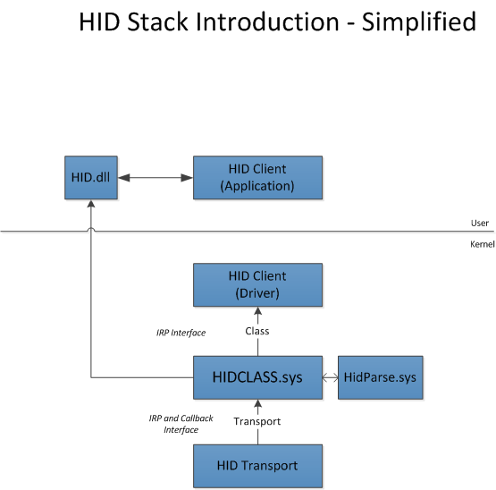
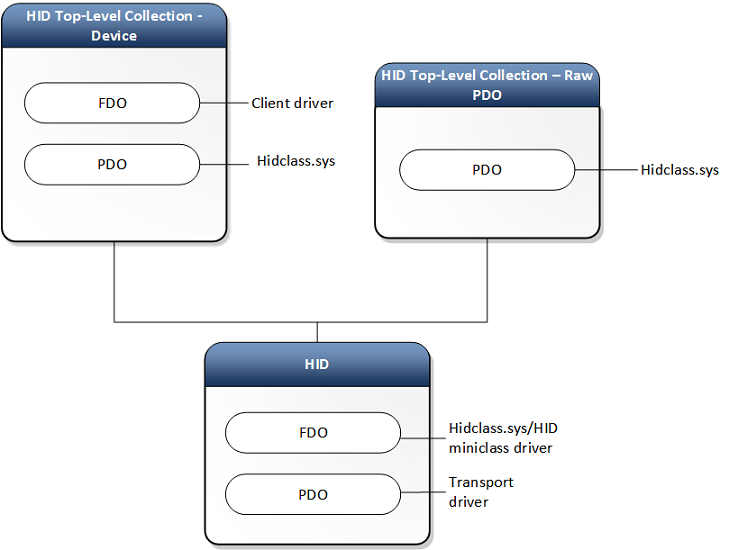

# HID Architecture

The architecture of the HID driver stack in Windows is built on the class driver named *hidclass.sys*. Clients and transport minidrivers access the class driver from user-mode or kernel-mode.

## The HID Class Driver

The system-supplied HID class driver is the WDM function driver and bus driver for the HID device setup class (HIDClass). The executable component of the HID class driver is *hidclass.sys*. The HID Class driver is the glue between HID clients and various transports. This allows a HID Client to be written in an independent way from transports. This level of abstraction allows clients to continue to work (with little to no modifications) when a new standard, or a 3rd party transport is introduced.

The following is an architectural representation. 

The preceding diagram includes the following:

-   HID Clients – Identifies the Windows and 3rd party clients and their interfaces.
-   HID Class driver - The *hidclass.sys* executable.
-   HID Transport Minidriver - Identifies the Windows and 3rd party transports and their interfaces.

Here is the device stack diagram of a generic HID client and transport.

{:height="600px" width="400px"}

Here is another device stack diagram showing HID keyboard and mouse collections over USB.

## HID Clients

The HID Clients are drivers, services or applications that communicate with *HIDClass.sys* and often represent a specific type of device (E.g. sensor, keyboard, mouse, etc). They identify the device via a hardware ID or a specific HID Collection and communicate with the HID Collection via the following guidance.

User-mode drivers and applications, and kernel-mode drivers, do the following to operate HID collections:

-   User-mode drivers and applications use HIDClass support routines (HidD\_Xxx) to obtain information about a HID collection.
-   Kernel-mode drivers, user-mode drivers and applications use HID parsing support routines (HidP\_Xxx), and kernel-mode drivers use HID class driver IOCTLs to handle HID reports.

The following table is a simplification of the information listed above.

|             | Drivers                      | Applications |
|-------------|------------------------------|--------------|
| User Mode   | HidD\_Xxx                    | HidP\_Xxx    |
| Kernel Mode | HidD\_Xxx OR IOCTL\_HID\_xxx | N/A          |

 

For more information, see [Opening HID collections](opening-hid-collections.md).

For a list of all supported HID Clients, see [HID Clients Supported in Windows](hid-clients-supported-in-windows.md).

## The HID Transport Driver

The HID class driver is designed to use HID minidrivers to access a hardware input device. A HID minidriver abstracts the device-specific operation of the input devices that it supports. The HID minidriver binds its operation to the HID class driver by registering with the HID class driver. The HID class driver communicates with a HID minidriver by calling the minidriver's support routines. The HID minidriver, in turn, sends communications down the driver stack to an underlying bus or port driver.

For a list of the HID Transports provided in Windows, see [HID Transports Supported in Windows](hid-transports-supported-in-windows.md).

 

 

--------------------
[Send comments about this topic to Microsoft](mailto:wsddocfb@microsoft.com?subject=Documentation%20feedback%20%5Bhid\hid%5D:%20HID%20Architecture%20%20RELEASE:%20%287/18/2016%29&body=%0A%0APRIVACY%20STATEMENT%0A%0AWe%20use%20your%20feedback%20to%20improve%20the%20documentation.%20We%20don't%20use%20your%20email%20address%20for%20any%20other%20purpose,%20and%20we'll%20remove%20your%20email%20address%20from%20our%20system%20after%20the%20issue%20that%20you're%20reporting%20is%20fixed.%20While%20we're%20working%20to%20fix%20this%20issue,%20we%20might%20send%20you%20an%20email%20message%20to%20ask%20for%20more%20info.%20Later,%20we%20might%20also%20send%20you%20an%20email%20message%20to%20let%20you%20know%20that%20we've%20addressed%20your%20feedback.%0A%0AFor%20more%20info%20about%20Microsoft's%20privacy%20policy,%20see%20http://privacy.microsoft.com/default.aspx. "Send comments about this topic to Microsoft")

