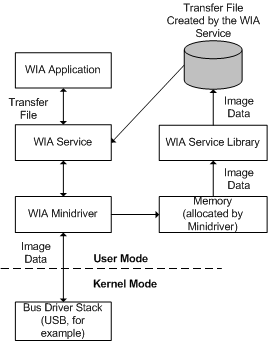

# File Transfers

## 

**Note**   File transfers are for operating systems prior to Windows Vista.

 

A *file data transfer* is a transfer of image data from the WIA minidriver into a file that the WIA service created. The WIA application that initiates the data transfer indicates to the WIA service that it is ready to perform a file transfer.

The WIA service then creates a file and instructs the WIA minidriver to transfer data into the file. The WIA minidriver contacts the device by requesting the data to be transferred. The minidriver requires its own memory, so the lower-level bus driver stack is able to place the acquired data into the buffer. When the WIA minidriver receives the data in its buffer, it uses the [**wiasWriteBufToFile**](https://msdn.microsoft.com/library/windows/hardware/ff549473) WIA service library function, passing in its memory buffer. The WIA service library then writes the contents of the WIA minidriver's memory buffer into the file that the WIA service created, as the following diagram shows.

Use the **wiasWriteBufToFile** service library function for most file transfers. Use the [**wiasWritePageBufToFile**](https://msdn.microsoft.com/library/windows/hardware/ff549484) service library function only for drivers that require the WIA service to write multipage TIFF files. Drivers that use their own TIFF headers when they write multipage TIFF files should use **wiasWriteBufToFile**.

 

 

--------------------
[Send comments about this topic to Microsoft](mailto:wsddocfb@microsoft.com?subject=Documentation%20feedback%20%5Bimage\image%5D:%20File%20Transfers%20%20RELEASE:%20%288/17/2016%29&body=%0A%0APRIVACY%20STATEMENT%0A%0AWe%20use%20your%20feedback%20to%20improve%20the%20documentation.%20We%20don't%20use%20your%20email%20address%20for%20any%20other%20purpose,%20and%20we'll%20remove%20your%20email%20address%20from%20our%20system%20after%20the%20issue%20that%20you're%20reporting%20is%20fixed.%20While%20we're%20working%20to%20fix%20this%20issue,%20we%20might%20send%20you%20an%20email%20message%20to%20ask%20for%20more%20info.%20Later,%20we%20might%20also%20send%20you%20an%20email%20message%20to%20let%20you%20know%20that%20we've%20addressed%20your%20feedback.%0A%0AFor%20more%20info%20about%20Microsoft's%20privacy%20policy,%20see%20http://privacy.microsoft.com/default.aspx. "Send comments about this topic to Microsoft")

