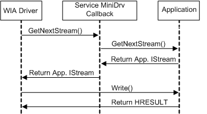
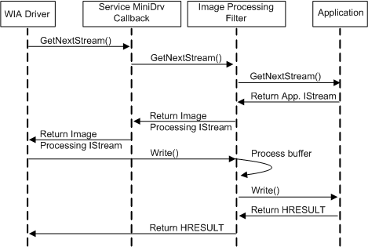

# Integration with the Image Processing Filter

Stream-based data transfers allow easy integration of the [WIA Image Processing Filter](wia-image-processing-filter.md) with a WIA driver because the stream is provided by the caller and the WIA driver takes the same action no matter what the destination stream is. That is, the driver simply asks for a stream and then writes to it, no matter what type of stream is returned to the driver.

The WIA Image Processing Filter is required to implement **IStream**. When this filter is created, it is given the application's destination stream, which it should then delegate (or forward) its calls to. In other words, when **IStream::Write** is called on the filter, it should process the buffer and then call **IStream::Write** on the destination stream with the processed buffer.

Similarly, the Image Processing Filter can give a stream to the driver so that data can be written from the driver to the Image Processing Filter, which then writes to the application's destination stream. Note that if no filter is present, the driver does not change but continues to write to the stream.

This situation is shown graphically in the following figures. The first figure illustrates a stream-based data transfer when the Image Processing Filter is not used.

The second figure illustrates stream-based data transfer when the Image Processing Filter is used.

Notice that the driver's behavior does not change; the driver receives a stream and writes to it whether the stream is provided by the Image Processing Filter or by an application directly. As a result, you can publish value-add image processing components separately. For example, you could provide an in-box driver that is functional but could provide better quality images when the user installs the image processing component from a CD. The driver does not need to be changed in this situation.

The **IStream** interface and its methods are described in the Microsoft Windows SDK documentation.

 

 

--------------------
[Send comments about this topic to Microsoft](mailto:wsddocfb@microsoft.com?subject=Documentation%20feedback%20%5Bimage\image%5D:%20Integration%20with%20the%20Image%20Processing%20Filter%20%20RELEASE:%20%288/17/2016%29&body=%0A%0APRIVACY%20STATEMENT%0A%0AWe%20use%20your%20feedback%20to%20improve%20the%20documentation.%20We%20don't%20use%20your%20email%20address%20for%20any%20other%20purpose,%20and%20we'll%20remove%20your%20email%20address%20from%20our%20system%20after%20the%20issue%20that%20you're%20reporting%20is%20fixed.%20While%20we're%20working%20to%20fix%20this%20issue,%20we%20might%20send%20you%20an%20email%20message%20to%20ask%20for%20more%20info.%20Later,%20we%20might%20also%20send%20you%20an%20email%20message%20to%20let%20you%20know%20that%20we've%20addressed%20your%20feedback.%0A%0AFor%20more%20info%20about%20Microsoft's%20privacy%20policy,%20see%20http://privacy.microsoft.com/default.aspx. "Send comments about this topic to Microsoft")

