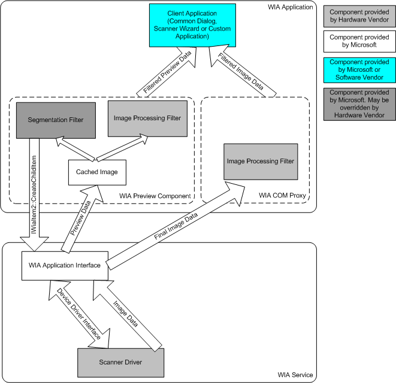

# Introduction to Image Processing Filters

## 

The image processing filter is a WIA extension. The image processing filter serves two primary purposes:

-   To allow Image processing code to be separated from the driver. For example, the image processing filter can be used to modify the brightness and contrast of an image, and to perform deskewing and rotation. The image processing filter is in its own DLL, separate from the user-mode driver DLL. The image processing filter receives unfiltered imaging data from the driver on which it performs filtering.

-   To enable accurate live previews. The image processing filter is used from a new for Windows Vista WIA Preview component (described in the Microsoft Windows SDK documentation) that provides accurate live previews. In this context, "live" means that an application won't have to re-acquire the image from the scanner once it changes a few property settings, which are discussed later in this section. The previews are accurate since the filtering is actually performed by a vendor component on the actual preview image rather than just a random filter on a totally separate image.

In order to provide accurate previews, a filter should implement [**brightness**](https://msdn.microsoft.com/library/windows/hardware/ff552567) and [**contrast**](https://msdn.microsoft.com/library/windows/hardware/ff552573) properties at a minimum. This is so the common UI, which provides brightness and contrast controls to the user, can display accurate previews.

The image processing filter is always executed when an image is scanned. So there is no way for an application to get the image from the scanner without having the image processing filter applied first. An application does not need to be aware of the filter.

Microsoft provides the WIA Preview component that caches of the original, unfiltered preview image that is acquired from the scanner. The Preview component makes it possible to apply a filter multiple times to an image without having to re-acquire the image from the scanner. The WIA Preview component would typically be used for preview images when an application lets a user change settings, such as contrast and brightness. While the user changes the settings, the application can continuously display the resulting image in the preview pane without having to re-scan the image.

The image processing filter is a WIA extension, running as an in-process COM component. In contrast to the segmentation filter, an application typically does not create an instance of the image processing filter itself by calling **IWiaItem2::GetExtension** (described in the Windows SDK Documentation). Instead, the application will create an instance of the WIA Preview component, which in turn will load the actual image processing filter using the **IWiaItem2::GetExtension** method. The image processing filter is also invoked automatically when an application calls **IWiaTransfer::Download**.

An image processing filter is tied to a driver and typically distributed together with the driver. The WIA Preview component is available in sti.dll and ships with the operating system.

The following figure shows the image processing filter being loaded by WIA components into the application's process. Note that it is possible for more than one instance of the image processing filter to be loaded in the application's process at the same time, so filter writes must be cautious about this. For example, in case when global (static) variables are used, the filter writer must ensure proper synchronization.

 

 

--------------------
[Send comments about this topic to Microsoft](mailto:wsddocfb@microsoft.com?subject=Documentation%20feedback%20%5Bimage\image%5D:%20Introduction%20to%20Image%20Processing%20Filters%20%20RELEASE:%20%288/17/2016%29&body=%0A%0APRIVACY%20STATEMENT%0A%0AWe%20use%20your%20feedback%20to%20improve%20the%20documentation.%20We%20don't%20use%20your%20email%20address%20for%20any%20other%20purpose,%20and%20we'll%20remove%20your%20email%20address%20from%20our%20system%20after%20the%20issue%20that%20you're%20reporting%20is%20fixed.%20While%20we're%20working%20to%20fix%20this%20issue,%20we%20might%20send%20you%20an%20email%20message%20to%20ask%20for%20more%20info.%20Later,%20we%20might%20also%20send%20you%20an%20email%20message%20to%20let%20you%20know%20that%20we've%20addressed%20your%20feedback.%0A%0AFor%20more%20info%20about%20Microsoft's%20privacy%20policy,%20see%20http://privacy.microsoft.com/default.aspx. "Send comments about this topic to Microsoft")

