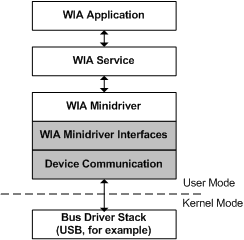

# WIA Driver Components

## 

The WIA minidriver can be viewed as two logical layers:

-   The WIA service interface layer

-   The device communication layer

The following diagram illustrates the logical breakdown of a WIA minidriver and its components.

### WIA Minidriver Interfaces

A WIA minidriver is a COM object that implements the **IUnknown** COM interface and two WIA-specific COM interfaces: [IStiUSD](istiusd-com-interface.md) and [IWiaMiniDrv](https://msdn.microsoft.com/library/windows/hardware/ff545027). The WIA minidriver interface layer implements these interfaces and is the entry point into the WIA minidriver. Applications do not call the WIA minidriver interfaces directly; only the WIA service calls into these interfaces.

### Device Communication

The device communication layer is responsible for low-level interactions with the still image device through a kernel-mode bus driver. All interactions with the device are sent through this layer. This layer is responsible for packaging data to be sent to the device into a format that the physical device can understand, and for unpackaging data received from the device into a format that the driver understands.

This sections provides additional information about the WIA minidriver and its components in the following areas:

[WIA Minidriver Interfaces](wia-minidriver-interfaces.md)

[Device Communication through the Bus Driver](device-communication-through-the-bus-driver.md)

[WIA Components](wia-components.md)

 

 

--------------------
[Send comments about this topic to Microsoft](mailto:wsddocfb@microsoft.com?subject=Documentation%20feedback%20%5Bimage\image%5D:%20WIA%20Driver%20Components%20%20RELEASE:%20%288/17/2016%29&body=%0A%0APRIVACY%20STATEMENT%0A%0AWe%20use%20your%20feedback%20to%20improve%20the%20documentation.%20We%20don't%20use%20your%20email%20address%20for%20any%20other%20purpose,%20and%20we'll%20remove%20your%20email%20address%20from%20our%20system%20after%20the%20issue%20that%20you're%20reporting%20is%20fixed.%20While%20we're%20working%20to%20fix%20this%20issue,%20we%20might%20send%20you%20an%20email%20message%20to%20ask%20for%20more%20info.%20Later,%20we%20might%20also%20send%20you%20an%20email%20message%20to%20let%20you%20know%20that%20we've%20addressed%20your%20feedback.%0A%0AFor%20more%20info%20about%20Microsoft's%20privacy%20policy,%20see%20http://privacy.microsoft.com/default.aspx. "Send comments about this topic to Microsoft")

