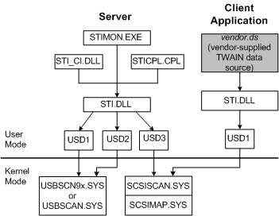

# Windows 98 Core Components

## 

On MIcrosoft Windows 98, the still image core components are as shown in the following figure.

On the server side, three core components communicate with *sti.dll*: *stimon.exe*, *sti\_ci.dll*, and *sticpl.cpl*. These components are, respectively, the still image event monitor, the class installer, and the Scanners and Cameras Control Panel application. *Sti\_ci.dll* is invoked only when a new still image device is installed or removed, and *sticpl.cpl* is invoked only to do configuration chores.

*Stimon.exe* processes events and communicates with *sti.dll*, which in turn communicates with one or more user-mode still image drivers (USDs), which are labeled USD1, USD2, and USD3 on the left side of this figure. Each of the user-mode drivers communicates with one type of kernel-mode driver, depending on the device's bus connection. For a USB device, the user-mode still image driver communicates with *usbscn9x.sys* for composite usb devices and *usbscan.sys* for noncomposite usb devices; for a SCSI device, the user-mode driver communicates with both *scsiscan.sys* and *scsimap.sys*.

On the client application side, an IHV must supply a TWAIN data source, which is shown in the preceding figure as *vendor.ds*, a generic name for this component. The TWAIN data source is a component of the TWAIN Scanning architecture, and communicates with an instance of *sti.dll* on the client side. In turn, *sti.dll* communicates with a user-mode still image driver (USD1 in the figure), which communicates with one of the kernel-mode drivers discussed earlier.

 

 

[Send comments about this topic to Microsoft](mailto:wsddocfb@microsoft.com?subject=Documentation%20feedback%20%5Bimage\image%5D:%20Windows%2098%20Core%20Components%20%20RELEASE:%20%288/17/2016%29&body=%0A%0APRIVACY%20STATEMENT%0A%0AWe%20use%20your%20feedback%20to%20improve%20the%20documentation.%20We%20don't%20use%20your%20email%20address%20for%20any%20other%20purpose,%20and%20we'll%20remove%20your%20email%20address%20from%20our%20system%20after%20the%20issue%20that%20you're%20reporting%20is%20fixed.%20While%20we're%20working%20to%20fix%20this%20issue,%20we%20might%20send%20you%20an%20email%20message%20to%20ask%20for%20more%20info.%20Later,%20we%20might%20also%20send%20you%20an%20email%20message%20to%20let%20you%20know%20that%20we've%20addressed%20your%20feedback.%0A%0AFor%20more%20info%20about%20Microsoft's%20privacy%20policy,%20see%20http://privacy.microsoft.com/default.aspx. "Send comments about this topic to Microsoft")

