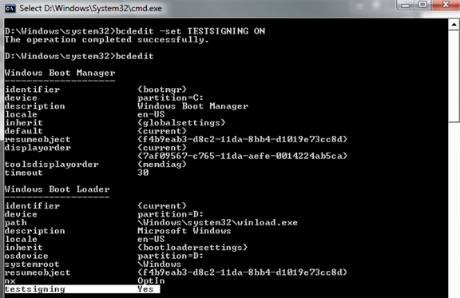

# The TESTSIGNING Boot Configuration Option


The TESTSIGNING boot configuration option determines whether Windows Vista and later versions of Windows will load any type of test-signed kernel-mode code. This option is not set by default, which means test-signed kernel-mode drivers will not load by default on 64-bit versions of Windows Vista and later versions of Windows.

**Note**  For 64-bit versions of Windows Vista and later versions of Windows, the kernel-mode code signing policy requires that all kernel-mode code have a digital signature. However, in most cases, an unsigned driver can be installed and loaded on 32-bit versions of Windows Vista and later versions of Windows. For more information, see [Kernel-Mode Code Signing Policy (Windows Vista and Later)](kernel-mode-code-signing-policy--windows-vista-and-later-.md).

 

The TESTSIGNING boot configuration option is enabled or disabled through the BCDEdit command. To enable test-signing, use the following BCDEdit command:

```
Bcdedit.exe -set TESTSIGNING ON
```

To disable test-signing, use the following BCDEdit command:

```
Bcdedit.exe -set TESTSIGNING OFF
```

**Note**  After you change the TESTSIGNING boot configuration option, restart the computer for the change to take effect.

 

**Caution**  Administrative privileges are required to use BCDEdit to modify BCD. Changing some boot entry options using the **BCDEdit /set** command could render your computer inoperable. As an alternative, use the System Configuration utility (MSConfig.exe) to change boot settings.

**Note**  Before setting BCDEdit options you might need to disable or suspend BitLocker and Secure Boot on the computer.

 

 

To use BCDEdit, you must be a member of the Administrators group on the system and run the command from an elevated command prompt. To open an elevated Command Prompt window, create a desktop shortcut to *Cmd.exe*, right-click the *Cmd.exe* shortcut, and select **Run as administrator**.

The following screen shot shows the result of using the BCDEdit command-line tool to enable test-signing.



When the BCDEdit option for test-signing is enabled, Windows does the following:

-   Displays a watermark with the text "Test Mode" in all four corners of the desktop, to remind users the system has test-signing enabled.
    **Note**  Starting with Windows 7, Windows displays this watermark only in the lower left-hand corner of the desktop.

     

-   The operating system loader and the kernel load drivers that are signed by any certificate. The certificate validation is not required to chain up to a trusted root certification authority. However, each driver image file must have a digital signature.

 

 

[Send comments about this topic to Microsoft](mailto:wsddocfb@microsoft.com?subject=Documentation%20feedback%20%5Bdevinst\devinst%5D:%20The%20TESTSIGNING%20Boot%20Configuration%20Option%20%20RELEASE:%20%287/22/2016%29&body=%0A%0APRIVACY%20STATEMENT%0A%0AWe%20use%20your%20feedback%20to%20improve%20the%20documentation.%20We%20don't%20use%20your%20email%20address%20for%20any%20other%20purpose,%20and%20we'll%20remove%20your%20email%20address%20from%20our%20system%20after%20the%20issue%20that%20you're%20reporting%20is%20fixed.%20While%20we're%20working%20to%20fix%20this%20issue,%20we%20might%20send%20you%20an%20email%20message%20to%20ask%20for%20more%20info.%20Later,%20we%20might%20also%20send%20you%20an%20email%20message%20to%20let%20you%20know%20that%20we've%20addressed%20your%20feedback.%0A%0AFor%20more%20info%20about%20Microsoft's%20privacy%20policy,%20see%20http://privacy.microsoft.com/default.aspx. "Send comments about this topic to Microsoft")


