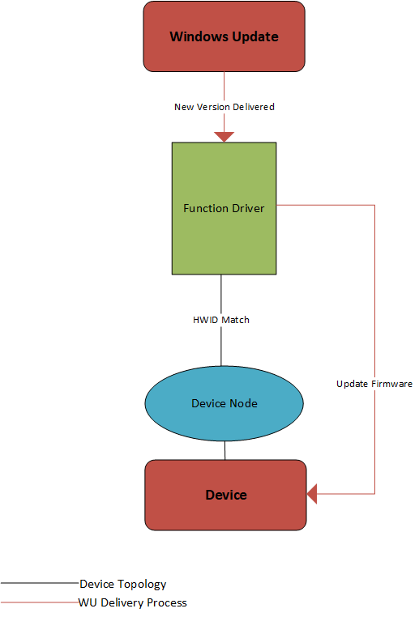
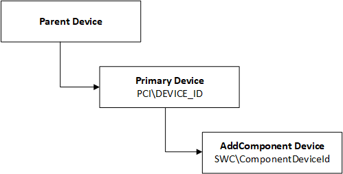

# Updating Device Firmware using Windows Update

This topic describes how to update a removable device's firmware using the Windows Update (WU) service.  For information about updating firmware for chassis-mounted devices, see [Windows UEFI firmware update platform](../bringup/windows-uefi-firmware-update-platform.md).

To do this, you'll provide an update mechanism, implemented as a device driver, that includes the firmware payload.  If your device uses a Microsoft-supplied driver, provide a separate firmware update driver package.  If your device uses an vendor-supplied driver, you have the option of adding the firmware update logic and payload to your existing function driver, or providing a separate firmware update driver package.  In both cases, the firmware update driver package must be universal.

Because WU cannot execute software, the firmware update driver must hand the firmware to PnP for installation.

## Firmware update driver actions

Typically, the firmware update driver is a lightweight device driver that does the following:

* At device start or in AddDevice:

    1. Identify the device to which it is attached.
    2. Determine whether the driver has a firmware version that is more recent than the version on the device.
    3. If a firmware update is necessary, set an event timer to schedule the update.
    4. Otherwise, do nothing until the driver is started again.

* During system runtime:

    1. If an update is queued, wait for a set of conditions to be met.
    2. When conditions are met, perform the firmware update on the device.

## Firmware update driver contents

Typically, the firmware update driver package contains the following:

* [Universal Driver INF](using-a-universal-inf-file.md)
* Driver catalog
* Function driver (.sys or .dll)
* Firmware update payload binary

Submit your firmware update package as a separate driver submission.

## Adding firmware update logic to a vendor-supplied driver

The existing function driver can implement the firmware update mechanism (in this case, “firmware update driver” and the device’s function driver are one and the same).



Alternatively, if you want to be able to update the functional driver and the firmware update driver separately, create a second device node, on which a custom driver can be installed to update the firmware.


There are a couple ways to create a second device node.  Certain device types have the ability to expose a second device node on one physical device, such as USB.  You can use this functionality to create a device node targetable by WU, and install the firmware update driver on it.  Many device types, however, do not allow a single physical device to enumerate more than one device node.

In this case, use an extension INF that specifies the [AddComponent](../install/inf-addcomponent-directive.md) directive to create a device node that can be targeted by Windows Update and install the firmware update driver on it.  The following snippet from an INF file shows how you can do this:

```
[Manufacturer]
%Contoso%=Standard,NTamd64
[Standard.NTamd64]
%DeviceName%=Device_Install, PCI\DEVICE_ID
[Device_Install.Components]
AddComponent=ComponentName,,AddComponentSection
[AddComponentSection]
ComponentIDs = ComponentDeviceId
```

In the above INF sample, `ComponentIDs = ComponentDeviceId` indicates that the child device will have a hardware ID `SWC\ComponentDeviceId`.  When installed, this INF will create the following device hierarchy:



Then for future firmware updates, the firmware update driver source code likely stays the same, but update the INF and firmware binary file.
In this case, the functional and firmware device nodes must have different hardware IDs in order to be targeted independently.

## Adding firmware update logic to a Microsoft-supplied driver

For devices that use an inbox driver, an additional device must be enumerated that can have a custom driver installed on it

Must create a second device node.

## Best practices

In your firmware update driver INF, specify [DIRID 13](using-dirids.md), to cause PnP to leave the files in the driver package in the DriverStore:

```
[Firmware_AddReg]
; Store location of firmware payload
HKR,,FirmwareFilename,,"%13%\firmware_payload.bin"
```

PnP resolves this location when it installs the device.  The driver can then open this registry key to determine the location of the payload.

Firmware update drivers should use:

```
Class=Firmware
ClassGuid={f2e7dd72-6468-4e36-b6f1-6488f42c1b52}
```

If another device needs to be located, the firmware driver should locate the device by walking the device tree relative to itself, not by enumerating all devices for a match.  There may be multiple instances of the device, and the driver should only touch the one to which it is attached.

The driver should be robust to multiple instances of the device being on the system, possibly with multiple different firmware versions.  For example, there may be one instance of the device that has been connected and updated several times; a brand new device may then be plugged in which is several firmware versions old.  This means that state (such as current version) must be stored against the device, and not in a global location.

If there is an existing method to update the firmware (EXE or co-installer, for example), you can largely reuse the update code within a UMDF driver.
