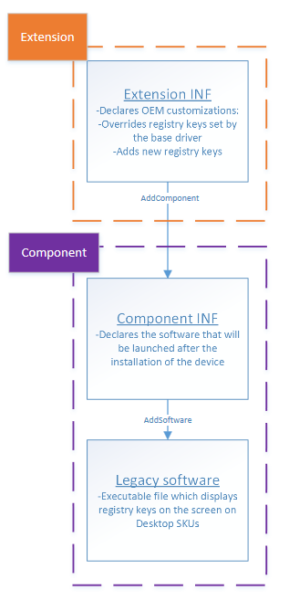
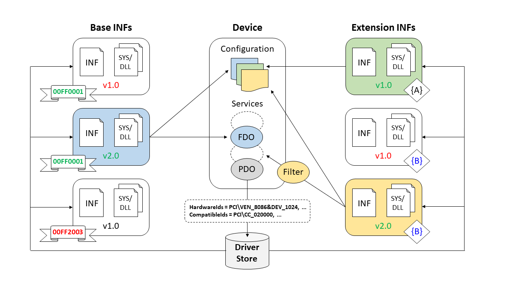

# Using an Extension INF File

Prior to Windows 10, Windows selected a single driver package to install for a given device.  This resulted in large, complex driver packages that included code for all scenarios and configurations, and each minor update required an update to the entire driver package.  Starting in Windows 10, you can split INF functionality into multiple components, each of which can be serviced independently.  To extend a driver package INF file's functionality, provide an extension INF in a separate driver package.  An extension INF:

* Can be provided by a different company and updated independently from the base INF.
* Looks the same as a base INF, but can extend the base INF for customization or specialization.
* Enhances the value of the device, but is not necessary for the base driver to work.
* Must be a [universal INF file](../install/using-a-universal-inf-file.md).

Every device must have one base INF, and can optionally have one or more extension INFs associated with it.

Typical scenarios where you might use an extension INF include:

* Modifying settings provided in a base INF, such as customizing the device friendly name or modifying a hardware configuration setting.
* Creating one or more software components by specifying the [INF AddComponent directive](inf-addcomponent-directive.md) and providing a [component INF file](using-a-component-inf-file.md).

You can find sample code for these scenarios in the examples below on this page.  Also see [Universal Driver Scenarios](../develop/universal-driver-scenarios.md), which describes how the [DCHU universal driver sample](https://github.com/Microsoft/Windows-driver-samples/tree/master/general/DCHU) uses extension INFs.

In the following diagram, two different companies have created separate driver packages for the same device, which are shown in the dotted lines.  The first contains just an extension INF, and the second contains a component INF and a legacy software module.  The diagram also shows how an extension INF can reference a component INF, which can in turn reference software modules to install.



## How extension INF and base INF work together

Settings in an extension INF are applied after settings in a base INF. As a result, if an extension INF and a base INF specify the same setting, the version in the extension INF is applied. Similarly, if the base INF changes, the extension INF remains and is applied over the new base INF.

## Specifying ExtensionId

When you write an extension INF, you generate a special GUID called the **ExtensionId**, which is an entry in the INF's **\[Version\]** section.

The system identifies possible extension INFs for a specific device by matching the hardware ID and compatible IDs of the device to those specified in an extension INF in a [**Models**](inf-models-section.md) section that applies to that system.

Among all possible extension INFs that specify the same **ExtensionId** value, the system selects only one to install and applies its settings over those of the base INF.  The driver date and driver version specified in the INF are used, in that order, to choose the single INF between multiple extension INFs with the same **ExtensionId**.

To illustrate, consider the following scenario that includes a hypothetical device for which there are three extension INFs:



The **ExtensionId** values are shown in curly brackets, and each driver's [rank](how-setup-ranks-drivers--windows-vista-and-later-.md) is shown in the banner ribbons.

First, the system selects the driver with the most recent version and highest rank.

Next, the system processes the available extension INFs.  Two have **ExtensionId** value `{B}`, and one has **ExtensionId** value `{A}`.  From the first two, let's say that driver date is the same.  The next tiebreaker is driver version, so the system selects the extension INF with v2.0.

The extension INF with the unique **ExtensionId** value is also selected.  The system applies the base INF for the device, and then applies the two extension INFs for that device.

Note that extension INF files are always applied after the base INF, but that there is no determined order in which the extension INFs are applied.

## Creating an extension INF

Here are the entries you need to define an INF as an extension INF.

1.  Specify these values for **Class** and **ClassGuid** in the [**Version**](inf-version-section.md) section. For more info on setup classes, see [System-Defined Device Setup Classes Available to Vendors](https://msdn.microsoft.com/library/windows/hardware/ff553426).

    ```
    [Version]
    ...
    Class       = Extension
    ClassGuid   = {e2f84ce7-8efa-411c-aa69-97454ca4cb57}
    ```

2.  Provide an **ExtensionId** entry in the [**\[Version\]**](inf-version-section.md) section. Generate a new GUID for the initial version of an extension INF, or reuse the last GUID for subsequent updates of the initial extension INF.

    ```
    ExtensionId = {zzzzzzzz-zzzz-zzzz-zzzz-zzzzzzzzzzzz} ; replace with your own GUID
    ```

3.  If you are updating an extension INF, keep the **ExtensionId** the same and increment the version or date (or both) specified by the [**DriverVer**](inf-driverver-directive.md) directive. For a given **ExtensionId** value, PnP selects the INF with the highest **DriverVer**.

4.  In the [**INF Models section**](inf-models-section.md), specify one or more hardware and compatible IDs that match those of the target device.  Note that these hardware and compatible IDs do not need to match those of the base INF.  Typically, an extension INF lists a more specific hardware ID than the base INF, with the goal of further specializing a specific driver configuration.  For example, the base INF might use a two-part PCI hardware ID, while the extension INF specifies a four-part PCI hardware ID, like the following:
    
    ```
    [DeviceExtensions.NTamd64]
    %Device.ExtensionDesc% = DeviceExtension_Install, USB\VID_XXXX&PID_XXXX&REV_XXXX
    ```

    Alternatively, the extension INF might list the same hardware ID as the base INF, for instance if the device is already very narrowly targeted, or if the base INF already lists the most specific hardware ID.
    
    In some cases, the extension INF might provide a less specific device ID, like a compatible ID, in order to customize a setting across a broader set of devices.

5.  Optionally, provide a **TargetComputers** section if you want to constrain which computers this INF can be installed on.  You might do this if you are using extension INFs with less specific hardware IDs or compatible IDs that are applicable to a large number of devices.
6.  Do not define a service with `SPSVCINST_ASSOCSERVICE`.  However, an extension INF can define other services, such as a filter driver for the device.  For more info about specifying services, see [**INF AddService Directive**](inf-addservice-directive.md).

The driver validation and submission process is the same for extension INFs as for regular INFs. For more info, see [Windows HLK Getting Started](https://msdn.microsoft.com/library/windows/hardware/dn915002).

## Example 1: Using an extension INF to set the device friendly name

In one common scenario, a device manufacturer (IHV) provides a base driver and a base INF, and then a system builder (OEM) provides an extension INF that supplements and in some cases overrides the configuration and settings of the base INF.  The following snippet is a complete extension INF that shows how to set the device friendly name.

```
[Version]
Signature   = "$WINDOWS NT$"
Class       = Extension
ClassGuid   = {e2f84ce7-8efa-411c-aa69-97454ca4cb57}
Provider    = %CONTOSO%
ExtensionId = {zzzzzzzz-zzzz-zzzz-zzzz-zzzzzzzzzzzz} ; replace with your own GUID
DriverVer   = 05/28/2013,1.0.0.0
CatalogFile = delta.cat

[Manufacturer]
%CONTOSO% = DeviceExtensions,NTamd64

[DeviceExtensions.NTamd64]
%Device.ExtensionDesc% = DeviceExtension_Install, USB\VID_XXXX&PID_XXXX&REV_XXXX

[DeviceExtension_Install]
; No changes

[DeviceExtension_Install.HW]
AddReg = FriendlyName_AddReg

[FriendlyName_AddReg]
HKR,,FriendlyName,, "New Device Friendly Name"

[Strings]
CONTOSO              = "Contoso"
Device.ExtensionDesc = "Sample Device Extension"
```

## Example 2: Using an extension INF to install additional software

The following snippet is a complete extension INF that is included in the [Driver package installation toolkit for universal drivers](https://github.com/Microsoft/Windows-driver-samples/tree/master/general/DCHU).  This example uses [INF AddComponent directive](inf-addcomponent-directive.md) to create components that install a service and an executable.  For more info about what you can do in a component INF, see [Using a Component INF File](using-a-component-inf-file.md).

To access this file online, see [`osrfx2_DCHU_extension.inx`](https://github.com/Microsoft/Windows-driver-samples/blob/master/general/DCHU/osrfx2_DCHU_extension_loose/osrfx2_DCHU_extension/osrfx2_DCHU_extension.inx).

```
;/*++
;
;Copyright (c) Microsoft Corporation.  All rights reserved.
;
;   THIS CODE AND INFORMATION IS PROVIDED "AS IS" WITHOUT WARRANTY OF ANY
;   KIND, EITHER EXPRESSED OR IMPLIED, INCLUDING BUT NOT LIMITED TO THE
;   IMPLIED WARRANTIES OF MERCHANTABILITY AND/OR FITNESS FOR A PARTICULAR
;   PURPOSE.
;
;Module Name:
;
;    osrfx2_DCHU_extension.INF
;
;Abstract:
;
;    Extension inf for the OSR FX2 Learning Kit
;
;--*/

[Version]
Signature = "$WINDOWS NT$"
Class = Extension
ClassGuid = {e2f84ce7-8efa-411c-aa69-97454ca4cb57}
Provider = %ManufacturerName%
ExtensionId = {3846ad8c-dd27-433d-ab89-453654cd542a}
CatalogFile = osrfx2_DCHU_extension.cat
DriverVer = 05/16/2017,15.14.36.721

[Manufacturer]
%ManufacturerName% = OsrFx2Extension, NT$ARCH$

[OsrFx2Extension.NT$ARCH$]
%OsrFx2.ExtensionDesc% = OsrFx2Extension_Install, USB\Vid_045e&Pid_94aa&mi_00
%OsrFx2.ExtensionDesc% = OsrFx2Extension_Install, USB\Vid_0547&PID_1002

[OsrFx2Extension_Install.NT]
CopyInf=osrfx2_DCHU_usersvc.inf

[OsrFx2Extension_Install.NT.HW]
AddReg = OsrFx2Extension_AddReg
AddReg = OsrFx2Extension_COMAddReg

[OsrFx2Extension_AddReg]
HKR, OSR, "OperatingParams",, "-Extended"
HKR, OSR, "OperatingExceptions",, "x86"

; Add all registry keys to successfully register the
; In-Process ATL COM Server MSFT Sample.
[OsrFx2Extension_COMAddReg]
HKCR,AppID\ATLDllCOMServer.DLL,AppID,,"{9DD18FED-55F6-4741-AF25-798B90C4AED5}"
HKCR,AppID\{9DD18FED-55F6-4741-AF25-798B90C4AED5},,,"ATLDllCOMServer"
HKCR,ATLDllCOMServer.SimpleObject,,,"SimpleObject Class"
HKCR,ATLDllCOMServer.SimpleObject\CLSID,,,"{92FCF37F-F6C7-4F8A-AA09-1A14BA118084}"
HKCR,ATLDllCOMServer.SimpleObject\CurVer,,,"ATLDllCOMServer.SimpleObject.1"
HKCR,ATLDllCOMServer.SimpleObject.1,,,"SimpleObject Class"
HKCR,ATLDllCOMServer.SimpleObject.1\CLSID,,,"{92FCF37F-F6C7-4F8A-AA09-1A14BA118084}"
HKCR,CLSID\{92FCF37F-F6C7-4F8A-AA09-1A14BA118084},,,"SimpleObject Class"
HKCR,CLSID\{92FCF37F-F6C7-4F8A-AA09-1A14BA118084}\InprocServer32,,%REG_EXPAND_SZ%,"%%SystemRoot%%\System32\ATLDllCOMServer.dll"
HKCR,CLSID\{92FCF37F-F6C7-4F8A-AA09-1A14BA118084}\InprocServer32,ThreadingModel,,"Apartment"
HKCR,CLSID\{92FCF37F-F6C7-4F8A-AA09-1A14BA118084}\ProgID,,,"ATLDllCOMServer.SimpleObject.1"
HKCR,CLSID\{92FCF37F-F6C7-4F8A-AA09-1A14BA118084}\Programmable,,%FLG_ADDREG_KEYONLY%
HKCR,CLSID\{92FCF37F-F6C7-4F8A-AA09-1A14BA118084}\TypeLib,,,"{9B23EFED-A0C1-46B6-A903-218206447F3E}"
HKCR,CLSID\{92FCF37F-F6C7-4F8A-AA09-1A14BA118084}\VersionIndependentProgID,,,"ATLDllCOMServer.SimpleObject"

[OsrFx2Extension_Install.NT.Components]
AddComponent = osrfx2_DCHU_component,,OsrFx2Extension_ComponentInstall
AddComponent = osrfx2_DCHU_usersvc,,OsrFx2Extension_ComponentInstall_UserSvc

[OsrFx2Extension_ComponentInstall]
ComponentIds=VID_045e&PID_94ab

[OsrFx2Extension_ComponentInstall_UserSvc]
ComponentIds=VID_045e&PID_94ac

[Strings]
ManufacturerName = "Contoso"
OsrFx2.ExtensionDesc = "OsrFx2 DCHU Device Extension"
REG_EXPAND_SZ = 0x00020000
FLG_ADDREG_KEYONLY = 0x00000010
```

## Example 3: Using an extension INF to install a filter driver

You can also use an extension INF to install a filter driver for a device that uses system-supplied device drivers. The extension INF specifies the hardware ID of the device, and provides the service and filter driver settings.

The following code snippet shows how to use an extension INF to install a filter driver.

```
[Version]
Signature   = "$WINDOWS NT$"
Class       = Extension
ClassGuid   = {e2f84ce7-8efa-411c-aa69-97454ca4cb57}
Provider    = %CONTOSO%
ExtensionId = {zzzzzzzz-zzzz-zzzz-zzzz-zzzzzzzzzzzz} ; replace with your own GUID
DriverVer   = 05/28/2013,1.0.0.0
CatalogFile = delta.cat

[Manufacturer]
%CONTOSO% = DeviceExtensions,NTx86

[DeviceExtensions.NTx86]
%Device.ExtensionDesc% = DeviceExtension_Install,USB\VID_XXXX&PID_XXXX&REV_XXXX

[DeviceExtension_Install]
CopyFiles = Filter_CopyFiles

[DeviceExtension_Install.HW]
AddReg = DeviceExtensionFilter_AddReg

[DeviceExtensionFilter_AddReg]
HKR,,"UpperFilters",0x00010008,"fltsample" 

[DeviceExtension_Install.Services]
AddService = fltsample,,FilterService_Install

[FilterService_Install]
DisplayName   = %FilterSample.ServiceDesc%
ServiceType   = 1   ; SERVICE_KERNEL_DRIVER
StartType     = 3   ; SERVICE_DEMAND_START
ErrorControl  = 1   ; SERVICE_ERROR_NORMAL
ServiceBinary = %12%\fltsample.sys

[Filter_CopyFiles]
fltsample.sys

[SourceDisksFiles]
fltsample.sys = 1

[SourceDisksNames]
1 = Disk

[DestinationDirs]
Filter_CopyFiles = 12

[Strings]
CONTOSO                  = "Contoso"
Device.ExtensionDesc     = "Sample Extension Device"
FilterSample.ServiceDesc = "Sample Upper Filter"
```

## Related topics

* [Universal Driver Scenarios](../develop/universal-driver-scenarios.md)
* [Using a Universal INF File](using-a-universal-inf-file.md)
* [Getting Started with Universal Drivers](../develop/getting-started-with-universal-drivers.md)
* [Driver package installation toolkit for universal drivers](https://github.com/Microsoft/Windows-driver-samples/tree/master/general/DCHU)
