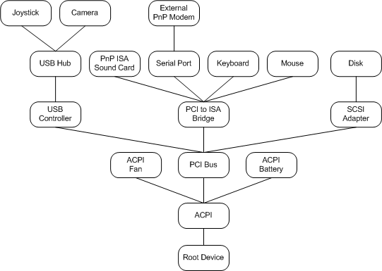

# Device Tree

## 

The PnP manager maintains a device tree that keeps track of the devices in the system. The following figure shows the device tree for a sample system configuration.

The device tree contains information about the devices present on the system. The PnP manager builds this tree when the machine boots, using information from drivers and other components, and updates the tree as devices are added or removed.

Each node of the device tree is called a device node, or [*devnode*](https://msdn.microsoft.com/library/windows/hardware/ff556277#wdkgloss-devnode). A devnode consists of the [*device objects*](https://msdn.microsoft.com/library/windows/hardware/ff556277#wdkgloss-device-object) for the device's drivers, plus internal information maintained by the system. Therefore, there is a devnode for each [*device stack*](https://msdn.microsoft.com/library/windows/hardware/ff556277#wdkgloss-device-stack).

The PnP manager asks a bus driver for a list of its child devices using an [**IRP\_MN\_QUERY\_DEVICE\_RELATIONS**](https://msdn.microsoft.com/library/windows/hardware/ff551670) request. The bus driver determines its list of children according to its bus protocol. For example, the [Windows ACPI driver](acpi-driver.md), Acpi.sys, looks in the ACPI namespace, the PCI driver queries PCI configuration space, and a USB hub driver follows the USB bus protocol.

The device tree is hierarchical, with devices on a bus represented as "children" of the bus adapter, controller or other *bus device*. (A bus device is any device to which other physical, logical, or virtual devices can be attached.) You can see the hierarchy of devices in the device tree using Device Manager and choosing the view option that allows you to view devices by connection.

The hierarchy of the device tree reflects the structure in which the devices are attached in the machine. The PnP manager uses this hierarchy as it manages the devices. For example, if a user requests to unplug the USB controller from the machine represented by the previous figure, the PnP manager determines from the device tree that this action would result in three other devices also being unplugged (the USB hub, the joystick, and the camera). When the PnP manager queries the drivers for the USB controller to determine if it is safe to remove the controller, it also queries the drivers of the controller's descendants (the hub, joystick, and camera).

The device tree is dynamic. As devices are added to, and removed from the machine, the PnP manager (together with drivers) maintains a current picture of the devices on the system.

There are other relationships between devices on the machine besides the hierarchical relationships represented in the device tree. These include *removal relations* and *ejection relations*. See the reference page for [**IRP\_MN\_QUERY\_DEVICE\_RELATIONS**](https://msdn.microsoft.com/library/windows/hardware/ff551670) for more information.

You cannot make any assumptions about the order in which the device tree is built, except that a bus device is configured before any of its child devices. For example, you should not assume that one device on a bus is configured before another device on the bus.

 

 

--------------------
[Send comments about this topic to Microsoft](mailto:wsddocfb@microsoft.com?subject=Documentation%20feedback%20%5Bkernel\kernel%5D:%20Device%20Tree%20%20RELEASE:%20%286/14/2017%29&body=%0A%0APRIVACY%20STATEMENT%0A%0AWe%20use%20your%20feedback%20to%20improve%20the%20documentation.%20We%20don't%20use%20your%20email%20address%20for%20any%20other%20purpose,%20and%20we'll%20remove%20your%20email%20address%20from%20our%20system%20after%20the%20issue%20that%20you're%20reporting%20is%20fixed.%20While%20we're%20working%20to%20fix%20this%20issue,%20we%20might%20send%20you%20an%20email%20message%20to%20ask%20for%20more%20info.%20Later,%20we%20might%20also%20send%20you%20an%20email%20message%20to%20let%20you%20know%20that%20we've%20addressed%20your%20feedback.%0A%0AFor%20more%20info%20about%20Microsoft's%20privacy%20policy,%20see%20http://privacy.microsoft.com/default.aspx. "Send comments about this topic to Microsoft")

