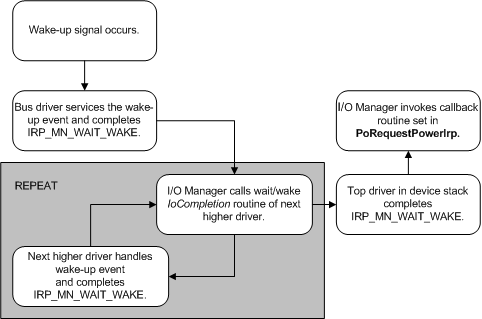

# Overview of Wait/Wake IRP Completion

## 

A wait/wake IRP completes when a wake-up signal arrives. The wake-up signal is device-specific but is generally a normal service event for the device. For example, an incoming ring might cause a sleeping modem to awaken.

The following figure shows the steps in completing a wait/wake IRP.

When the signal occurs, control re-enters the bus driver at the point where the bus detects that the device has awakened. The bus driver services the event as required and calls [**IoCompleteRequest**](https://msdn.microsoft.com/library/windows/hardware/ff548343) to complete the [**IRP\_MN\_WAIT\_WAKE**](https://msdn.microsoft.com/library/windows/hardware/ff551766) IRP for its PDO.

The I/O manager then calls the [*IoCompletion*](https://msdn.microsoft.com/library/windows/hardware/ff548354) routine set by the next-higher driver in the device stack. In the *IoCompletion* routine, that driver services the wake-up signal as necessary and calls **IoCompleteRequest** to complete the IRP. The I/O manager continues to call *IoCompletion* routines working back up the device stack until all drivers have completed the IRP.

In its *IoCompletion* routine, any driver that enumerates more than one child device (creates more than one PDO) and has received wait/wake requests from more than one such device must send itself a wait/wake IRP to re-arm itself for wait/wake on another child. For details, see [Understanding the Path of Wait/Wake IRPs through a Device Tree](understanding-the-path-of-wait-wake-irps-through-a-device-tree.md).

After calling *IoCompletion* routines set by drivers as they passed the IRP down the stack, the I/O manager invokes the callback routine set by the power policy owner when it requested the wait/wake IRP. In the callback routine, the policy owner should return its device to the working state and complete a pending wait/wake IRP for its child's PDO, if any.

Completing the child's IRP causes the I/O manager to call *IoCompletion* routines set by drivers in the child's device stack, and so on. Eventually, the policy owner that started the original wait/wake IRP on the devnode determines that its device asserted the wake-up signal, and all the pending wait/wake IRPs will be complete.

 

 

--------------------
[Send comments about this topic to Microsoft](mailto:wsddocfb@microsoft.com?subject=Documentation%20feedback%20%5Bkernel\kernel%5D:%20Overview%20of%20Wait/Wake%20IRP%20Completion%20%20RELEASE:%20%286/14/2017%29&body=%0A%0APRIVACY%20STATEMENT%0A%0AWe%20use%20your%20feedback%20to%20improve%20the%20documentation.%20We%20don't%20use%20your%20email%20address%20for%20any%20other%20purpose,%20and%20we'll%20remove%20your%20email%20address%20from%20our%20system%20after%20the%20issue%20that%20you're%20reporting%20is%20fixed.%20While%20we're%20working%20to%20fix%20this%20issue,%20we%20might%20send%20you%20an%20email%20message%20to%20ask%20for%20more%20info.%20Later,%20we%20might%20also%20send%20you%20an%20email%20message%20to%20let%20you%20know%20that%20we've%20addressed%20your%20feedback.%0A%0AFor%20more%20info%20about%20Microsoft's%20privacy%20policy,%20see%20http://privacy.microsoft.com/default.aspx. "Send comments about this topic to Microsoft")

