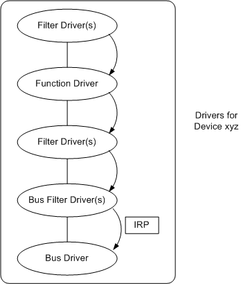

# Passing PnP IRPs Down the Device Stack

## 

The PnP manager uses IRPs to direct drivers to start, stop, and remove devices and to query drivers about their devices. All PnP IRPs have the major function code [**IRP\_MJ\_PNP**](https://msdn.microsoft.com/library/windows/hardware/ff550772), and all PnP drivers must provide a [*DispatchPnP*](https://msdn.microsoft.com/library/windows/hardware/ff543341) routine to service this function code. The PnP manager initializes **Irp-&gt;IoStatus.Status** to STATUS\_NOT\_SUPPORTED when it sends an IRP. For more information, see [DispatchPnP Routines](dispatchpnp-routines.md).

All drivers for a device must have the opportunity to respond to a PnP IRP unless a driver in the stack fails the IRP. (See the following figure.)

No single driver for a device can assume that it is the only driver that will respond to a PnP IRP. Consider, for example, a function driver that responds to an [**IRP\_MN\_QUERY\_CAPABILITIES**](https://msdn.microsoft.com/library/windows/hardware/ff551664) request and completes the IRP without passing it to the next-lower driver. None of the capabilities supported by lower drivers, such as a unique instance ID or power management capabilities supported by the parent bus driver, is reported.

A PnP IRP travels back up the device stack when the parent bus driver calls [**IoCompleteRequest**](https://msdn.microsoft.com/library/windows/hardware/ff548343) and the I/O manager calls any [*IoCompletion*](https://msdn.microsoft.com/library/windows/hardware/ff548354) routines registered by the function driver or filter drivers.

A function or filter driver must do the following when it receives a PnP IRP:

-   If the driver performs actions in response to the IRP:
    1.  Perform the appropriate actions.
    2.  Set **Irp-&gt;IoStatus.Status** to an appropriate status, such as STATUS\_SUCCESS. Set **Irp-&gt;IoStatus.Information**, if appropriate for the IRP.
    3.  Set up the next stack location with [**IoSkipCurrentIrpStackLocation**](https://msdn.microsoft.com/library/windows/hardware/ff550355) or [**IoCopyCurrentIrpStackLocationToNext**](https://msdn.microsoft.com/library/windows/hardware/ff548387). Call the latter routine if you set an *IoCompletion* routine.
    4.  Set an *IoCompletion* routine, if necessary.
    5.  Do not complete the IRP. (Do not call **IoCompleteRequest**.) The parent bus driver will complete the IRP.
-   If the driver does not perform actions for this IRP, it simply prepares to pass the IRP to the next driver:
    1.  Call **IoSkipCurrentIrpStackLocation** to remove its stack location from the IRP.
    2.  Do not set any fields in **Irp-&gt;IoStatus**.
    3.  Do not set an *IoCompletion* routine.
    4.  Do not complete the IRP. (Do not call **IoCompleteRequest**.) The parent bus driver will complete the IRP.

If a function or filter driver did not fail the IRP, it passes the IRP to the next-lower driver with [**IoCallDriver**](https://msdn.microsoft.com/library/windows/hardware/ff548336). A driver has a pointer to the next-lower driver; that pointer was returned from the [**IoAttachDeviceToDeviceStack**](https://msdn.microsoft.com/library/windows/hardware/ff548300) call in the higher driver's [*AddDevice*](https://msdn.microsoft.com/library/windows/hardware/ff540521) routine.

The parent bus driver completes the IRP after performing any tasks to respond to the IRP. After the bus driver calls **IoCompleteRequest**, the I/O manager calls any *IoCompletion* routines registered by the function or filter drivers for the device.

 

 

--------------------
[Send comments about this topic to Microsoft](mailto:wsddocfb@microsoft.com?subject=Documentation%20feedback%20%5Bkernel\kernel%5D:%20Passing%20PnP%20IRPs%20Down%20the%20Device%20Stack%20%20RELEASE:%20%286/14/2017%29&body=%0A%0APRIVACY%20STATEMENT%0A%0AWe%20use%20your%20feedback%20to%20improve%20the%20documentation.%20We%20don't%20use%20your%20email%20address%20for%20any%20other%20purpose,%20and%20we'll%20remove%20your%20email%20address%20from%20our%20system%20after%20the%20issue%20that%20you're%20reporting%20is%20fixed.%20While%20we're%20working%20to%20fix%20this%20issue,%20we%20might%20send%20you%20an%20email%20message%20to%20ask%20for%20more%20info.%20Later,%20we%20might%20also%20send%20you%20an%20email%20message%20to%20let%20you%20know%20that%20we've%20addressed%20your%20feedback.%0A%0AFor%20more%20info%20about%20Microsoft's%20privacy%20policy,%20see%20http://privacy.microsoft.com/default.aspx. "Send comments about this topic to Microsoft")

