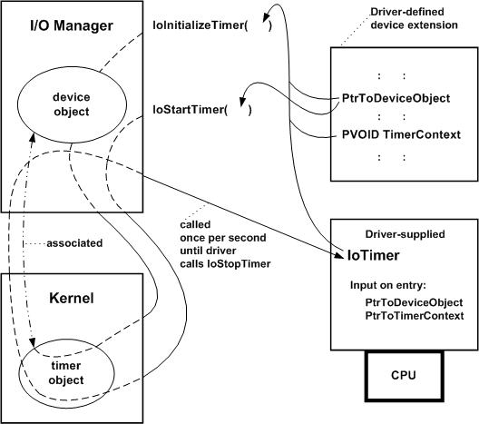

# Registering and Enabling an IoTimer Routine

## 

Any driver can register an [*IoTimer*](https://msdn.microsoft.com/library/windows/hardware/ff550381) routine, after it creates one or more device objects, by calling [**IoInitializeTimer**](https://msdn.microsoft.com/library/windows/hardware/ff549344). The driver can then start the timer by calling [**IoStartTimer**](https://msdn.microsoft.com/library/windows/hardware/ff550373). The following figure illustrates these calls.

After calling [**IoCreateDevice**](https://msdn.microsoft.com/library/windows/hardware/ff548397) to create device objects, a driver can call **IoInitializeTimer** with the entry point of its *IoTimer* routine, along with pointers to a driver-created device object and a context area in which the driver maintains whatever context its *IoTimer* routine uses. The I/O manager associates the device object with a kernel-allocated timer object and sets up the timer object to time out every second.

After the driver calls **IoStartTimer**, its *IoTimer* routine is called once per second until the driver calls [**IoStopTimer**](https://msdn.microsoft.com/library/windows/hardware/ff550377). A driver can reenable calls to its *IoTimer* routine with **IoStartTimer**. (Frequently, when a driver calls **IoStartTimer**, it supplies the device object pointer obtained from the I/O stack location of the current IRP.)

On entry, the *IoTimer* routine is passed the device object pointer*,* along with the context pointer that the driver supplied when it called **IoInitializeTimer**.

Drivers must not call **IoStopTimer** from within an *IoTimer* routine.

The I/O manager unregisters the timer routine for a specified device object and frees its associated context when the driver calls [**IoDeleteDevice**](https://msdn.microsoft.com/library/windows/hardware/ff549083).

 

 

--------------------
[Send comments about this topic to Microsoft](mailto:wsddocfb@microsoft.com?subject=Documentation%20feedback%20%5Bkernel\kernel%5D:%20Registering%20and%20Enabling%20an%20IoTimer%20Routine%20%20RELEASE:%20%286/14/2017%29&body=%0A%0APRIVACY%20STATEMENT%0A%0AWe%20use%20your%20feedback%20to%20improve%20the%20documentation.%20We%20don't%20use%20your%20email%20address%20for%20any%20other%20purpose,%20and%20we'll%20remove%20your%20email%20address%20from%20our%20system%20after%20the%20issue%20that%20you're%20reporting%20is%20fixed.%20While%20we're%20working%20to%20fix%20this%20issue,%20we%20might%20send%20you%20an%20email%20message%20to%20ask%20for%20more%20info.%20Later,%20we%20might%20also%20send%20you%20an%20email%20message%20to%20let%20you%20know%20that%20we've%20addressed%20your%20feedback.%0A%0AFor%20more%20info%20about%20Microsoft's%20privacy%20policy,%20see%20http://privacy.microsoft.com/default.aspx. "Send comments about this topic to Microsoft")

