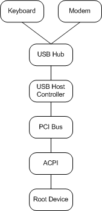
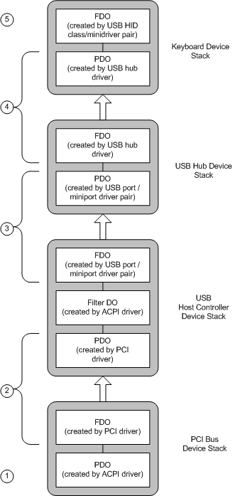
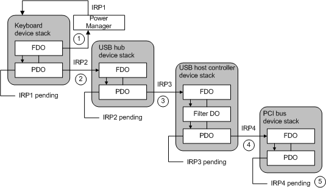

# Understanding the Path of Wait/Wake IRPs through a Device Tree

## 

Within a single device stack, the power policy owner sends a wait/wake IRP and all drivers handle the wait/wake IRP, as outlined in [Overview of Wait/Wake Operation](overview-of-wait-wake-operation.md) and detailed in [Sending a Wait/Wake IRP](sending-a-wait-wake-irp.md) and [Receiving a Wait/Wake IRP](receiving-a-wait-wake-irp.md), respectively.

Within a branch of the [device tree](device-tree.md) (which comprises a leaf devnode and the devnodes of its parents, grandparents, and so forth), drivers must cooperate to ensure that a wait/wake IRP reaches a driver that can enable all the necessary hardware for wake-up.

On ACPI computers, ACPI is responsible for enabling the system-specific General Purpose Event (GPE) register associated with the wake-up signal from each leaf device. Consequently, drivers must request and forward wait/wake IRPs until one reaches either an ACPI filter driver (inserted in the device stack at start-up) or the underlying [Windows ACPI driver](acpi-driver.md), Acpi.sys. In response, ACPI enables the register, holds the IRP pending until the signal arrives, and then completes the IRP. Because ACPI can respond to the wake-up signal, it does not forward the IRP to a lower driver.

ACPI filter drivers, like the underlying ACPI driver itself, are transparent to other drivers. To provide maximum flexibility in hardware design, the exact position of an ACPI filter driver in any device stack is device- and system-specific. In designing a driver, you cannot make any assumptions about the presence or position of an ACPI filter in the device stack.

Keep in mind that drivers that enumerate children create a PDO for each child device and an FDO for the parent device. The driver thus acts as the bus driver for a child device and the function driver/policy owner for a parent device. Therefore, whenever a bus driver receives a wait/wake IRP for a child PDO, it should request another wait/wake IRP for its parent PDO.

### 

The following figure shows a sample configuration in which such a situation occurs.

In the sample configuration, the keyboard and modem are children of the USB hub, which in turn is a child of the USB host controller, which is enumerated by the PCI bus. The following figure shows the device stacks for the keyboard in the sample configuration.

As the previous figure shows, reading from the bottom up:

1.  The [Windows ACPI driver](acpi-driver.md), Acpi.sys, creates the PDO for PCI.

2.  The PCI driver creates the PCI FDO and the USB host controller PDO and owns policy for the PCI device stack.

3.  The USB host controller driver (a host port/miniport driver pair) creates the USB Host Controller FDO and the USB Hub PDO. It owns policy for the USB host controller device stack. Note that Acpi.sys creates a filter DO in this stack as well.

4.  The USB hub driver creates the USB Hub FDO and the keyboard PDO. This driver owns power policy for the USB hub device stack.

5.  The function driver for the keyboard is the USB HID class driver/minidriver pair. This driver creates the FDO for the keyboard and owns its power policy. Because the keyboard has no child devices, this driver creates no PDOs.

Note that each device stack might include additional optional filter DOs that are not shown.

To allow keyboard input to awaken the system, the policy owner for the keyboard requests an **IRP\_MN\_WAIT\_WAKE** for its PDO. That IRP sets off a chain of other wait/wake IRPs, as shown in the following figure.

When a bus driver receives an [**IRP\_MN\_WAIT\_WAKE**](https://msdn.microsoft.com/library/windows/hardware/ff551766) targeted to a PDO it created, it must request another **IRP\_MN\_WAIT\_WAKE** for the device stack for which it owns power policy and created an FDO.

As the previous figure shows:

1.  The keyboard driver calls [**PoRequestPowerIrp**](https://msdn.microsoft.com/library/windows/hardware/ff559734) to send a wait/wake IRP (IRP1) to its PDO.

    The power manager allocates the IRP and sends it through the I/O manager to the top of the device stack for the keyboard. Drivers set [*IoCompletion*](https://msdn.microsoft.com/library/windows/hardware/ff548354) routines and pass the IRP down the stack until it reaches the keyboard PDO. The USB hub driver, which acts as the bus driver for the keyboard, holds IRP1 pending.

2.  Because the USB hub driver cannot wake the system when the wake-up signal arrives, the USB hub driver must call **PoRequestPowerIrp** to request a wait/wake IRP (IRP2) for the USB hub device stack.

    The power manager sends this IRP to the top of the USB hub device stack. The drivers in this stack set *IoCompletion* routines and pass the IRP down to the USB host controller driver (which acts as the bus driver for the USB hub). The USB host controller driver holds IRP2 pending until the keyboard signals a wake event.

3.  Similarly, the USB host controller driver cannot wake the system, so the USB host controller driver calls **PoRequestPowerIrp** to send a wait/wake IRP (IRP3) to the USB host controller device stack.

    The power manager sends this IRP to the top of the USB host controller device stack, where drivers set *IoCompletion* routines and pass the IRP down to the PCI driver (which acts as the bus driver for the USB hub). The PCI driver holds IRP3 pending until the keyboard signals a wake event.

4.  The PCI driver cannot wake the system, so the PCI driver calls **PoRequestPowerIrp** to send a wait/wake IRP (IRP4) to the PCI device stack. Its parent is the root device, for which ACPI is the bus driver.

    The power manager sends the IRP to the top of the PCI bus device stack; its drivers set completion routines and pass the IRP down to the [Windows ACPI driver](acpi-driver.md), Acpi.sys.

5.  Acpi.sys can wake the system, so it does not send a wait/wake IRP to any other PDO. Acpi.sys holds IRP4 pending until a wake signal arrives.

When the keyboard asserts the wake-up signal, Acpi.sys intercepts it. ACPI, however, cannot determine that the keyboard asserted the signal, only that the signal came through the root device. Acpi.sys then completes IRP4, and the I/O manager calls *IoCompletion* routines traveling back up the PCI device stack. When IRP4 is complete and all *IoCompletion* routines have run, the PCI driver's callback routine is invoked. In its callback routine, the PCI driver determines that the signal came through the USB host controller. The PCI driver then completes IRP3. The same sequence occurs through the USB host controller stack and the USB hub stack, until the keyboard driver receives IRP1. At this point, the keyboard driver can service the wake-up event, as necessary.

Each time a driver sends a wait/wake IRP to a parent PDO, it must set a [*Cancel*](https://msdn.microsoft.com/library/windows/hardware/ff540742) routine for its own IRP. Setting a *Cancel* routine gives the driver an opportunity to cancel the new IRP if the IRP that triggered it is canceled. In the USB example, if the keyboard driver cancels its wait/wake IRP (thus disabling keyboard wake-up), the USB hub, USB host controller, and PCI drivers must cancel the IRPs that they sent as a consequence of the keyboard IRP. For more information, see [Cancel Routines for Wait/Wake IRPs](canceling-a-wait-wake-irp.md#ddk-cancel-routines-for-wait-wake-irps-kg).

Although a parent driver might enumerate more than one child that can be enabled for wait/wake, only one wait/wake IRP can be pending for a PDO. In such cases, the parent driver should make sure that it keeps a wait/wake IRP pending whenever any of its devices is enabled for wake-up. To do so, the driver increments an internal counter each time it receives a wait/wake IRP. Each time the driver completes a wait/wake IRP, it decrements the count and, if the resulting value is nonzero, sends another wait/wake IRP to its device stack.

For example, in the USB configuration shown previously in the [Sample USB Configuration](#sample-usb-configuration) figure, the USB hub enumerates two devices, a keyboard and a modem. When the USB hub driver receives a wait/wake IRP for the keyboard PDO, it increments a count of wait/wake IRPs before requesting an IRP for its own PDO. If the modem's policy owner later enables wake-up for the modem, the USB hub driver pends the new IRP for the modem PDO and increments its wait/wake reference count. However, because the USB hub PDO cannot have two simultaneously pending wait/wake IRPs, the USB hub driver does not request a new wait/wake IRP for the USB hub PDO.

When a wake-up signal arrives from either the keyboard or modem, the USB hub driver determines which device signaled, completes the corresponding IRP, and decrements its reference count. Because both devices were enabled for wake-up (and thus its reference count is nonzero), it must send its own device stack another wait/wake IRP to "rearm" its own PDO for wake-up. (The same is true of the USB host controller and PCI driver.)

A driver does not, however, send itself an IRP to reenable wait/wake on the same device on which a wake-up signal just arrived. Only the device power policy manager can do that. Reenabling wait/wake is not automatic.

 

 

--------------------
[Send comments about this topic to Microsoft](mailto:wsddocfb@microsoft.com?subject=Documentation%20feedback%20%5Bkernel\kernel%5D:%20Understanding%20the%20Path%20of%20Wait/Wake%20IRPs%20through%20a%20Device%20Tree%20%20RELEASE:%20%286/14/2017%29&body=%0A%0APRIVACY%20STATEMENT%0A%0AWe%20use%20your%20feedback%20to%20improve%20the%20documentation.%20We%20don't%20use%20your%20email%20address%20for%20any%20other%20purpose,%20and%20we'll%20remove%20your%20email%20address%20from%20our%20system%20after%20the%20issue%20that%20you're%20reporting%20is%20fixed.%20While%20we're%20working%20to%20fix%20this%20issue,%20we%20might%20send%20you%20an%20email%20message%20to%20ask%20for%20more%20info.%20Later,%20we%20might%20also%20send%20you%20an%20email%20message%20to%20let%20you%20know%20that%20we've%20addressed%20your%20feedback.%0A%0AFor%20more%20info%20about%20Microsoft's%20privacy%20policy,%20see%20http://privacy.microsoft.com/default.aspx. "Send comments about this topic to Microsoft")

