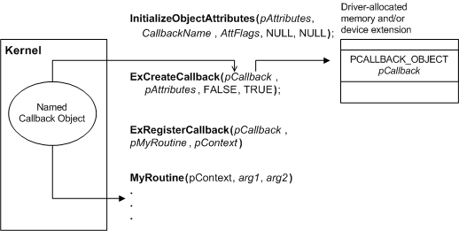

# Using a Driver-Defined Callback Object


## <a href="" id="ddk-using-a-driver-defined-callback-object-kg"></a>


To use a callback object defined by another driver, a driver opens the object, then registers a routine to be called when the callback is triggered, as shown in the following figure. The driver requesting notification must know the name of the callback object and must understand the semantics of the arguments passed to the callback routine.



Before it can open the object, the driver must call [**InitializeObjectAttributes**](https://msdn.microsoft.com/library/windows/hardware/ff547804) to create an attribute block, specifying the name of the object. After it has a pointer to an attribute block, it calls [**ExCreateCallback**](https://msdn.microsoft.com/library/windows/hardware/ff544560), passing the attribute pointer, a location in which to receive a handle to the callback, and **FALSE** for the *Create* parameter, indicating that it requires an existing callback object.

The driver can then call [**ExRegisterCallback**](https://msdn.microsoft.com/library/windows/hardware/ff545534) with the returned handle to register its callback routine.

The callback routine has the following prototype:

```
typedef VOID (*PCALLBACK_FUNCTION ) (
    IN PVOID CallbackContext,
    IN PVOID Argument1,
    IN PVOID Argument2
    );
```

The *CallbackContext* parameter is the context pointer to be passed to the callback routine each time it is called. Typically, this parameter is a pointer to a block of context data, which the caller should allocate from nonpaged pool if the routine can be called at DISPATCH\_LEVEL. The two arguments are defined by the component that created the callback. Typically, the arguments provide information about the conditions that triggered the callback.

When the creator of the callback triggers notification, the system calls the registered routine, passing a pointer to the context and the two arguments. Values for the arguments are supplied by the component that created the callback. The callback routine is called at the same IRQL at which the creating driver triggered notification, which is always IRQL &lt;= DISPATCH\_LEVEL.

In its callback routine, a driver can perform whatever tasks it requires for the current conditions.

When the driver no longer requires notification, it should call [**ExUnregisterCallback**](https://msdn.microsoft.com/library/windows/hardware/ff545649) to remove its routine from the list of registered callbacks and to remove its reference to the callback object.

 

 


--------------------
[Send comments about this topic to Microsoft](mailto:wsddocfb@microsoft.com?subject=Documentation%20feedback%20%5Bkernel\kernel%5D:%20Using%20a%20Driver-Defined%20Callback%20Object%20%20RELEASE:%20%286/14/2017%29&body=%0A%0APRIVACY%20STATEMENT%0A%0AWe%20use%20your%20feedback%20to%20improve%20the%20documentation.%20We%20don't%20use%20your%20email%20address%20for%20any%20other%20purpose,%20and%20we'll%20remove%20your%20email%20address%20from%20our%20system%20after%20the%20issue%20that%20you're%20reporting%20is%20fixed.%20While%20we're%20working%20to%20fix%20this%20issue,%20we%20might%20send%20you%20an%20email%20message%20to%20ask%20for%20more%20info.%20Later,%20we%20might%20also%20send%20you%20an%20email%20message%20to%20let%20you%20know%20that%20we've%20addressed%20your%20feedback.%0A%0AFor%20more%20info%20about%20Microsoft's%20privacy%20policy,%20see%20http://privacy.microsoft.com/default.aspx. "Send comments about this topic to Microsoft")


