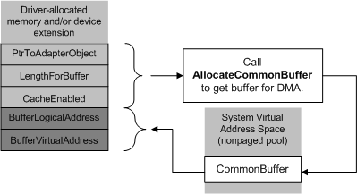

# Using Common-Buffer Bus-Master DMA

## 

As described in [Using Bus-Master DMA](using-bus-master-dma.md), some drivers for bus-master DMA devices use common-buffer DMA exclusively, and some use common-buffer DMA in combination with packet-based DMA.

Use common-buffer DMA economically. Setting up a common buffer can tie up some (or all, depending on the size of the requested buffer) of the map registers associated with the adapter object that represents the bus-master adapter.

Setting up common-buffer areas economically, such as by using **PAGE\_SIZE** chunks or a single allocation, leaves more map registers available for packet-based DMA operations. It also leaves more system memory free for other purposes, which produces better overall driver and system performance.

To set up a common buffer for bus-master DMA, a bus-master DMA device driver must call [**AllocateCommonBuffer**](https://msdn.microsoft.com/library/windows/hardware/ff540575) with the adapter object pointer returned by [**IoGetDmaAdapter**](https://msdn.microsoft.com/library/windows/hardware/ff549220). Typically, a driver makes this call from its [*DispatchPnP*](https://msdn.microsoft.com/library/windows/hardware/ff543341) routine for [**IRP\_MN\_START\_DEVICE**](https://msdn.microsoft.com/library/windows/hardware/ff551749) requests. A driver should allocate a common buffer only if it will use the buffer repeatedly for its DMA operations while the driver remains loaded. The following diagram illustrates such a call to **AllocateCommonBuffer**.

The requested size for the buffer, shown in the previous diagram as LengthForBuffer, determines how many map registers must be used to provide a virtual-to-logical mapping for the common buffer. Use the [**BYTES\_TO\_PAGES**](https://msdn.microsoft.com/library/windows/hardware/ff540709) macro to determine the maximum number of pages needed (**BYTES\_TO\_PAGES** (*LengthForBuffer*)). This value cannot be greater than the *NumberOfMapRegisters* returned by [**IoGetDmaAdapter**](https://msdn.microsoft.com/library/windows/hardware/ff549220).

In addition, the caller must supply the following:

-   A Boolean value that indicates whether caching should be enabled

-   A pointer to a driver-defined variable that will contain the device-accessible base *Logical Address* for the buffer (BufferLogicalAddress in the previous diagram) on return from **AllocateCommonBuffer**

If the call succeeds, **AllocateCommonBuffer** returns a driver-accessible base virtual address for the buffer (BufferVirtualAddress in the previous diagram), which the driver must save in its device extension, controller extension, or other driver-accessible resident storage area (nonpaged pool allocated by the driver).

**AllocateCommonBuffer** returns **NULL** if it cannot allocate memory for the buffer. If the returned base virtual address is **NULL**, the driver either must use the system's packet-based DMA support exclusively or the driver must fail the **IRP\_MN\_START\_DEVICE** request, returning STATUS\_INSUFFICIENT\_RESOURCES.

Otherwise, the driver can use the allocated common buffer as a driver- and adapter-accessible storage area for DMA transfers.

When the PnP manager sends an IRP that stops or removes the device, the driver must call [**FreeCommonBuffer**](https://msdn.microsoft.com/library/windows/hardware/ff546511) to release each common buffer it has allocated.

 

 

--------------------
[Send comments about this topic to Microsoft](mailto:wsddocfb@microsoft.com?subject=Documentation%20feedback%20%5Bkernel\kernel%5D:%20Using%20Common-Buffer%20Bus-Master%20DMA%20%20RELEASE:%20%286/14/2017%29&body=%0A%0APRIVACY%20STATEMENT%0A%0AWe%20use%20your%20feedback%20to%20improve%20the%20documentation.%20We%20don't%20use%20your%20email%20address%20for%20any%20other%20purpose,%20and%20we'll%20remove%20your%20email%20address%20from%20our%20system%20after%20the%20issue%20that%20you're%20reporting%20is%20fixed.%20While%20we're%20working%20to%20fix%20this%20issue,%20we%20might%20send%20you%20an%20email%20message%20to%20ask%20for%20more%20info.%20Later,%20we%20might%20also%20send%20you%20an%20email%20message%20to%20let%20you%20know%20that%20we've%20addressed%20your%20feedback.%0A%0AFor%20more%20info%20about%20Microsoft's%20privacy%20policy,%20see%20http://privacy.microsoft.com/default.aspx. "Send comments about this topic to Microsoft")

