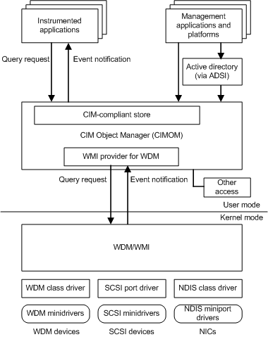

# WMI Architecture

## 

To support WMI, your driver registers as a WMI provider. A WMI provider is a Win32 dynamic-link library (DLL) that handles WMI requests and supplies WMI instrumentation data. See [Registering as a WMI Data Provider](registering-as-a-wmi-data-provider.md) to learn how a driver registers as a WMI provider.

After your driver is registered as a WMI provider, WMI consumers then request data or invoke methods exposed by providers.

Query requests travel from user-mode consumers down to the WMI kernel-mode service, which in turn sends IRP requests to your driver.

For instance, when a WMI client requests a given data block, the WMI kernel component sends a query request to the driver to retrieve or set data. The driver handles WMI requests as described in [Handling WMI Requests](handling-wmi-requests.md).

The following figure shows this data flow:

 

 

--------------------
[Send comments about this topic to Microsoft](mailto:wsddocfb@microsoft.com?subject=Documentation%20feedback%20%5Bkernel\kernel%5D:%20WMI%20Architecture%20%20RELEASE:%20%286/14/2017%29&body=%0A%0APRIVACY%20STATEMENT%0A%0AWe%20use%20your%20feedback%20to%20improve%20the%20documentation.%20We%20don't%20use%20your%20email%20address%20for%20any%20other%20purpose,%20and%20we'll%20remove%20your%20email%20address%20from%20our%20system%20after%20the%20issue%20that%20you're%20reporting%20is%20fixed.%20While%20we're%20working%20to%20fix%20this%20issue,%20we%20might%20send%20you%20an%20email%20message%20to%20ask%20for%20more%20info.%20Later,%20we%20might%20also%20send%20you%20an%20email%20message%20to%20let%20you%20know%20that%20we've%20addressed%20your%20feedback.%0A%0AFor%20more%20info%20about%20Microsoft's%20privacy%20policy,%20see%20http://privacy.microsoft.com/default.aspx. "Send comments about this topic to Microsoft")

