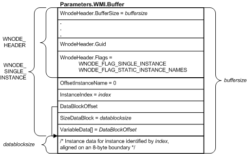
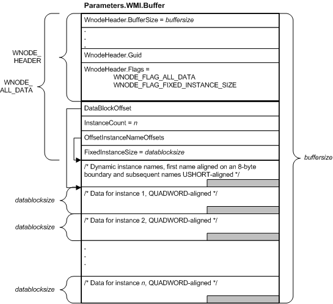

# WMI WNODE\_XXX Structures

## 

WMI uses a set of standard data structures called **WNODE\_*XXX*** to pass data between user-mode data consumers and kernel-mode data providers such as drivers. If a driver handles WMI requests by calling [**WmiSystemControl**](https://msdn.microsoft.com/library/windows/hardware/ff565834), the driver is not required to read or write **WNODE\_*XXX*** structures. Otherwise, the driver must interpret the input **WNODE\_*XXX*** at **Parameters.WMI.Buffer** and/or write an output **WNODE\_*XXX*** to that location.

The following table lists WMI IRPs and their corresponding **WNODE\_*XXX*** structures.

<table>
<colgroup>
<col width="50%" />
<col width="50%" />
</colgroup>
<thead>
<tr class="header">
<th>WMI IRP</th>
<th>Related WNODE_XXX Structure</th>
</tr>
</thead>
<tbody>
<tr class="odd">
<td>
[<strong>IRP_MN_CHANGE_SINGLE_INSTANCE</strong>](https://msdn.microsoft.com/library/windows/hardware/ff550831)
</td>
<td>
[<strong>WNODE_SINGLE_INSTANCE</strong>](https://msdn.microsoft.com/library/windows/hardware/ff566377)
</td>
</tr>
<tr class="even">
<td>
[<strong>IRP_MN_CHANGE_SINGLE_ITEM</strong>](https://msdn.microsoft.com/library/windows/hardware/ff550836)
</td>
<td>
[<strong>WNODE_SINGLE_ITEM</strong>](https://msdn.microsoft.com/library/windows/hardware/ff566378)
</td>
</tr>
<tr class="odd">
<td>
[<strong>IRP_MN_EXECUTE_METHOD</strong>](https://msdn.microsoft.com/library/windows/hardware/ff550868)
</td>
<td>
[<strong>WNODE_METHOD_ITEM</strong>](https://msdn.microsoft.com/library/windows/hardware/ff566376)
</td>
</tr>
<tr class="even">
<td>
[<strong>IRP_MN_QUERY_ALL_DATA</strong>](https://msdn.microsoft.com/library/windows/hardware/ff551650)
</td>
<td>
[<strong>WNODE_ALL_DATA</strong>](https://msdn.microsoft.com/library/windows/hardware/ff566372)
</td>
</tr>
<tr class="odd">
<td>
[<strong>IRP_MN_QUERY_SINGLE_INSTANCE</strong>](https://msdn.microsoft.com/library/windows/hardware/ff551718)
</td>
<td>
[<strong>WNODE_SINGLE_INSTANCE</strong>](https://msdn.microsoft.com/library/windows/hardware/ff566377)
</td>
</tr>
</tbody>
</table>

 

Two additional **WNODE\_*XXX*** structures, [**WNODE\_EVENT\_ITEM**](https://msdn.microsoft.com/library/windows/hardware/ff566373) and [**WNODE\_EVENT\_REFERENCE**](https://msdn.microsoft.com/library/windows/hardware/ff566374), are used to send notifications of enabled events. A driver that registers event blocks will, if an event is enabled and the event occurs, send notification of the event to WMI by calling [**IoWMIWriteEvent**](https://msdn.microsoft.com/library/windows/hardware/ff550520) and passing a **WNODE\_EVENT\_*XXX*** structure. For information about sending WMI events, see [Sending WMI Events](sending-wmi-events.md).

Each **WNODE\_*XXX*** structure consists of the following:

-   An embedded [**WNODE\_HEADER**](https://msdn.microsoft.com/library/windows/hardware/ff566375) structure that contains information common to all **WNODE\_*XXX*** including the size of the buffer, the GUID that represents the data block, and flags that indicate the type of **WNODE\_*XXX*** structure, whether it uses static or dynamic instance names, and other characteristics of the block.

-   The fixed members of the particular **WNODE\_*XXX*** structure, such as offsets to instance names and data.

A **WNODE\_*XXX*** structure in an IRP buffer (**Parameters.WMI.Buffer**) is typically followed by variable data related to the request, such as dynamic instance names, static instance name strings, input for or output from a method, or data for one or more instances of a data block. The size of the buffer must therefore exceed **sizeof(WNODE\_*XXX*)** by the amount of variable data involved.

Note that WMI does not perform type-checking on variable data supplied by a driver. The driver must align output data on an appropriate boundary in the output buffer so that a data consumer can parse the data correctly. In particular, each instance must start on an 8-byte boundary and each of its items must be aligned on a natural boundary according to the data block schema previously registered by the driver. Dynamic instance names can be aligned on a 2-byte boundary.

The following figure shows a block diagram of an IRP buffer containing a [**WNODE\_SINGLE\_INSTANCE**](https://msdn.microsoft.com/library/windows/hardware/ff566377) structure that a driver might return in response to an [**IRP\_MN\_QUERY\_SINGLE\_INSTANCE**](https://msdn.microsoft.com/library/windows/hardware/ff551718) request.

Starting at the top of the previous figure:

-   The [**WNODE\_HEADER**](https://msdn.microsoft.com/library/windows/hardware/ff566375) structure at the beginning of the [**WNODE\_SINGLE\_INSTANCE**](https://msdn.microsoft.com/library/windows/hardware/ff566377) is contained in a **WnodeHeader** member. WMI fills in all members of the **WNODE\_HEADER** before sending the request. In the **WNODE\_HEADER**:

    -   **WnodeHeader.Buffersize** indicates the size of the **WNODE\_SINGLE\_INSTANCE**, including data that follows the fixed members of the structure. (The value of **WnodeHeader.Buffersize** is typically less than **Parameters.WMI.Buffersize**, which indicates the size of the buffer allocated by WMI to receive output from the driver.)
    -   **WnodeHeader.Guid** contains the GUID that identifies the data block.
    -   In this example, **WnodeHeader.Flags** indicates that this structure is a **WNODE\_SINGLE\_INSTANCE** and that the data block uses static instance names.
-   Because the data block uses static instance names, WMI sets **InstanceIndex** to the index of the instance in the list of static instance names passed by the driver when it registered the block. **OffsetInstanceNames** is not used.

-   WMI sets **DataBlockOffset** to indicate the offset from the beginning of the buffer to the first byte of instance data. (The driver must not change this value) Again because the data block uses static instance names, this offset indicates the same location as **VariableData**. If the data block used dynamic instance names, the instance names would start at **VariableData** and **DataBlockOffset** would specify a greater offset into the buffer.

-   The driver sets **SizeDataBlock** to the number of bytes of instance data being returned.

-   At **VariableData** (after instance name data, if present), the driver writes instance data for the requested instance in the output buffer.

A driver reads and writes [**WNODE\_METHOD\_ITEM**](https://msdn.microsoft.com/library/windows/hardware/ff566376) and [**WNODE\_SINGLE\_ITEM**](https://msdn.microsoft.com/library/windows/hardware/ff566378) structures in much the same way as **WNODE\_SINGLE\_INSTANCE**. These structures resemble each other in that each has the fixed members **OffsetInstanceName**, **InstanceIndex**, **DataBlockOffset**, **SizeDataBlock** (or, in the case of **WNODE\_SINGLE\_ITEM**, **SizeDataItem**) and **VariableData**. **WNODE\_METHOD\_ITEM** includes a **MethodId** and **WNODE\_SINGLE\_ITEM** includes an **ItemId** which **WNODE\_SINGLE\_INSTANCE** lacks.

[**WNODE\_ALL\_DATA**](https://msdn.microsoft.com/library/windows/hardware/ff566372) differs from the preceding structures in that it is used to pass multiple instances of a data block, possibly including dynamic instance names and possibly of different sizes.

The following figure shows a block diagram of an IRP buffer containing a **WNODE\_ALL\_DATA** that a driver might return in response to an [**IRP\_MN\_QUERY\_ALL\_DATA**](https://msdn.microsoft.com/library/windows/hardware/ff551650) request.

Starting at the top of the previous figure:

-   As described in the previous figure, the [**WNODE\_HEADER**](https://msdn.microsoft.com/library/windows/hardware/ff566375) structure at the beginning of the [**WNODE\_ALL\_DATA**](https://msdn.microsoft.com/library/windows/hardware/ff566372) is contained in a **WnodeHeader** member. **WnodeHeader.Buffersize** and **WnodeHeader.Guid** indicate the size of the **WNODE\_ALL\_DATA** and the GUID of the data block, respectively.

    In this example, WMI sets **WnodeHeader.Flags** to indicate that this structure is a **WNODE\_ALL\_DATA** and that the data block was registered with dynamic instance names (that is, WMI clears WNODE\_FLAG\_STATIC\_INSTANCE\_NAMES and WNODE\_FLAG\_PDO\_INSTANCE\_NAMES). On output, the driver sets WNODE\_FLAG\_FIXED\_INSTANCE\_SIZE to indicate that all of the instances are the same size.

-   WMI sets **DataBlockOffset** to indicate the offset from the beginning of the buffer to the first byte of instance data. (The driver must not change this value). In this example, instance data follows the instance names at **OffsetInstanceNameOffsets**.

-   The driver sets **InstanceCount** to indicate the number of instances being returned.

-   **WNODE\_*XXX*** for data blocks that use dynamic instance names always contain the instance name strings. Because this example uses dynamic instance names, **OffsetInstanceNameOffsets** indicates the offset from the beginning of the buffer to an array of offsets to dynamic instance names in the buffer.

-   **FixedInstanceSize** indicates the number of bytes of data in each instance being returned by the driver. If instances of this data block were to vary in size, the driver would clear WNODE\_FLAG\_FIXED\_INSTANCE\_SIZE in **WnodeHeader.Flags** and set **OffsetInstanceDataAndLength** to an array of **OFFSETINSTANCEDATAANDLENGTH** structures, each specifying an offset to the data for one instance and the number of bytes in that instance instead of setting **FixedInstanceSize**.

For more information about **WNODE\_*XXX*** structures, see [System Structures](https://msdn.microsoft.com/library/windows/hardware/ff564540).

 

 

