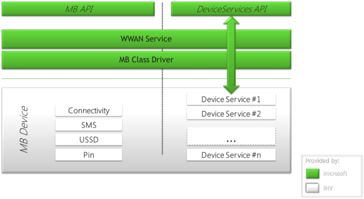

# Device Services Extension API

Windows-compliant mobile broadband devices project each supported feature as a device service. Examples of services are IP Connectivity (ability to connect to or disconnect from a mobile broadband network), Phonebook, SIM Toolkit, SMS, and USSD. Each device service has a corresponding GUID. All control messages and non-IP packets that are exchanged between the mobile broadband generic driver and the device carry the GUID to identify the service that is associated with the request. Command identifiers (CIDs) and status indication codes are defined under a service’s GUID namespace. For example, Phonebook and SIM Toolkit might both share the same CID code, but they are distinguished by the device service GUID that is exchanged in the request.

Any device services that are not natively implemented by the Windows wireless platform can be accessed by the Device Services Extension API. This API provides a direct pipe for the independent hardware vendor (IHV) software to access functionality on the device. This pipe provides a conduit through the WWAN service and mobile broadband generic driver to the device, as shown in the following diagram:

The Windows wireless platform supports APIs for the following app functions:

-   Enumerate device services

-   Open/close device services

-   Send control commands to a specific device service

-   Send data to (or receive data from) a specific device service

-   Register for “unsolicited” device events from a specific device service

## Related topics

[List of mobile broadband Windows Runtime APIs](list-of-mobile-broadband-windows-runtime-apis.md)

 

 

[Send comments about this topic to Microsoft](mailto:wsddocfb@microsoft.com?subject=Documentation%20feedback%20%5Bp_mb\p_mb%5D:%20Device%20Services%20Extension%20API%20%20RELEASE:%20%281/18/2017%29&body=%0A%0APRIVACY%20STATEMENT%0A%0AWe%20use%20your%20feedback%20to%20improve%20the%20documentation.%20We%20don't%20use%20your%20email%20address%20for%20any%20other%20purpose,%20and%20we'll%20remove%20your%20email%20address%20from%20our%20system%20after%20the%20issue%20that%20you're%20reporting%20is%20fixed.%20While%20we're%20working%20to%20fix%20this%20issue,%20we%20might%20send%20you%20an%20email%20message%20to%20ask%20for%20more%20info.%20Later,%20we%20might%20also%20send%20you%20an%20email%20message%20to%20let%20you%20know%20that%20we've%20addressed%20your%20feedback.%0A%0AFor%20more%20info%20about%20Microsoft's%20privacy%20policy,%20see%20http://privacy.microsoft.com/default.aspx. "Send comments about this topic to Microsoft")

