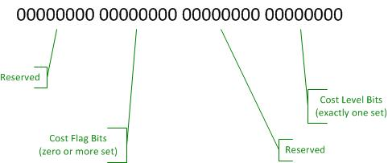

# Network cost information element

To communicate the cost of the Wi-Fi network to clients, Microsoft has defined a vendor extension to the 802.11 protocol. This extension is the Network Cost IE.

**Note**  
The 802.11 protocol allows vendor-defined information elements (IEs), and requires clients that do not understand a particular IE to ignore it and continue processing the remaining IEs. This minimizes the compatibility risk of adding a new IE to products that interact with existing clients of other operating system types.

 

The following table shows the Network Cost IE format:

<table>
<colgroup>
<col width="25%" />
<col width="25%" />
<col width="25%" />
<col width="25%" />
</colgroup>
<thead>
<tr class="header">
<th>Field name</th>
<th>Size (octets)</th>
<th>Value</th>
<th>Description</th>
</tr>
</thead>
<tbody>
<tr class="odd">
<td>
Attribute ID
</td>
<td>
1
</td>
<td>
0xDD
</td>
<td>
Type (vendor extension)
</td>
</tr>
<tr class="even">
<td>
Length
</td>
<td>
1
</td>
<td>
0x08
</td>
<td>
Length of the following fields
</td>
</tr>
<tr class="odd">
<td>
Organizationally Unique Identifier (OUI)
</td>
<td>
3
</td>
<td>
0x00, 0x50, 0xF2
</td>
<td>
Vendor (Microsoft)
</td>
</tr>
<tr class="even">
<td>
OUI Type
</td>
<td>
1
</td>
<td>
0X11
</td>
<td>
OUI type (network cost)
</td>
</tr>
<tr class="odd">
<td>
Cost attribute (Required)
</td>
<td>
4
</td>
<td>
Variable
</td>
<td>
DWORD, little endian byte order
</td>
</tr>
</tbody>
</table>

 

The following figure shows the format of the cost attribute field:

The following table shows the possible cost level bits (exactly one is required):

<table>
<colgroup>
<col width="33%" />
<col width="33%" />
<col width="33%" />
</colgroup>
<thead>
<tr class="header">
<th>Value</th>
<th>Name</th>
<th>Description</th>
</tr>
</thead>
<tbody>
<tr class="odd">
<td>
0x01
</td>
<td>
Unrestricted
</td>
<td>
No incremental cost applies for transferring data on this connection.
</td>
</tr>
<tr class="even">
<td>
0x02
</td>
<td>
Fixed
</td>
<td>
Data transfer is metered and counts against a data limit. No difference in cost applies within this limit.
</td>
</tr>
<tr class="odd">
<td>
0x04
</td>
<td>
Variable
</td>
<td>
Incremental cost applies for all usage on this link.
</td>
</tr>
</tbody>
</table>

 

The following tables shows the possible cost flag bits:

<table>
<colgroup>
<col width="33%" />
<col width="33%" />
<col width="33%" />
</colgroup>
<thead>
<tr class="header">
<th>Value</th>
<th>Name</th>
<th>Description</th>
</tr>
</thead>
<tbody>
<tr class="odd">
<td>
0x01 00 00
</td>
<td>
Over Data Limit
</td>
<td>
Usage has exceeded the data limit and different network costs or conditions apply.
</td>
</tr>
<tr class="even">
<td>
0x02 00 00
</td>
<td>
Congested
</td>
<td>
The network operator is experiencing or expecting heavy load and requests reduced activity where possible.
</td>
</tr>
<tr class="odd">
<td>
0x04 00 00
</td>
<td>
Roaming
</td>
<td>
The connection is roaming outside the provider’s home network or affiliates.
</td>
</tr>
<tr class="even">
<td>
0x08 00 00
</td>
<td>
Approaching Data Limit
</td>
<td>
Usage is near the data limit; different network costs or conditions may apply soon.
</td>
</tr>
</tbody>
</table>

 

The following table shows some sample cost attribute values:

<table>
<colgroup>
<col width="33%" />
<col width="33%" />
<col width="33%" />
</colgroup>
<thead>
<tr class="header">
<th>Value</th>
<th>Name</th>
<th>Description</th>
</tr>
</thead>
<tbody>
<tr class="odd">
<td>
Default WLAN
</td>
<td>
0x00 00 00 01
</td>
<td>
Unrestricted connection; standard WLAN backed by fixed broadband.
</td>
</tr>
<tr class="even">
<td>
Portable Hotspot Default
</td>
<td>
0x00 00 00 02
</td>
<td>
Metered network; limit unknown or not yet reached; matches Windows default for mobile broadband connections.
</td>
</tr>
<tr class="odd">
<td>
Over Limit / Throttled
</td>
<td>
0x00 01 00 01
</td>
<td>
User has exceeded data limit; speed is reduced, but no further usage limitation applies.
</td>
</tr>
<tr class="even">
<td>
Over Limit / Charges
</td>
<td>
0x00 01 00 04
</td>
<td>
User has exceeded data limit; additional usage incurs incremental charges.
</td>
</tr>
<tr class="odd">
<td>
Portable Hotspot / Roaming
</td>
<td>
0x00 04 00 04
</td>
<td>
Connection is roaming; incremental charges apply due to network state.
</td>
</tr>
</tbody>
</table>

 

## Add network cost support to your device

1.  Add the IE to your device’s WLAN beacon and probe response, which is fixed to the **Portable Hotspot Default** value shown in the table with the sample cost attribute values. Verify that a Windows 8, Windows 8.1, or Windows 10 computer that connects to this network automatically selects the **Reduce network usage** option for this network.

2.  When roaming, replace the default value with the **Portable Hotspot / Roaming** value that is listed in the table with the sample cost attribute values.

3.  Optionally, work with your partner carriers to determine cases where other values may be appropriate, such as the following:

    -   Unrestricted while on certain bearers (LTE, HSPA+, etc.),

    -   Defined channel to detect over-limit states.

    -   Operator-defined behavior when past data limit.

4.  Optionally, if your device can use Wi-Fi as a second-hop network, check for this IE on the network to which you connect and relay its value (or its absence) to your own SSID. If none is present, use the **Default WLAN** value that is listed in the table with the sample cost attribute values.

## Related topics

[Communication channels](communication-channels.md)

 

 

[Send comments about this topic to Microsoft](mailto:wsddocfb@microsoft.com?subject=Documentation%20feedback%20%5Bp_mb\p_mb%5D:%20Network%20cost%20information%20element%20%20RELEASE:%20%281/18/2017%29&body=%0A%0APRIVACY%20STATEMENT%0A%0AWe%20use%20your%20feedback%20to%20improve%20the%20documentation.%20We%20don't%20use%20your%20email%20address%20for%20any%20other%20purpose,%20and%20we'll%20remove%20your%20email%20address%20from%20our%20system%20after%20the%20issue%20that%20you're%20reporting%20is%20fixed.%20While%20we're%20working%20to%20fix%20this%20issue,%20we%20might%20send%20you%20an%20email%20message%20to%20ask%20for%20more%20info.%20Later,%20we%20might%20also%20send%20you%20an%20email%20message%20to%20let%20you%20know%20that%20we've%20addressed%20your%20feedback.%0A%0AFor%20more%20info%20about%20Microsoft's%20privacy%20policy,%20see%20http://privacy.microsoft.com/default.aspx. "Send comments about this topic to Microsoft")

