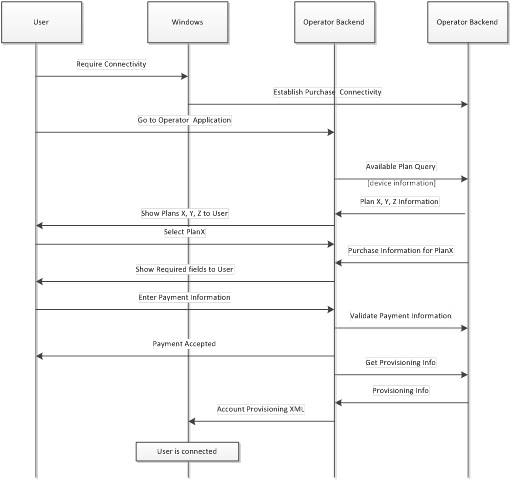

# Plan purchase

A simple and intuitive on-device plan purchase that is integrated with the Windows experience can simplify the subscription acquisition process and let users purchase the subscription when they need the mobile connectivity.

Developing a plan purchase experience involves the following:

-   **Determination of subscription status** When the app is started, it should intelligently determine whether the device has a currently associated plan, and then show the appropriate experience based on that. For existing users who have no current associated plan, the app can show an Account Management experience and a Purchase Subscription experience.

    To determine the current subscription status, the mobile broadband app can get device and subscription information from Windows — for example, International Mobile Subscriber Identity (IMSI), Integrated Circuit Card ID (ICCID), and International Mobile Equipment Identity (IMEI). It can use the connectivity status of mobile broadband connection to determine whether the user has a plan.

-   **Purchase or top-up experience** The purchase business-logic details (such as plan information, payment, and credit card validation) must be maintained in your app. Windows supports web services or cellular protocols such as Unstructured Supplementary Service Data (USSD) to interact with your back-end systems to develop this business logic.

<!-- -->

-   **Provisioning** After the user has purchased the plan, Windows must provision the device and you must activate the device in its back-end. Provisioning is defined as configuring a Windows-based computer with information that is required to connect to a carrier network. This typically occurs after a subscription purchase. Provisioning information contains mobile broadband profile (access point name \[APN\], user name, and password), hot-spot profiles, Wi-Fi credentials, and plan information. Windows can use this information to automatically connect to your network without any user input. For more info about provisioning, see [Account provisioning](account-provisioning.md).

For some carriers, the activation process on the mobile network is not instantaneous and can take up to ten minutes. Your app must handle this case elegantly and give a good user experience. The Windows activation experience should get information about estimated activation time and display that information to the user during the purchase.

Design considerations include the following:

-   **Simplify the user experience by retrieving device information** During a purchase, your business logic needs device information to show the plans that are available for the device. Your app can get the information by using the [Subscriber and Device Information API](subscriber-and-device-information-api.md); therefore, you don’t have to ask the user to manually enter this information.

-   **Provide a seamless connection experience by using the Provisioning API** After the user has purchased the plan, you can assign credentials to the subscription. The user must use these credentials and connectivity parameters to connect to your network. You can use the [Provisioning API](provisioning-api.md) to provide this information. The Provisioning Engine will store this information and automatically connect to your network.

-   **Choose the back-end interaction** For purchasing the plan, the user can use limited connectivity, alternate Internet connectivity (home, coffee shop), or control channel protocols (USSD).

The following flow chart describes how plan purchase works with Windows and Windows Store apps:

## Related topics

[Mobile broadband app scenarios](mobile-broadband-app-scenarios.md)

 

 

[Send comments about this topic to Microsoft](mailto:wsddocfb@microsoft.com?subject=Documentation%20feedback%20%5Bp_mb\p_mb%5D:%20Plan%20purchase%20%20RELEASE:%20%281/18/2017%29&body=%0A%0APRIVACY%20STATEMENT%0A%0AWe%20use%20your%20feedback%20to%20improve%20the%20documentation.%20We%20don't%20use%20your%20email%20address%20for%20any%20other%20purpose,%20and%20we'll%20remove%20your%20email%20address%20from%20our%20system%20after%20the%20issue%20that%20you're%20reporting%20is%20fixed.%20While%20we're%20working%20to%20fix%20this%20issue,%20we%20might%20send%20you%20an%20email%20message%20to%20ask%20for%20more%20info.%20Later,%20we%20might%20also%20send%20you%20an%20email%20message%20to%20let%20you%20know%20that%20we've%20addressed%20your%20feedback.%0A%0AFor%20more%20info%20about%20Microsoft's%20privacy%20policy,%20see%20http://privacy.microsoft.com/default.aspx. "Send comments about this topic to Microsoft")

