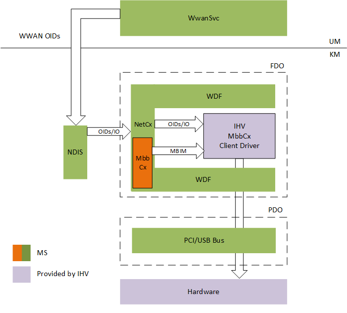

# Mobile Broadband (MBB) WDF class extension (MBBCx)

Any MBB-NetAdapter client driver is first and foremost a full-fledged WDF client driver, and then it's also a NetAdapterCx client driver just like other NIC drivers, and finally it's a client driver to the MBB class extension, which provides MBB media specific functionalities. 

Therefore, a MBB-NetAdapter driver performs 3 categories of tasks
- call [standard WDF APIs](https://docs.microsoft.com/en-us/windows-hardware/drivers/ddi/content/_wdf/) for common device tasks, like Pnp and Power management
- call [NetAdapterCx APIs](netadaptercx-api-reference.md) for common network device operations, like transmitting/receiving network packets.
- call [MbbCx APIs]() for MBB specific control path operation, such as MBIM message handling

Before you begin
- Familiarize yourself with [Windows Driver Foundation (WDF)](https://docs.microsoft.com/en-us/windows-hardware/drivers/wdf/using-the-framework-to-develop-a-driver)
- Familiarize yourself with [NetAdapter class extension](index.md)

This topic assume you have already known how to write a NetAdapterCx client driver for a basic NIC, and it focues on the codes needed specifically for MBBCx. 