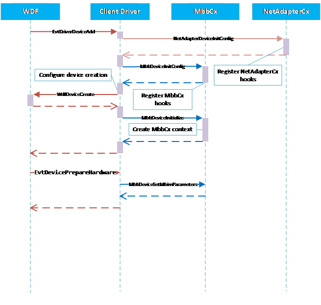
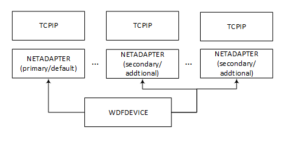
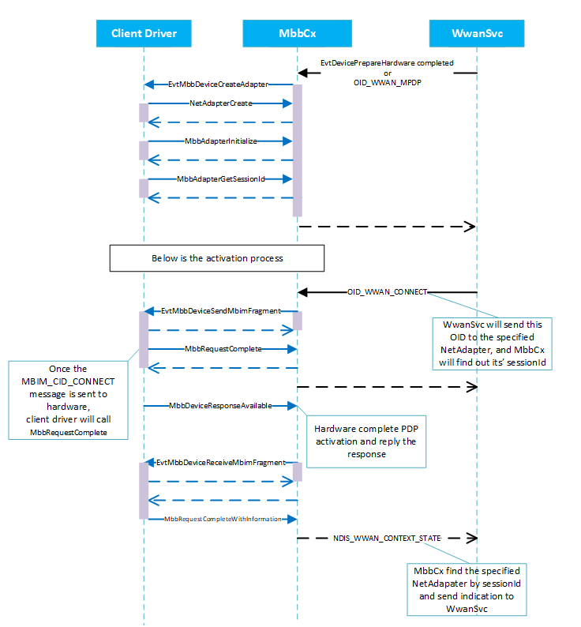

# Writing an MBBCx client driver

[!include[MBBCx Beta Prerelease](../mbbcx-beta-prerelease.md)]

>[!WARNING]
>The sequence diagrams in this topic are for illustration purposes only. They are not public contracts and are subject to change in the future. 

## INF files for MBBCx client drivers

INF files for MBBCx client drivers are the same as other NetAdapterCx client drivers. For more information, see [INF files for NetAdapterCx client drivers](inf-files-for-netadaptercx-client-drivers.md).

## Initialize the device

In addition to those tasks required by NetAdapterCx for [NetAdapter device initialization](device-initialization.md), an MBB client driver must also perform the following tasks in its [*EvtDriverDeviceAdd*](https://docs.microsoft.com/windows-hardware/drivers/ddi/content/wdfdriver/nc-wdfdriver-evt_wdf_driver_device_add) callback function:

1. Call [**MbbDeviceInitConfig**](mbbdeviceinitconfig.md) after calling [*NetAdapterDeviceInitConfig*](https://docs.microsoft.com/windows-hardware/drivers/ddi/content/netadapter/nf-netadapter-netadapterdeviceinitconfig) but before calling [*WdfDeviceCreate*](https://docs.microsoft.com/windows-hardware/drivers/ddi/content/wdfdevice/nf-wdfdevice-wdfdevicecreate), referencing the same [**WDFDEVICE\_INIT**](../wdf/wdfdevice_init.md) object passed in by the framework.

2. Call [**MbbDeviceInitialize**](mbbdeviceinitialize.md) to register MBB device-specific callback functions using an initialized [MBB_DEVICE_CONFIG](mbb-device-config.md) structure and the WDFDEVICE object obtained from *WdfDeviceCreate*.

The following example demonstrates how to initialize the MBB device. Error handling has been left out for clarity.

```C++
    status = NetAdapterDeviceInitConfig(deviceInit);
    status = MbbDeviceInitConfig(deviceInit);

    // Set up other callbacks such as Pnp and Power policy

    status = WdfDeviceCreate(&deviceInit, &deviceAttributes, &wdfDevice);

    MBB_DEVICE_CONFIG mbbDeviceConfig;
    MBB_DEVICE_CONFIG_INIT(&mbbDeviceConfig,
                           EvtMbbDeviceSendMbimFragment,
                           EvtMbbDeviceReceiveMbimFragment,
                           EvtMbbDeviceSendServiceSessionData,
                           EvtMbbDeviceCreateAdapter);

    status = MbbDeviceInitialize(wdfDevice, &mbbDeviceConfig);
```
Unlike other types of NetAdapterCx drivers, MBB client drivers must not create the NETADAPTER object from within the *EvtDriverDeviceAdd* callback function. Instead, it will be instructed by MBBCx to do so later.

Next, the client driver must call [**MbbDeviceSetMbimParameters**](mbbdevicesetmbimparameters.md), typically in the [*EvtDevicePrepareHardware*](https://docs.microsoft.com/windows-hardware/drivers/ddi/content/wdfdevice/nc-wdfdevice-evt_wdf_device_prepare_hardware) callback function that follows.

This message flow diagram illustrates the initialization process.



## Handling MBIM control messages

MBBCx uses the standard MBIM control commands defined in MBIM specification Rev 1.0, sections 8, 9, and 10, for the control plane. Commands and responses are exchanged through a set of callback functions provided by the client driver and APIs provided by MBBCx. MBBCx mimics the operational model of an MBIM device, as defined in MBIM specification Rev 1.0, section 5.3, by using these function calls:

- MBBCx sends an MBIM command message to the client driver by invoking its [*EvtMbbDeviceSendMbimFragment*](evt-mbb-device-send-mbim-fragment.md) callback function. The client driver asynchronously completes this send request by calling [**MbbRequestComplete**](mbbrequestcomplete.md).
- The client driver signals availability of the result by calling [**MbbDeviceResponseAvailable**](mbbdeviceresponseavailable.md).
- MBBCx fetches the MBIM response message from the client driver by invoking its [*EvtMbbDeviceReceiveMbimFragment*](evt-mbb-device-receive-mbim-fragment.md) callback function. The client driver asynchronously completes this get-response request by calling [**MbbRequestCompleteWithInformation**](mbbrequestcompletewithinformation.md). 
- The MBB client driver may notify MBBCx of an unsolicited device event by calling **MbbDeviceResponseAvailable**. MBBCx then retrieves the information from the client driver similarly to how it fetches MBIM response messages.

The following diagram illustrates MBBCx-client driver message exchange flow.


### Synchronization of MBIM control messages

The MBBCx framework always serializes calls into the client driver's *EvtMbbDeviceSendMbimFragment* and *EvtMbbDeviceReceiveMbimFragment* callback functions. No new calls will be made by the framework until the client driver calls either **MbbRequestComplete** or **MbbRequestCompleteWithInformation**.

While a client driver is guaranteed not to receive overlapped *EvtMbbDeviceSendMbimFragment* or *EvtMbbDeviceReceiveMbimFragment* callbacks, it may receive multiple calls to them in succession before the response for a previous command is available from the device.

If the device is not in the *D0* state, the MBBCx framework will first bring the device to D0 (in other words, it calls calls [*EvtDeviceD0Entry*](https://docs.microsoft.com/windows-hardware/drivers/ddi/content/wdfdevice/nc-wdfdevice-evt_wdf_device_d0_entry)) before it calls *EvtMbbDeviceSendMbimFragment* or *EvtMbbDeviceReceiveMbimFragment*. The MBBCx framework also guarantees that it will keep the device in the D0 state, meaning it will not call [*EvtDeviceD0Exit*](https://docs.microsoft.com/windows-hardware/drivers/ddi/content/wdfdevice/nc-wdfdevice-evt_wdf_device_d0_exit), until the client calls **MbbRequestComplete** or **MbbRequestCompleteWithInformation**.

## Creating the NetAdapter interface for the PDP context/EPS bearer

Before establishing a data session, MBBCx will instruct the client driver to create a NETADAPTER object, and it will be used by MBBCx to represent the network interface for the data session activated. This is accomplished by MBBCx calling into the client driver's [*EvtMbbDeviceCreateAdapter*](evt-mbb-device-create-adapter.md) callback function. 

In the implementation of the *EvtMbbDeviceCreateAdapter* callback function, the MBBCx client driver must first perform the same tasks required for creating a NETADAPTER object as any NetAdapterCx client driver. Additionally, it must also perform the following additional tasks:

1. Call [**MbbAdapterInitialize**](mbbadapterinitialize.md) on the NETADAPTER object created by [*NetAdapterCreate*](https://docs.microsoft.com/windows-hardware/drivers/ddi/content/netadapter/nf-netadapter-netadaptercreate).

2. After calling *MbbAdapterinitialize*, call [**MbbAdapterGetSessionId**](mbbadaptergetsessionid.md) to retreive the data session ID for which MBBCx intends to use this NETADAPTER object. For example, if the returned value is 0, it means MBBCx will use this NETADAPTER interface for the data session established by the primary PDP context/default EPS bearer.

3. We recommend that MBBCx client drivers keep an internal mapping between the created NETADAPTER object and the returned *SessionId*. This helps track the data session-to-NETADAPTER object relationship, which is especially useful when multiple PDP contexts/EPS bearers have been activated.

4. Before returning from *EvtMbbDeviceCreateAdapter*, client drivers must start the adapter by calling [**NetAdapterStart**](https://docs.microsoft.com/windows-hardware/drivers/ddi/content/netadapter/nf-netadapter-netadapterstart). Optionally, they can also set the adapter's capabilities by calling one or more of these functions *before* the call to **NetAdapterStart**: 
    - [**NetAdapterSetDatapathCapabilities**](https://docs.microsoft.com/windows-hardware/drivers/ddi/content/netadapter/nf-netadapter-netadaptersetdatapathcapabilities)
    - [**NetAdapterSetLinkLayerCapabilities**](https://docs.microsoft.com/windows-hardware/drivers/ddi/content/netadapter/nf-netadapter-netadaptersetlinklayercapabilities)
    - [**NetAdapterSetLinkLayerMtuSize**](https://docs.microsoft.com/windows-hardware/drivers/ddi/content/netadapter/nf-netadapter-netadaptersetlinklayermtusize)
    - [**NetAdapterSetPowerCapabilities**](https://docs.microsoft.com/windows-hardware/drivers/ddi/content/netadapter/nf-netadapter-netadaptersetpowercapabilities)

MBBCx invokes this callback function at least once, so there is always one NETADPATER object for the primary PDP context/default EPS bearer. If multiple PDP contexts/EPS bearers are activated, MBBCx might invoke this callback function more times, once for every data session to be established. There must be a one-to-one relationship between the network interface represented by the NETADAPTER object and a data session, as shown in the following diagram.



The following example shows how to create a NETADAPTER object for a data session. Note that error handling and code required for setting up adapter capabilities is left out for brevity and clarity.

```C++
    NTSTATUS
    EvtMbbDeviceCreateAdapter(
        WDFDEVICE  Device,
        PNETADAPTER_INIT AdapterInit
    )
    {
        // Get the client driver defined per-device context 
        PMY_DEVICE_CONTEXT deviceContext = MyGetDeviceContext(Device);

        // Set up the client driver defined per-adapter context
        WDF_OBJECT_ATTRIBUTES adapterAttributes;
        WDF_OBJECT_ATTRIBUTES_INIT_CONTEXT_TYPE(&adapterAttributes, 
                                                MY_NETADAPTER_CONTEXT);


        // Create the NETADAPTER object
        NETADAPTER netAdapter;
        NTSTATUS status = NetAdapterCreate(AdapterInit, 
                                           &adapterAttributes,
                                           &netAdapter);
        
        // Initialize the adapter for MBB
        status = MbbAdapterInitialize(netAdapter);

        // Retrieve the Session ID and use an array to store
        // the session <-> NETADAPTER object mapping
        ULONG sessionId;
        PMY_NETADAPTER_CONTEXT netAdapterContext = MyGetNetAdapterContext(netAdapter);

        netAdapterContext->NetAdapter = netAdapter;

        sessionId = MbbAdapterGetSessionId(netAdapter);

        netAdapterContext->SessionId = sessionId;

        deviceContext->Sessions[sessionId].NetAdapterContext = netAdapterContext;

        //
        // Optional: set adapter capabilities
        //
        ...
        NetAdapterSetDatapathCapabilities(netAdapter, 
                                          &txCapabilities, 
                                          &rxCapabilities);

        ...
        NetAdapterSetLinkLayerCapabilities(netAdapter,
                                           &linkLayerCapabilities);
                                           
        ...
        NetAdapterSetLinkLayerMtuSize(netAdapter,
                                      MY_MAX_PACKET_SIZE - ETHERNET_HEADER_LENGTH);

        // 
        // Required: start the adapter
        //
        status = NetAdapterStart(netAdapter);

        return status;
    }
```

For a code example of setting datapath capabilities, see [Network data buffer management](network-data-buffer-management.md).

MBBCx guarantees that it calls *EvtMbbDeviceCreateAdapter* before requesting **MBIM_CID_CONNECT** with the same session ID. The following flow diagram shows the interactions between the client driver and the class extension in creating the NETADAPTER object.  



The flow for creating the NETADAPTER object for the primary PDP context/default EPS bearer is initiated by MBBCx when [*EvtDevicePrepareHardware*](https://docs.microsoft.com/windows-hardware/drivers/ddi/content/wdfdevice/nc-wdfdevice-evt_wdf_device_prepare_hardware) has successfully finished.

The flow for creating the NETADAPTER object for the secondary PDP context/dedicated EPS bearer is triggered by *WwanSvc* whenever on-demand connections are requested by applications.

### Lifetime of the NETADAPTER object

The NETADAPTER object created by the client driver will be automatically destroyed by MBBCx when it's no longer in use. For example, this happens after additional PDP context/EPS bearers are deactivated. **MBBCx client drivers must not call [WdfObjectDelete](https://docs.microsoft.com/windows-hardware/drivers/ddi/content/wdfobject/nf-wdfobject-wdfobjectdelete) on the NETADAPTER objects they create.** 

If a client driver needs to clean up context data tied to a NETADAPTER object, it should provide an [*EvtDestroyCallback*](https://docs.microsoft.com/windows-hardware/drivers/ddi/content/wdfobject/nc-wdfobject-evt_wdf_object_context_destroy) function in the object attributes structure when calling **NetAdapterCreate**.  

## Power management of the MBB device

For power management, client drivers should use the NETPOWERSETTINGS object [like other types of NetAdapterCx client drivers](configuring-power-management.md).

## Handling device service sessions

When an application sends DSS data down to the modem device, MBBCx invokes the client driver's [*EvtMbbDeviceSendServiceSessionData*](evt-mbb-device-send-service-session-data.md) callback function. The client driver should then send the data asynchronously to the device and call [**MbbDeviceSendServiceSessionDataComplete**](mbbdevicesendservicesessiondatacomplete.md) once the send has completed, so MBBCx then can free the memory allocated for the data. 

Conversely, the client driver calls [**MbbDeviceReceiveServiceSessionData**](mbbdevicereceiveservicesessiondata.md) to pass any data up to the application through MBBCx.
