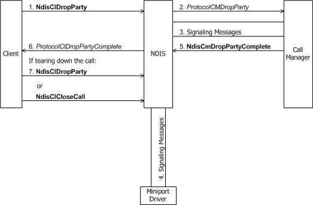

# Dropping a Party from a Multipoint Call

A connection-oriented client that serves as the root of a multipoint call must eventually drop each party from that call with [**NdisClDropParty**](https://msdn.microsoft.com/library/windows/hardware/ff561629) or [**NdisClCloseCall**](https://msdn.microsoft.com/library/windows/hardware/ff561627).

A client drops a party from a call in the following situations:

-   Before initiating the tear down of a multipoint call with **NdisClCloseCall**(see [Client-Initiated Request to Close a Call](client-initiated-request-to-close-a-call.md)), a client must drop all but the last party with successive calls to **NdisClDropParty**. The client specifies the last party to drop from the call with **NdisClCloseCall**.

-   In response to a remote party's request to be dropped from a multipoint call (see [Incoming Request to Drop a Party from a Multipoint Call](incoming-request-to-drop-a-party-from-a-multipoint-call.md)), a client, from its [**ProtocolClIncomingDropParty**](https://msdn.microsoft.com/library/windows/hardware/ff570231) function, calls **NdisClDropParty**.

A client's call to **NdisClDropParty** causes NDIS to call the [**ProtocolCmDropParty**](https://msdn.microsoft.com/library/windows/hardware/ff570244) function of the call manager or MCM driver that shares the same *NdisVcHandle* to the multipoint VC.

The following figure shows the client of a call manager requesting to drop a party from a multipoint call.

The next figure shows the client of an MCM driver requesting to drop a party from a multipoint call.

*ProtocolCmDropParty* communicates with network control devices to drop a party from an existing multipoint call. NDIS can pass to *ProtocolCmDropParty* a pointer to a buffer that contains data (supplied to the client in the call to **NdisClDropParty**). *ProtocolCmDropParty* must send any such data across the network before the connection is dropped.

*ProtocolCmDropParty* can complete synchronously, or more probably, asynchronously with [**NdisCmDropPartyComplete**](https://msdn.microsoft.com/library/windows/hardware/ff561674), in the case of a call manager, or [**NdisMCmDropPartyComplete**](https://msdn.microsoft.com/library/windows/hardware/ff563543), in the case of an MCM driver.

The call to **Ndis(M)CmDropPartyComplete** causes NDIS to call the client's [**ProtocolClDropPartyComplete**](https://msdn.microsoft.com/library/windows/hardware/ff570227) function. If the client is in the process of tearing down a multipoint VC that it created, *ProtocolClDropPartyComplete* can call **NdisClDropParty** with any valid *NdisPartyHandle* to one of the remaining parties on the client's active multipoint VC. If only one party remains on its multipoint VC, the client should drop that party by passing its *NdisPartyHandle* to **NdisClCloseCall**(see [Client-Initiated Request to Close a Call](client-initiated-request-to-close-a-call.md)).

 

 

