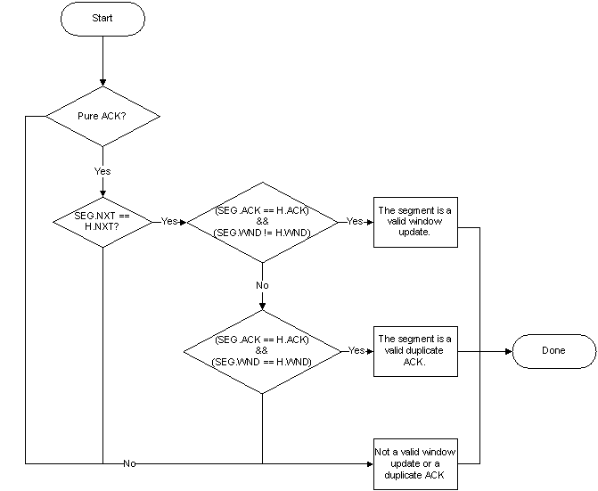

# Examples of Receive Segment Coalescing

This section illustrates the coalescing algorithm by using examples of segments that are received in order and processed in a single deferred procedure call (DPC).

This page uses X and X’ for labeling successive segments. All other segment and single coalesced unit (SCU) fields are as described in [Rules for Coalescing TCP/IP Segments](rules-for-coalescing-tcp-ip-packets.md).

## Example 1: Data segments

### Segment Description

10 successive segments belonging to the same TCP connection are processed. All of the following conditions are true for each:

-   X’.SEQ == X.NXT

-   X’SEQ &gt; X.SEQ

-   X’.ACK == X.ACK

None of these segments generates an exception.
### Result

A single SCU is formed out of the 10 segments. This is indicated as a single [**NET\_BUFFER**](https://msdn.microsoft.com/library/windows/hardware/ff568376) in a single [**NET\_BUFFER\_LIST**](https://msdn.microsoft.com/library/windows/hardware/ff568388).

## Example 2: Data segments, followed by an exception, followed by data segments

### Segment Description

5 successive segments belonging to the same TCP connection are processed. All of the following conditions are true for each:

-   X’.SEQ == X.NXT

-   X’SEQ &gt; X.SEQ

-   X’.ACK == X.ACK

None of these segments generates an exception.
The 6th segment is a duplicate ACK segment with a TCP SACK option and generates an exception based on rule number 3 in [Rules for Coalescing TCP/IP Segments](rules-for-coalescing-tcp-ip-packets.md).

**Note**  In this case, the exception rule for handling a TCP option takes precedence and thus overrides the coalescing rule.

 

2 successive segments belonging to the same TCP connection are processed. All of the following conditions are true for each:

-   X’.SEQ == X.NXT

-   X’SEQ &gt; X.SEQ

-   X’.ACK == X.ACK

None of these segments generates an exception.
### Result

A single SCU is formed out of the first 5 segments. The 6th segment does not form an SCU.

The 7th and 8th segments form an SCU together.

A [**NET\_BUFFER\_LIST**](https://msdn.microsoft.com/library/windows/hardware/ff568388) chain is indicated with three **NET\_BUFFER\_LIST** structures each having a single [**NET\_BUFFER**](https://msdn.microsoft.com/library/windows/hardware/ff568376). The ordering of received segments is maintained.

## Example 3: Data segments, followed by multiple window updates

### Segment Description

5 successive segments belonging to the same TCP connection are processed. All of the following conditions are true for each:

-   X’.SEQ == X.NXT

-   X’SEQ &gt; X.SEQ

-   X’.ACK == X.ACK

None of these segments generates an exception.
The 6th segment is a pure ACK that is a window update with SEG.WND = 65535 as shown in the following flowchart.

The 7th segment is a pure ACK that is a window update with SEG.WND = 131070 as shown in the same flowchart.

### Result

A single SCU is formed out of the 7 segments. This is indicated as a single [**NET\_BUFFER**](https://msdn.microsoft.com/library/windows/hardware/ff568376) in a single [**NET\_BUFFER\_LIST**](https://msdn.microsoft.com/library/windows/hardware/ff568388).

The SCU.WND = 131070, and the checksum is updated based on this value.

## Example 4: Piggybacked ACKs mixed with data segments

### Segment Description

3 successive segments belonging to the same TCP connection are processed. All of the following conditions are true for each:

-   X’.SEQ == X.NXT

-   X’SEQ &gt; X.SEQ

-   X’.ACK == X.ACK

None of these segments generates an exception.
2 successive segments belonging to the same TCP connection are processed. All of the following conditions are true for each:

-   X’.SEQ == X.NXT

-   X’SEQ &gt; X.SEQ

-   X’.ACK == X.ACK

None of these segments generates an exception.
### Result

A single SCU is formed out of the 5 segments. This is indicated as a single [**NET\_BUFFER**](https://msdn.microsoft.com/library/windows/hardware/ff568376) in a single [**NET\_BUFFER\_LIST**](https://msdn.microsoft.com/library/windows/hardware/ff568388). The SCU.ACK is set to the last SEG.ACK.

 

 

