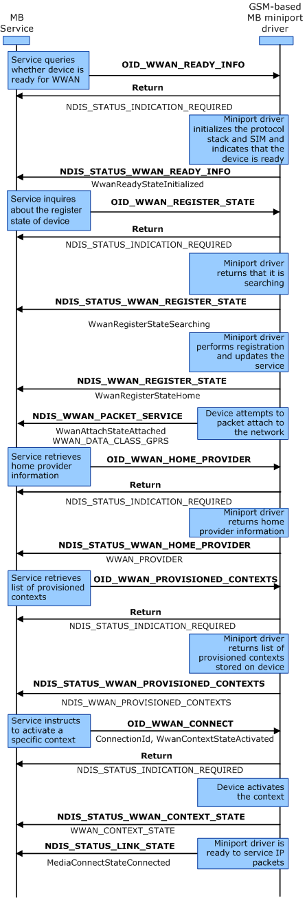

# Initialization of a Non-SIM-Locked GPRS Device with a Provisioned Context

The following diagram represents the optimal user experience for GSM-based MB devices. The out-of-box experience requires no user configuration. It is assumed that the device is configured to automatically select the network to register with. The labels in bold represent OID identifiers or transactional flow control, and the labels in regular text represent the important flags within the OID structure.

To initialize a non-SIM-locked GSM-based device, implement the following steps:

1.  The MB Service sends an asynchronous (non-blocking) [OID\_WWAN\_READY\_INFO](https://msdn.microsoft.com/library/windows/hardware/ff569833) query request to the miniport driver to identify ready state of the device. The miniport driver responds with a provisional acknowledgment (NDIS\_STATUS\_INDICATION\_REQUIRED) that it has received the request, and it will send a notification with the requested information in the future.

2.  The miniport driver sends an [**NDIS\_STATUS\_WWAN\_READY\_INFO**](https://msdn.microsoft.com/library/windows/hardware/ff567856) notification to the MB Service that indicates to the MB Service that the state of the MB device is **WwanReadyStateInitialized**.

3.  The MB Service sends an asynchronous (non-blocking) [OID\_WWAN\_REGISTER\_STATE](https://msdn.microsoft.com/library/windows/hardware/ff569834) query request to the miniport driver to identify the registration state of the device. The miniport driver responds with a provisional acknowledgment (NDIS\_STATUS\_INDICATION\_REQUIRED) that it has received the request, and it will send a notification with the requested information in the future.

4.  The miniport driver sends an [**NDIS\_STATUS\_WWAN\_REGISTER\_STATE**](https://msdn.microsoft.com/library/windows/hardware/ff567857) notification to the MB Service that indicates that the registration mode of the device is **WwanRegistraterModeAutomatic** and its current registration state is **WwanRegisterStateSearching**.

5.  Later, when the device is registered to a network provider, the miniport driver sends an unsolicited NDIS\_STATUS\_WWAN\_REGISTER\_STATE notification to the MB Service that indicates that the current registration state of the device is **WwanRegisterStateHome**.

6.  The device attempts to attach packet service. When the packet service state changes to attached, the miniport driver sends an unsolicited [**NDIS\_STATUS\_WWAN\_PACKET\_SERVICE**](https://msdn.microsoft.com/library/windows/hardware/ff567850) notification to the MB Service that indicates that packet service is attached and current data class is **WWAN\_DATA\_CLASS\_GPRS**.

7.  The MB Service sends an asynchronous (non-blocking) [OID\_WWAN\_HOME\_PROVIDER](https://msdn.microsoft.com/library/windows/hardware/ff569826) query request to the miniport driver to retrieve home provider information. The miniport driver responds with a provisional acknowledgment (NDIS\_STATUS\_INDICATION\_REQUIRED) that is has received the request, and it will send a notification with the requested information in the future.

8.  The miniport driver sends an [**NDIS\_STATUS\_WWAN\_HOME\_PROVIDER**](https://msdn.microsoft.com/library/windows/hardware/ff567848) notification to the MB Service that indicates the home provider details.

9.  The MB Service sends an asynchronous (non-blocking) OID\_WWAN\_PROVISIONED\_CONTEXTS query request to the miniport driver to retrieve the list of provisioned contexts. The miniport driver responds with a provisional acknowledgment (NDIS\_STATUS\_INDICATION\_REQUIRED) that it has received the request, and it will send a notification with the requested information in the future.

10. The miniport driver sends an [**NDIS\_STATUS\_WWAN\_PROVISIONED\_CONTEXTS**](https://msdn.microsoft.com/library/windows/hardware/ff567854) notification to the MB Service, which contains a list of [**WWAN\_CONTEXT**](https://msdn.microsoft.com/library/windows/hardware/ff571201) structures.

11. The MB Service sends an asynchronous (non-blocking) [OID\_WWAN\_CONNECT](https://msdn.microsoft.com/library/windows/hardware/ff569823) set request to the miniport driver to activate Packet Data Protocol (PDP) context. The miniport driver responds with a provisional acknowledgment (NDIS\_STATUS\_INDICATION\_REQUIRED) that it has received the request, and it will send a notification with the requested information in the future.

12. The miniport driver sends an [**NDIS\_STATUS\_WWAN\_CONTEXT\_STATE**](https://msdn.microsoft.com/library/windows/hardware/ff567843) notification to the MB Service that indicates that PDP context is activated.

13. The miniport driver sends an [**NDIS\_STATUS\_LINK\_STATE**](https://msdn.microsoft.com/library/windows/hardware/ff567391) notification to indicate that the media connect state is **MediaConnectStateConnected**.

 

 

