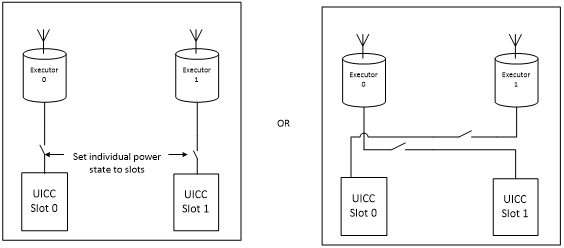
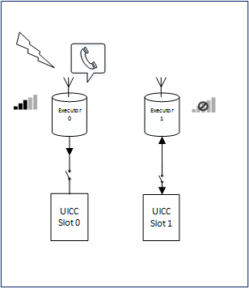
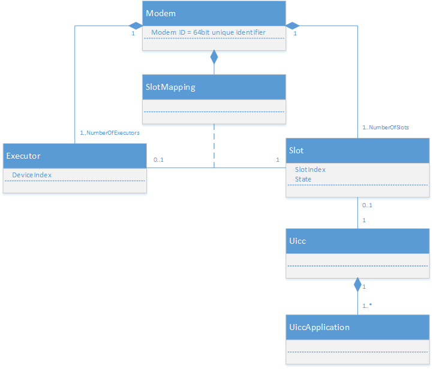
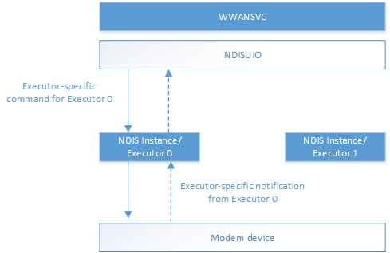
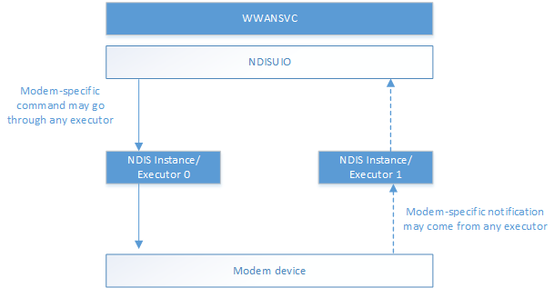
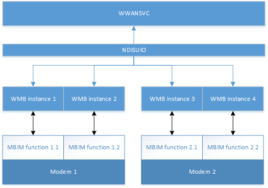

# MB Multi-SIM Operations

## Desktop Multi-Modem Multi-Executor Support

Traditionally, non-phone Windows devices have not usually been configured for multi-SIM modems because they have fewer physical space restraints than phones, allowing them to truly harness multiple active radios at the same time instead of having one modem with multiple SIM cards like a phone does. Due to the rise of eSIM and scenarios in the enterprise, however, the demand for multi-SIM-per-modem support on non-phone devices has increased.

Most typical multi-SIM phone devices have dual SIM slots but are limited to one primary SIM card supporting data while the other only supports voice features. Such a limitation does not exist in the non-phone PC model as all SIM cards are used for data connection.

While the framework defined in this specification can theoretically support an unbounded number of modems and SIM cards, Windows 10 Version 1703 and later will only support the dual-SIM/single-active scenario end to end. 

## NDIS Modem Interface Specification

### Existing Interface and Feature Gaps

It is possible to support dual-SIM/dual-active functionality with multiple independent modems, where each modem is a separate device and operates completely independently. However, this is outside this documentation’s scope, which instead focuses on a WWAN miniport modem that is capable of presenting multiple and simultaneous cellular stacks to the host. This section defines the various objects and establishes the terminology used in all MB documentation related to multi-SIM functionality.

Advancements in hardware have resulted in devices that are capable of maintaining simultaneous registrations with multiple cellular networks. In such devices, there are assumed to be “multiple instances of the cellular stack” running in parallel which are each able to maintain registration, monitor signal strengths, perform handovers and listen for incoming pages. Each instance of this “cellular stack” will be referred to as an *executor* for the rest of this document. For example, in a device capable of maintaining registrations with two networks simultaneously the modem hardware is considered to have two executors.

The executor is a logical representation of the hardware and in reality may in fact be one single hardware transceiver being multiplexed. Exact hardware specifics are regarded as vendor implementation details and are out of scope for this specification. For an NDIS miniport driver, executors are exposed as multiple instances of a WWAN miniport adapter. For an MBIM modem, executors are represented by multiple MBIM functions on an enumerated composite device.

The above diagram illustrates the logical view of a dual SIM modem. Notice the two possible combinations of executor and UICC.

The cellular stack inside an executor is considered mostly self-contained except in the case of a Dual Standby modem implementation where the executor conducting traffic (voice and/or data) may prevent the other from maintaining registration.

The above diagram illustrates the logical view of a dual standby modem. Traffic on Executor 0, a phone call, causes Executor 1 to lose registration.

The Windows Desktop modem interface model in NDIS 6.7 does not accommodate such an architecture because it is based upon several implicit assumptions:

* The model assumes that there is a single executor within the modem.
* The model assumes that there is a single UICC card directly associated with the modem hardware.
* The UICC is treated as if it were a single-application SIM card.

By contrast, the Microsoft RIL interface on Windows Mobile explicitly exposes the multiplicity of all of these assumptions. The Mobile Broadband interface in Windows Mobile exposes the ability to register independently through separate miniports and assumes that some basic configuration of the device has already been accomplished through the RIL interface. To provide equivalent functionality, Windows Desktop must provide mechanisms to discover the number of executors and slots, to access executors independently, to define the mapping between executors and slots, and to define the applications within the mapped UICC card that each executor will use.

### Major Objects and Operations

The above figure shows an abstract model of a modem. Each modem is identified by a globally unique identifier (GUID) and contains a set of one or more executors, each of which is capable of independent registration on a cellular network. Each executor has an associated executor index, an integer, beginning with 0 for the first executor. In addition, the modem exposes one or more slots that may contain UICC cards. It is assumed is that the number of slots is greater than or equal to the number of executors. Each slot has an associated index, also beginning with 0, and a current state related to the power state of the slot and availability state of a card in the slot (if any).

To maintain compatibility with existing modems, each executor operates with information provided by a UICC card in a single slot. The association between executors and slots is defined by slot mapping, which maps each executor to exactly one slot.

A slot may contain a UICC card; each card contains one or more UICC applications such as a USIM, CSIM, ISIM, or possibly other telephony and non-telephony applications such as PKCS#15 or Global Platform applications for an NFC secure element. The addressing and use of these individual UICC applications is a topic for future specification and out of scope of this documentation.

The Windows Desktop NDIS interface to the modem is characterized by the exchange of OIDs and NDIS notifications. In most cases these OIDs are directed to individual executors; however, a few commands and notifications are scoped to the modem as a whole.

For non-Windows Mobile operating systems, a multi-executor modem appears as one device with multiple physical WWAN miniport instances. Each physical miniport instance represents an executor that is capable of maintaining registration as an NDIS instance. Additional virtual instances may be created at runtime to manage context-specific packet data and device service sessions. Executor-specific commands and notifications are exchanged through the WWAN miniport NDIS physical instance representing that executor. Modem-specific commands (i.e., those that are not executor-specific) and their corresponding notifications may be sent to or come from any physical miniport instance.

The above two digrams show the difference in executor-specific commands and notifications, where commands and notifications go through and come from the same executor, and modem-specific commands and notifications, where commands may go through any executor and come from any executor.

All OID set or query requests issued to a miniport instance are executed against the modem and executor with which the miniport instance is associated. Likewise, all unsolicited notifications and unsolicited Device Service events sent from a miniport instance are applicable to the modem and the executor with which the miniport instance is associated. For example, an unsolicited NDIS_STATUS_WWAN_REGISTER_STATE or NDIS_STATUS_WWAN_PACKET_SERVICE notification from a miniport indicates the registration (or packet service state) of the associated modem and the executor only and is unrelated to the state of other modem(s) or other executor(s). 

When there are multiple modems and/or multiple executors in a device, non-context-specific unsolicited notifications related to a particular modem and executor combination shall be issued from the physical miniport adapter associated with that modem and executor combination. 

In the same way, if a device has multiple modems and/or multiple executors, non-context-specific OID query requests related to a particular modem and executor may be issued to the physical miniport adapter instance associated with that modem and executor combination. The adapter receiving such a query request shall process it according to the OID definition. If so chosen by miniport driver, this query request may be processed concurrently with any other in-process OID set or query requests in any instance of adapters associated with that modem and executor. All instances of a miniport adapter associated with a same modem and executor shall report the same state information for that cellular modem and executor as a whole (such as radio power state, registration state, packet service state, etc.).  

For a device which has multiple modems and/or multiple executors, non-context-specific OID set requests may be issued to the physical miniport adapter instance associated with that modem and executor. The miniport driver shall keep track of the progress of such a request as a whole. If one such set request is in progress in any adapter and has not completed yet, a second such set request attempt (to any adapter instance associated with the same modem and executor) shall be queued and processed after the previous requests have completed.

Windows inbox WMB class drivers normally follow the specification above, but if the aforementioned race condition occurs at the modem layer the modem should follow the same guidance to queue up conflicting device wide commands on the MBIM function if it is still processing another function that is linked to the same underlying device.

## OIDs for Set and Query Requests

To query the number of devices (executors) and slots in the modem, as well as the number of executors that may be active concurrently, the host uses [OID_WWAN_SYS_CAPS](https://go.microsoft.com/fwlink/p/?linkid=841265).

To query the capability of an executor, the host uses [OID_WWAN_DEVICE_CAPS_EX](https://go.microsoft.com/fwlink/p/?linkid=841266).

To define the slot that is bound to each executor or query the current mapping, the host uses [OID_WWAN_DEVICE_SLOT_MAPPINGS](https://go.microsoft.com/fwlink/p/?linkid=841267).

To query the status of a particular slot on the modem, the host uses [OID_WWAN_SLOT_INFO_STATUS](https://go.microsoft.com/fwlink/p/?linkid=841268).

## Per-device and Per-executor Commands

With the addition of the executor concept to non-Windows Mobile devices in Windows 10 Version 1703 and later, OIDs are now split into two categories: per-device OIDs and per-executor OIDs. The table below explains which OIDs fall into which category.

| Per-device or Per-executor| OID name |
| --- | --- |
| Per-device| OID_WWAN_DRIVER_CAPS |
|  | OID_WWAN_ENUMERATE_DEVICE_SERVICE_COMMANDS |
|  | OID_WWAN_ENUMERATE_DEVICE_SERVICES |
|  | OID_WWAN_PRESHUTDOWN |
|  | OID_WWAN_VENDOR_SPECIFIC |
|  | OID_WWAN_SYS_CAPS |
|  | OID_WWAN_DEVICE_SLOT_MAPPINGS |
| Per-executor | OID_WWAN_AUTH_CHALLENGE |
|  | OID_WWAN_CONNECT |
|  | OID_WWAN_DEVICE_CAPS |
|  | OID_WWAN_DEVICE_CAPS_EX |
|  | OID_WWAN_DEVICE_SERVICE_COMMAND |
|  | OID_WWAN_DEVICE_SERVICE_SESSION |
|  | OID_WWAN_DEVICE_SERVICE_SESSION_WRITE |
|  | OID_WWAN_DEVICE_SERVICES |
|  | OID_WWAN_HOME_PROVIDER |
|  | OID_WWAN_NETWORK_IDLE_HINT |
|  | OID_WWAN_PACKET_SERVICE |
|  | OID_WWAN_PIN |
|  | OID_WWAN_PIN_EX |
|  | OID_WWAN_PIN_LIST |
|  | OID_WWAN_PREFERRED_MULTICARRIER_PROVIDERS |
|  | OID_WWAN_PREFERRED_PROVIDERS |
|  | OID_WWAN_PROVISIONED_CONTEXTS |
|  | OID_WWAN_RADIO_STATE |
|  | OID_WWAN_READY_INFO |
|  | OID_WWAN_REGISTER_STATE |
|  | OID_WWAN_SERVICE_ACTIVATION |
|  | OID_WWAN_SIGNAL_STATE |
|  | OID_WWAN_SMS_CONFIGURATION |
|  | OID_WWAN_SMS_DELETE |
|  | OID_WWAN_SMS_READ |
|  | OID_WWAN_SMS_SEND |
|  | OID_WWAN_SMS_STATUS |
|  | OID_WWAN_SUBSCRIBE_DEVICE_SERVICE_EVENTS |
|  | OID_WWAN_USSD |
|  | OID_WWAN_VISIBLE_PROVIDERS |
|  | OID_WWAN_SLOT_INFO_STATUS |

**Note**  [OID_WWAN_RADIO_STATE](https://msdn.microsoft.com/library/windows/hardware/ff569832) has been updated for Windows 10 Version 1703 as well. See OID_WWAN_RADIO_STATE for more information.

## MBIM Interface Update for Multi-SIM Operations

For non-Windows Mobile operating systems, a multi-executor modem appears as one USB composite device with multiple MBIM functions. Each MBIM function represents an executor that is capable of maintaining registration. Executor-specific commands and notifications are exchanged through the MBIM function representing that executor, while modem-specific commands (i.e., those that are not executor-specific) and their corresponding notifications may be sent to or come from any MBIM function that belongs to the same underlying USB composite device. 

All CID set or query requests issued to a MBIM function are executed against the modem and executor with which the miniport instance is associated; likewise, all unsolicited notifications sent from a MBIM function are applicable to the modem and the executor with which the MBIM function is associated. In the same way, all unsolicited Device Service events sent from a miniport instance are applicable to the modem and the executor with which the MBIM function is associated. For example, an unsolicited MBIM_CID_REGISTER_STATE or MBIM_CID_PACKET_SERVICE notification from a MBIM function indicates the registration or packet service state of the associated modem/executor only and is unrelated to the state of other modem(s) or other executor(s). 

When there are multiple modems and/or multiple executors in a device, non-context-specific unsolicited notifications related to a particular modem and executor combination shall be issued from the MBIM function associated with the aforementioned modem and executor. 

In a device with multiple modems and/or multiple executors, non-context-specific CID query requests related to a particular modem and executor may be issued to the MBIM function associated with that modem and executor combination. The function receiving such a query request shall process it according to the CID definition. If so chosen by the modem firmware, such a query request may be processed concurrently with any other CID set or query requests being processed by any MBIM functions associated with that modem and executor. All MBIM functions associated with the same modem shall report the same state information for that cellular modem in addition to the executor that they represent.  

When there are multiple modems and/or multiple executors in a device, non-executor-specific CID set requests may be issued to the MBIM function associated with that modem and executor. The modem shall keep track of the progress of such requests as a whole. If one such set request is in progress in any adapter and has not completed yet, a second such set request attempt (to any adapter instance associated with the same modem and executor) shall be queued and processed after the previous requests have been completed.

The above diagram illustrates the information flow between the WWANSVC and MBIM functions in two different modems.

This section contains the detailed modem-wide and per-executor CID descriptions for the defined device services. The definitions reference back to existing public MBIM1.0 specification. An MBIM-compliant device implements and reports the following device service when queried by CID_MBIM_DEVICE_SERVICES. The existing well-known services are defined in section 10.1 of the USB NCM MBIM 1.0 specification. Microsoft extends this to define the following service.

Service Name = **Basic Connect Extensions**

UUID = **UUID_BASIC_CONNECT_EXTENSIONS**

UUID Value = **3d01dcc5-fef5-4d05-0d3abef7058e9aaf**

The following CIDs are defined for **UUID_MS_BasicConnect**:

| CID | Command Code | Minimum OS Version |
| --- | --- | --- |
| MBIM_CID_MS_SYS_CAPS | 5 | Windows 10 Version 1703 |
| MBIM_CID_MS_DEVICE_CAPS_V2 | 6 | Windows 10 Version 1703 |
| MBIM_CID_MS_DEVICE_SLOT_MAPPINGS | 7 | Windows 10 Version 1703 |
| MBIM_CID_MS_SLOT_INFO_STATUS | 8 | Windows 10 Version 1703 |

All offsets in the CID sections below are calculated from the beginning of the InformationBuffer MBIM_COMMAND_MSG.

### MBIM_CID_MS_SYS_CAPS

#### Description

This CID retrieves information about the modem. This can be sent on any of the MB instances exposed as a USB function.

##### Query

The InformationBuffer on MBIM_COMMAND_MSG contains the response data as MBIM_MS_SYS_CAPS_INFO.

##### Set

Not applicable.

##### Unsolicited Event

Not applicable.

#### Parameters

|  | Set | Query | Notification |
| --- | --- | --- | --- |
| Command | N/A | N/A | N/A |
| Response | N/A | MBIM_MS_SYS_CAPS_INFO | N/A |

#### Data Structures

##### Query

The InformationBuffer shall be null and InformationBufferLength shall be zero.

##### Set

Not applicable.

##### Reponse

The following MBIM_SYS_CAPS_INFO structure shall be used in the InformationBuffer.

| Offset | Size | Field | Type | Description |
| --- | --- | --- | --- | --- |
| 0 | 4 | NumberOfExecutors | UINT32 | Number of MBB instances reported by this modem |
| 4 | 4 | NumberOfSlots | UINT32 | Number of physical UICC slots available on this modem |
| 8 | 4 | Concurrency | UINT32 | Number of MBB instances that may be active concurrently |
| 12 | 8 | ModemId | UINT64 | Unique 64-bit identifier for each modem |

The *NumberOfExecutors* field denotes the number of *executors* that are supported by the modem in its current configuration. This directly maps to the number of ‘sub-phone’ stacks the modem supports. 

The *NumberofSlots* field denotes the number of slots that are physically present on the modem. Each slot reported must be capable of receiving a UICC card (the slots themselves can be a heterogeneous mix if needed – mini SIM, micro SIM, nano SIM or any standard as defined by ETSI). The number of slots must be equal to or greater than the number of executors supported. The ‘greater than’ provision allows use of non-telephony UICC such as for security, NFC, etc.

The *Concurrency* field denotes the number of executors (MBB instances) that may be active at the same time. It range must be *1 ≤ Concurrency ≤ NumberOfExecutors*. For example, a dual-standby modem would have a Concurrency of 1 while a dual-active modem would have a concurrency of 2

The *ModemId* field denotes the unique 64-bit identifier for a given modem hardware. An IHV may implement its own logic to generate a unique 64-bit value for each modem; for instance, hashing one of the IMEI numbers, randomly generating 64-bit numbers, etc. Once the 64-bit ID is generated, it should persist across reboots and SIM card removals/insertions.

#### Status Codes

This CID uses Generic Status Codes (see Use of Status Codes in Section 9.4.5 of [LINK](TBD)).

### MBIM_CID_MS_DEVICE_CAPS_V2

#### Description

This CID retrieves the capability information related to an executor. Since this CID is an extension of MBIM_CID_DEVICE_CAPS, only the changes from MBIM_CID_DEVICE_CAPS as stated in Section 10.5.1 of [LINK](TBD) are presented here.

This CID continues to be query-only and will return a MBIM_MS_DEVICE_CAPS_INFO_V2 structure in response to MBIM_COMMAND_MSG with the MBIM service MSUUID_BASIC_CONNECT and CID MBIM_CID_MS_DEVICE_CAPS_V2.

#### Parameters

|  | Set | Query | Notification |
| --- | --- | --- | --- |
| Command | N/A | N/A | N/A |
| Response | N/A | MBIM_MS_DEVICE_CAPS_INFO_V2 | N/A |

#### Data Structures

##### Query

The same as Section 10.5.1.4 of [LINK](TBD).

##### Set

Not applicable.

##### Response

The following MBIM_DEVICE_CAPS_INFO_V2 structure shall be used in the InformationBuffer. Compared with the MBIM_CID_DEVICE_CAPS structure defined in section 10.5.1 of [LINK](TBD), the following structure has a new field called *DeviceIndex*. Unless stated here, the field descriptions in Table 10-14 of [LINK](TBD) apply here.

| Offset | Size | Field | Type | Description |
| --- | --- | --- | --- | --- |
| 0 | 4 | DeviceType | MBIM_DEVICE_TYPE |  |
| 4 | 4 | CellularClass | MBIM_CELLULAR_CLASS |  |
| 8 | 4 | VoiceClass | MBIM_VOICE_CLASS |  |
| 12 | 4 | SimClass | MBIM_SIM_CLASS | For MBIM modems which support this CID, SimClass will always be reported as MBIMSimClassSimRemovable. |
| 16 | 4 | DataClass | MBIM_DATA_CLASS |  |
| 20 | 4 | SmsCaps | MBIM_SMS_CAPS |  |
| 24 | 4 | ControlCaps | MBIM_CTRL_CAPS |  |
| 28 | 4 | MaxSessions | UINT32 |  |
| 32 | 4 | CustomDataClassOffset | OFFSET |  |
| 36 | 4 | CustomDataClassSize | SIZE(0..22) |  |
| 40 | 4 | DeviceIdOffset | OFFSET |  |
| 44 | 4 | DeviceIdSize | SIZE(0..26) |  |
| 48 | 4 | FirmwareInfoOffset | OFFSET |  |
| 52 | 4 | FirmwareInfoSize | SIZE(0..60) |  |
| 56 | 4 | HardwareInfoOffset | OFFSET |  |
| 60 | 4 | HardwareInfoSize | SIZE(0..60) |  |
| 64| 4 | ExecutorIndex | UINT32 | The executor index. It ranges from *0* to *n-1* where *n* is the number of MBB instances contained in the MBIM modem. Its value is always constant and independent of the enumeration order. |
| 68 |  | DataBuffer | DATABUFFER | The data buffer containing the *CustomDataClass*, *DeviceId*, *FirmwareInfo*, and *HardwareInfo* members. |

#### Status Codes

This CID uses Generic Status Codes (see Use of Status Codes in Section 9.4.5 of [LINK](TBD)).

### MBIM_CID_MS_DEVICE_SLOT_MAPPINGS

#### Description

This CID sets or returns the device-slot mappings (i.e. the executor-slot mappings).

##### Query

The InformationBuffer on MBIM_COMMAND_MSG is not used. MBIM_MS_DEVICE_SLOT_MAPPING_INFO is returned in the InformationBuffer of MBIM_COMMAND_DONE.

##### Set

The InformationBuffer of MBIM_COMMAND_MSG contains MBIM_MS_DEVICE_SLOT_MAPPING_INFO. MBIM_MS_DEVICE_SLOT_MAPPING_INFO is returned in the InformationBuffer of MBIM_COMMAND_DONE. Regardless of whether the Set CID succeeds or fails, the MBIM_MS_DEVICE_SLOT_MAPPING_INFO contained in the response represents the current device-slot mappings.

##### Unsolicited Events

Not applicable.

#### Parameters

|  | Set | Query | Notification |
| --- | --- | --- | --- |
| Command | MBIM_MS_DEVICE_SLOT_MAPPING_INFO | N/A | N/A |
| Response | MBIM_MS_DEVICE_SLOT_MAPPING_INFO | MBIM_MS_DEVICE_SLOT_MAPPING_INFO | N/A |

#### Data Structures

##### Query

The InformationBuffer shall be null and InformationBufferLength shall be zero.

##### Set

The following MBIM_MS_DEVICE_SLOT_MAPPING_INFO structure shall be used in the InformationBuffer.

| Offset | Size | Field | Type | Description |
| --- | --- | --- | --- | --- |
| 0 | 4 | MapCount (MC) | UINT32 | Number of mappings, which is always equal to the number of devices/executors. |
| 4 | 8 * MC | SlotMapList | OL_PAIR_LIST | The i-th (0 <= i <= MC-1) pair of this list records the index of the slot which is currently mapped to the i-th device/executor. The first element in the pair is a 4-byte field with the Offset into the DataBuffer, calculated from the beginning (offset 0) of this MBIM_MS_DEVICE_SLOT_MAPPINGS_INFO structure, to an UINT32. The second element of the pair is a 4-byte size of the record element. Since the type of the slot index is UINT32, the second element in the pair is always 4. |
| 4 + (8 * MC) | 4 * MC | DataBuffer | DATABUFFER | The data buffer that contains *SlotMapList*. Since the size of the slot is 4 bytes and MC is equal to the number of slot indices, the total size of DataBuffer is 4 * MC. |

##### Response

The MBIM_MS_DEVICE_SLOT_MAPPING_INFO used in Set is also used in the InformationBuffer for Response.

#### Status Codes

| Status Code | Description |
| --- | --- |
| MBIM_STATUS_BUSY | The operation failed because the device is busy. In the absence of any explicit information from the function to clear this condition, the host can use subsequent actions by the function (e.g., notifications or command completions) as a hint to retry the failed operation. |
| MBIM_STATUS_FAILURE | The operation failed (a generic failure). |
| MBIM_STATUS_VOICE_CALL_IN_PROGRESS | The operation failed because a voice call is in progress. |
| MBIM_STATUS_INVALID_PARAMETERS | The operation failed because of invalid parameters (e.g. slot numbers out of range or duplicated values in the mapping). |

### MBIM_CID_MS_SLOT_INFO_STATUS

#### Description

This CID retrieves a high-level aggregated status of a specified UICC slot and the card within it (if any). It may also be used to deliver an unsolicited notification when the status of one of the slots changes.

##### Query

The InformationBuffer of MBIM_COMMAND_MSG contains an MBIM_MS_SLOT_INFO_REQ structure. The InformationBuffer of the MBIM_COMMAND_DONE message contains an MBIM_MS_SLOT_INFO structure.

##### Set

Not applicable.

##### Unsolicited Events

The Event InformationBuffer contains an MBIM_MS_SLOT_INFO structure. The function sends this event in the event that the composite slot/card state changes.

#### Parameters

|  | Set | Query | Notification |
| --- | --- | --- | --- |
| Command | N/A | MBIM_MS_SLOT_INFO_REQ | N/A |
| Response | N/A | MBIM_MS_SLOT_INFO | MBIM_MS_SLOT_INFO |

#### Data Structures

##### Query

The following MBIM_MS_SLOT_INFO_REQ structure shall be used in the InformationBuffer.

| Offset | Size | Field | Type | Description |
| --- | --- | --- | --- | --- |
| 0 | 4 | SlotIndex | UINT32 | The index of the slot to be queried. |

##### Set

Not applicable.

##### Response

The following MBIM_MS_SLOT_INFO structure shall be used in the InformationBuffer.

| Offset | Size | Field | Type | Description |
| --- | --- | --- | --- | --- |
| 0 | 4 | SlotIndex | UINT32 | The index of the slot. |
| 4 | 4 | State | MBIM_MS_UICC_SLOT_STATE | THe state of the slot and card (if applicable). |

The following MBIM_MS_UICCSLOT_STATE structure describes the possible states of the slot.

| States | Value | Description |
| --- | --- | --- |
| MBIMMsUICCSlotStateUnknown | 0 | The modem is still in the process of initializing so the SIM slot state is not deterministic. |
| MBIMMsUICCSlotStateEmpty | 1 | The UICC slot is powered off and no card is present. An implementation that is unable to determine the presence of a card in a slot that is powered off reports its state as MBIMUICCSlotStateOff. |
| MBIMMsUICCSlotStateOff | 2 | The UICC slot is powered off. |
| MBIMMsUICCSlotStateEmpty | 3 | The UICC slot is empty (there is no card in it). |
| MBIMMsUICCSlotStateNotReady | 4 | The UICC slot is occupied and powered on but the card within it is not yet ready. |
| MBIMMsUICCSlotStateActive | 5 | The UICC slot is occupied and the card within it is ready. |
| MBIMMsUICCSlotStateError | 6 | The UICC slot is occupied and powered on but the card is in an error state and cannot be used until it is next reset. |

#### Status Codes

This CID uses Generic Status Codes (see Use of Status Codes in Section 9.4.5 of [LINK](TBD)).

### Non-NDIS Mapping of Per-executor and Per-modem MBIM CIDs

Most of the MBIM CIDs map or relate to NDIS OIDs, but there are a few commands that are used by the Windows WMB class driver that do not have an NDIS counterpart.  This section provides clarity on whether those commands are per-modem or per-executor.  

| Per-device or Per-executor | CID Name |
| --- | --- |
| Per-device | CID_MBIM_MSEMERGENCYMODE |
|  | CID_MBIM_MSHOSTSHUTDOWN |
| Per-executor | CID_MBIM_MSIPADDRESSINFO |
|  | CID_MBIM_MSNETWORKIDLEHINT |
|  | CID_MBIM_MULTICARRIER_CURRENT_CID_LIST |

--------------------
[Send comments about this topic to Microsoft](mailto:wsddocfb@microsoft.com?subject=Documentation%20feedback%20%5Bprint\print%5D:%20Slicer%20settings%20%20RELEASE:%20%289/2/2016%29&body=%0A%0APRIVACY%20STATEMENT%0A%0AWe%20use%20your%20feedback%20to%20improve%20the%20documentation.%20We%20don't%20use%20your%20email%20address%20for%20any%20other%20purpose,%20and%20we'll%20remove%20your%20email%20address%20from%20our%20system%20after%20the%20issue%20that%20you're%20reporting%20is%20fixed.%20While%20we're%20working%20to%20fix%20this%20issue,%20we%20might%20send%20you%20an%20email%20message%20to%20ask%20for%20more%20info.%20Later,%20we%20might%20also%20send%20you%20an%20email%20message%20to%20let%20you%20know%20that%20we've%20addressed%20your%20feedback.%0A%0AFor%20more%20info%20about%20Microsoft's%20privacy%20policy,%20see%20http://privacy.microsoft.com/default.aspx. "Send comments about this topic to Microsoft")