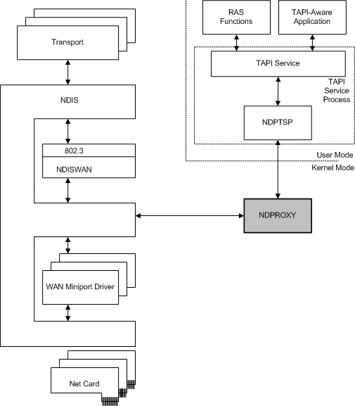

# NDPROXY Overview

## 

**Note**  If you are reading this page because of the 27 November 2013 [Microsoft Security Advisory (2914486)](http://technet.microsoft.com/security/advisory/2914486) affecting Windows XP and Windows Server 2003, you may find this Trustworthy Computing [blog post](http://blogs.technet.com/b/msrc/archive/2013/11/27/microsoft-releases-security-advisory-2914486.aspx) helpful.

 

NDPROXY is a system-provided driver that interfaces NDISWAN and CoNDIS WAN drivers (WAN miniport drivers, call managers, and miniport call managers) to the TAPI services. This topic introduces NDPROXY operations that are further documented in [CoNDIS WAN Operations that Support Telephonic Services](condis-wan-operations-that-support-telephonic-services.md).

The following figure shows how NDPROXY interfaces with other components in the RAS architecture.

NDPROXY provides the kernel-mode component of the service provider interface (SPI) for CoNDIS WAN. TAPI-aware applications make user-mode TAPI requests and the TAPI service routes these requests to NDPTSP. NDPTSP converts the user-mode TAPI service requests to kernel-mode SPI requests and passes the SPI requests to NDPROXY.

NDPROXY communicates through NDIS with the NDISWAN driver and one of the following:

-   A miniport driver with a separate call manager

-   An integrated miniport call manager (MCM)

The miniport driver interface and call manager interface to NDISWAN and NDPROXY are the same regardless of the configuration.

**Note**  You can use the miniport driver with a separate call manager in situations where multiple hardware platforms need to be supported. In this situation, the same call manager can be used in combination with multiple miniport drivers to simplify development.

 

The following list summarizes the interfaces that exist between NDPROXY and the other components in the CoNDIS WAN driver stack:

-   NDPROXY presents a connection-oriented client interface to CoNDIS WAN miniport drivers and a call manager interface to NDISWAN.

-   NDISWAN presents a connection-oriented client interface to NDPROXY, CoNDIS WAN miniport drivers, and MCMs.

-   CoNDIS WAN call managers or MCMs present a call manager interface to NDPROXY.

-   CoNDIS WAN miniport drivers and MCMs present a CoNDIS miniport driver interface to NDISWAN.

For more information about connection-oriented clients, call managers, miniport drivers, and MCMs, see [Connection-Oriented Environment](connection-oriented-environment.md).

NDPROXY calls the [**NdisCoOidRequest**](https://msdn.microsoft.com/library/windows/hardware/ff561711) function with connection-oriented TAPI OIDs to determine the capabilities of a CoNDIS WAN miniport driver. NDPROXY also registers the TAPI-specific address family, creates virtual connections (VCs), makes and accepts calls, and activates VCs so that data can be sent and received on those VCs. For more information about handling OID requests in the CoNDIS WAN miniport driver, see [Handling Queries in a CoNDIS WAN Miniport Driver](handling-queries-in-a-condis-wan-miniport-driver.md) and [Setting CoNDIS WAN Miniport Driver Information](setting-condis-wan-miniport-driver-information.md).

 

 

