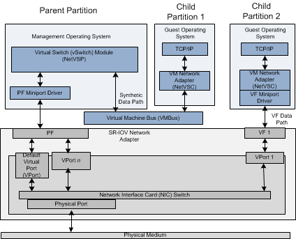

# Overview of SR-IOV Data Paths

When a Hyper-V child partition is started and the guest operating system is running, the virtualization stack starts the Network Virtual Service Client (NetVSC). NetVSC exposes a virtual machine (VM) network adapter by providing a miniport driver edge to the protocol stacks that run in the guest operating system. In addition, NetVSC provides a protocol driver edge that allows it to bind to the underlying miniport drivers.

NetVSC also communicates with the Hyper-V extensible switch that runs in the management operating system of the Hyper-V parent partition. The extensible switch component operates as a Network Virtual Service Provider (NetVSP). The interface between the NetVSC and NetVSP provides a software data path that is known as the *synthetic data path*. For more information about this data path, see [SR-IOV Synthetic Data Path](sr-iov-synthetic-data-path.md).

If the physical network adapter supports the single root I/O virtualization (SR-IOV) interface, it can enable one or more PCI Express (PCIe) Virtual Functions (VFs). Each VF can be attached to a Hyper-V child partition. When this happens, the virtualization stack performs the following steps:

1.  The virtualization stack exposes a network adapter for the VF in the guest operating system. This causes the PCI driver that runs in the guest operating system to start the VF miniport driver. This driver is provided by the independent hardware vendor (IHV) for the SR-IOV network adapter.

2.  After the VF miniport driver is loaded and initialized, NDIS binds the protocol edge of the NetVSC in the guest operating system to the driver.

    **Note**  NetVSC only binds to the VF miniport driver. No other protocol stacks in the guest operating system can bind to the VF miniport driver.

     

    After the NetVSC successfully binds to the driver, network traffic in the guest operating system occurs over the *VF data path*. Packets are sent or received over the underlying VF of the network adapter instead of the synthetic data path.

    For more information about the VF data path, see [SR-IOV VF Data Path](sr-iov-vf-data-path.md).

The following figure shows the various data paths that are supported over an SR-IOV network adapter.

After the Hyper-V child partition is started and before the VF data path is established, network traffic flows over the synthetic data path. After the VF data path is established, network traffic can revert to the synthetic data path if the following conditions are true:

-   The VF becomes unattached to the Hyper-V child partition. For example, the virtualization stack could detach a VF from one child partition and attach it to another child partition. This might occur when there are more Hyper-V child partitions that are running than there are VF resources on the underlying SR-IOV network adapter.

    The process of failing over to the synthetic data path from the VF data path is known as *VF failover*.

-   The Hyper-V child partition is being live migrated to a different host.

For more information about VF failover and live migration, see [SR-IOV VF Failover and Live Migration](sr-iov-vf-failover-and-live-migration-support.md).

 

 

