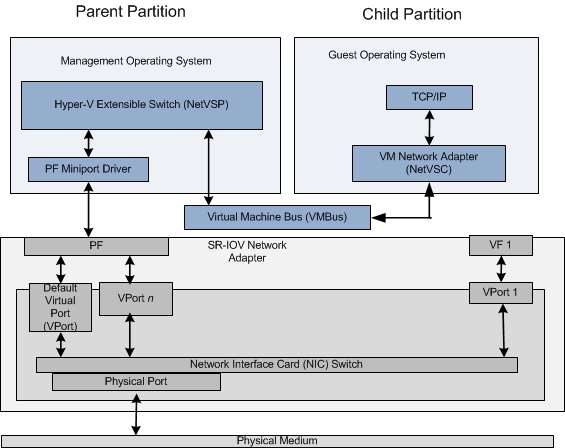

# SR-IOV Synthetic Data Path

When a Hyper-V child partition is started and the guest operating system is running, the virtualization stack starts the Network Virtual Service Client (NetVSC). NetVSC exposes a virtual machine (VM) network adapter that provides a miniport driver edge to the protocol stacks that run in the guest operating system.

NetVSC also communicates with the Hyper-V extensible switch that runs in the management operating system of the Hyper-V parent partition. The extensible switch component operates as a Network Virtual Service Provider (NetVSP). The interface between the NetVSC and NetVSP provides a software data path that is known as the *synthetic data path*.

The following diagram shows the components of the synthetic data path over an SR-IOV network adapter.

If the underlying SR-IOV network adapter allocates resources for PCI Express (PCIe) Virtual Functions (VFs), the virtualization stack will attach a VF to a Hyper-V child partition. Once attached, packet traffic within the child partition will occur over the hardware-optimized VF data path instead of the synthesized data path. For more information on the VF data path, see [SR-IOV Data Path](sr-iov-data-paths.md).

The virtualization stack may still enable the synthetic data path for a Hyper-V child partition if one of the following conditions is true:

-   The SR-IOV network adapter has insufficient VF resources to accommodate all of the Hyper-V child partitions that were started. After all VFs on the network adapter are attached to child partitions, the remaining partitions use the synthetic data path.

    The process of failing over to the synthetic data path from the VF data path is known as *VF failover*.

-   A VF was attached to a Hyper-V child partition but becomes detached. For example, the virtualization stack could detach a VF from one child partition and attach it to another child partition. This might occur when there are more Hyper-V child partitions that are running than there are VF resources on the underlying SR-IOV network adapter.

-   The Hyper-V child partition is being live migrated to a different host.

Although the synthetic data path over an SR-IOV network adapter is not as efficient as the VF data path, it can still be hardware optimized. For example, if one or more virtual ports (VPorts) are configured and attached to the PCIe Physical Function (PF), the data path can provide the offload capabilities that resemble the virtual machine queue (VMQ) interface. For more information, see [Nondefault Virtual Ports and VMQ](nondefault-virtual-ports-and-vmq.md).

 

 

