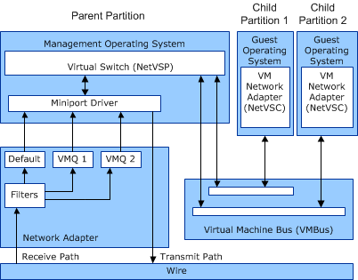

# VMQ Components

## 

The following illustration shows the relationships among the various components in a virtual machine queue (VMQ) operating environment.

The preceding figure illustrates the following VMQ components:

 **Network Virtual Service Provider (NetVSP)**  
An NDIS driver that runs in the management operating system of the Hyper-V parent partition. This driver provides services to support networking access by the Hyper-V child partitions.

**Note**  Starting with Windows Server 2008, the Hyper-V extensible switch component provides NetVSP support to the NetVSC components that run in the guest operating system. For more information about this component, see [Hyper-V Extensible Switch](hyper-v-extensible-switch.md).

 

**Network Virtual Service Client (NetVSC)**  
An NDIS driver that runs in the guest operating system of a Hyper-V child partition. NetVSC exposes a virtualized view of the physical network adapter on the host computer. This virtualized device is known as the *VM network adapter*.

The NetVSC provides the following functionality:

-   Supports networking device functionality in Hyper-V child partitions.

-   Accesses the physical network adapter by passing messages over the virtual machine bus (VMBus) to the associated NetVSP driver. This driver runs in the management operating system of the Hyper-V parent partition.

 **Virtual Machine Bus (VMBus)**  
A virtual communications bus that passes control and data messages between the Hyper-V parent and child partitions.

**Note**  In Hyper-V, a child partition is also known as a virtual machine (VM).

 

**VM Bus Channel**  
A communications channel on the VMBus between a NetVSC in a Hyper-V child partition and the NetVSP in the Hyper-V parent partition.

**VM Queue**  
A queue for received data. A network adapter that supports VMQ has hardware to route data to a VM queue.

**VMQ Filter**  
A filter to test incoming data. A network adapter that supports VMQ uses filters to test packet data in order to assign the packet to a queue.

 

 

