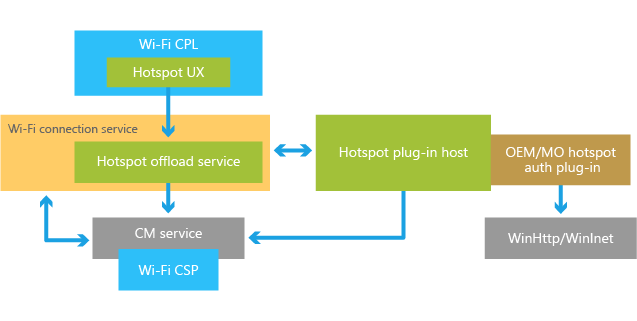

# Wi-Fi Hotspot Offloading Architecture

[!include[Wi-Fi Hotspot Offloading deprecation](wi-fi-hotspot-offloading-deprecation.md)]

The following diagram shows the major components in the Wi-Fi Offload Framework.

## Hotspot offload service

The hotspot offload service performs the following functions:

* Identifies Wi-Fi networks that are hotspot networks
* Oversees the creation and maintenance of connections to hotspot networks
* Monitors and responds to connection state changes for hotspot networks
* Monitors and responds to changes in user settings for enabling or disabling Wi-Fi hotspot offloading

The hotspot offload service relies on hotspot plugins created by mobile operators and/or OEMs to identify and authenticate their hotspot networks.

## Hotspot plugin host

The hotspot plugin host is the interface between the hotspot offload service and the partner-implemented hotspot plugin. For example, queries to the hotspot plugin to identify hotspot networks from a list of networks are made through the hotspot plugin host. The plugin host also enables the hotspot plugin to, among other things, send and receive HTTP messages via the WinHTTP/WinInet API and send SMS alerts and notifications to the user.

The hotspot offload service is responsible for creating a hotspot plugin host for each hotspot plugin.

## Hotspot plugin

The hotspot plugin performs the following functions:

* Identifies hotspot networks from a list of available networks
* Enables automatic connection to networks using EAP-SIM/AKA and HTTP-based authentication, as specified by the OEM or mobile operator
* Sends/receives HTTP messages via the WinHTTP/WinInet API
* Sends SMS notifications to the user
* Selects a bearer token for an HTTP request to send and receive messages over a cellular network

It also interacts directly with the following external components:

* WinInet/WinHTTP

Mobile operators and/or OEMs must implement and install their own hotspot plugins to enable Wi-Fi offloading. The installation package for the plugin includes the following:

* The plugin DLL
* Files containing connection-specific information such as a list of SSIDs, encrypted credentials, etc.
  * **Note:** These files are optional and are not expected in most plugins.
* Registry configuration

## Hotspot user interface

The hotspot user interface is displayed in the Wi-Fi control panel. Through the user interface the user can:

* Enable/disable automatic Wi-Fi hotspot offloading.
* View connection status during automatic connection to a hotspot network.
* Manually connect to a hotspot network.
  * If hotspot offload functionality is enabled on the device, user-initiated connections to a network that the hotspot offload service has identified as a hotspot network will be handled as automatic connections to a Wi-Fi hotspot network. Otherwise, the manual connection will be handled as a standard Wi-Fi connection.
* Configure a normal Wi-Fi profile for connection to a hotspot network if the mobile operator hotspot connectivity has been disabled by the user.

The hotspot user interface is only displayed when at least one plugin is configured.

## Example: Automatic connection to a hotspot network

The following is a very high-level description of the sequence of component interactions that occur during automatic connection to a hotspot network:

1. The Wi-Fi Connection Service sends to the Hotspot Offload Service a list of networks that are not connected.
2. For each entry in the list of networks, the Hotspot Offload Service queries the hotspot plugins (in the order the plugins were ranked) to determine if it is a hotspot network. The first plugin to identify the network is asked to authenticate that network at connection time.
3. When a hotspot plugin identifies a network as a hotspot network, it returns a priority value associated with that network, the authentication method to be used (whether it is HTTP-based, or EAP-SIM based, or requires no specific SIM) and, optionally, the network display mask. The priority value indicates the order in which a connection should be attempted. Connections to networks with lower priority values will be attempted before connections to networks with higher values.
4. The Hotspot Offload Service creates a Connection Manager profile for the selected network.
5. The Hotspot Offload Service profile may also configure an initial policy setting that will cause the Connection Manager to block applications from connecting to the network until authorized.
6. The Hotspot Offload Service marks the selected network as a hotspot network.
7. The Hotspot Offload Service calls the hotspot plugin, through the hotspot plugin host, to do any pre-connect processing if needed.
8. After the hotspot plugin has completed pre-connect processing, the Hotspot Offload Service waits for the Connection Manager to connect to the hotspot network and provide a connection-completion or failure notification.
9. On connection-completion, the Hotspot Offload Service sends a request to the hotspot plugin to perform any necessary post-connect actions, such as HTTPS exchange.
10. In the meantime, the Hotspot Offload Service does the following:
    * Starts a timer for completion of the post-connect activity (currently set to fire after 5 minutes)
    * Sets proper user interface display state
11. If the hotspot plugin indicates connection success, the Hotspot Offload service calls the Connection Manager to unblock the connection and notify applications.
12. If the post-connection request times out:
    * The Hotspot Offload Service resets the hotspot plugin’s state.
    * If retries are not exhausted the hotspot offload service initiates an attempt to reconnect, otherwise it deletes the network’s hotspot profile.
13. If the hotspot plugin indicates failure and retries are possible, the hotspot offload service initiates an attempt to reconnect, otherwise it deletes the network’s hotspot profile.

