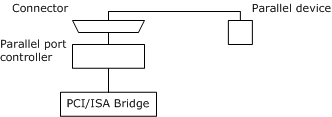
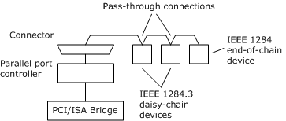

# Physical Configuration of Devices Attached to a Parallel Port

## 

This section describes the typical physical configurations of devices that are attached to a parallel port.

The following figure shows a parallel device attached a parallel port.

Microsoft Windows supports one parallel device attached to a parallel port, which can be a legacy device or a Plug and Play device that complies with the IEEE 1284 standard.

The following figure shows IEEE 1284.3 devices and an end-of-chain IEEE 1284 device that are simultaneously attached to a parallel port.

The IEEE 1284.3 standard specifies that up to four daisy chain devices and an end-of-chain device can be simultaneously attached to a parallel port.

The following table specifies the number of IEEE 1284.3 devices that are supported by each version of Windows.

<table>
<colgroup>
<col width="25%" />
<col width="25%" />
<col width="25%" />
<col width="25%" />
</colgroup>
<thead>
<tr class="header">
<th>Windows version</th>
<th>Maximum number of daisy chain devices</th>
<th>IEEE 1284.3 device IDs</th>
<th>Comments</th>
</tr>
</thead>
<tbody>
<tr class="odd">
<td>
Windows Me
</td>
<td>
zero
</td>
<td>
N/A
</td>
<td>
Not supported by system-supplied drivers.
</td>
</tr>
<tr class="even">
<td>
Windows 2000
</td>
<td>
four
</td>
<td>
from 0 through 3
</td>
<td>
To ensure reliable operation, Microsoft recommends at most two devices.
</td>
</tr>
<tr class="odd">
<td>
Windows XP and later
</td>
<td>
two
</td>
<td>
0 or 1
</td>
<td></td>
</tr>
</tbody>
</table>

 

For more information about supporting IEEE 1284.3 devices, see:

[Parallel Device Interfaces, Internal Names, and Symbolic Links](parallel-device-interfaces--internal-names--and-symbolic-links.md)

[Selecting and Deselecting an IEEE 1284 Device Attached to a Parallel Port](selecting-and-deselecting-an-ieee-1284-device-attached-to-a-parallel-p.md)

 

 

--------------------

