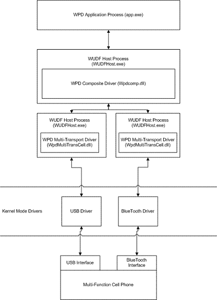

# The WpdMultiTransportDriver Sample

This section of the WPD driver documentation describes a sample multitransport driver, WpdMultiTransportDriver, that is included in the Windows Driver Kit.

A transport is a protocol over which a portable device communicates with a computer. Example transports include Internet Protocol (IP), Bluetooth, and USB.

A number of portable devices now support multiple transports. For example, some cell phones support both Bluetooth and USB.

Before Windows 7, if a user connected a portable device that supported multiple transports to their computer, the Windows Device Manager would display a unique node for each transport–. This could potentially imply that multiple devices had been installed. To resolve this, Windows 7 supports a multitransport driver model. This model ensures that only one node appears for each multitransport capable device.

The multitransport driver stack is shown in the following image:

In the previous image, a hypothetical WPD application (*App.exe*) can move data back and forth between a cell phone that is enabled with multitransport and either a USB or a Bluetooth connection. The WPD Composite driver (*Wpdcomp.dll*) is supplied by Microsoft and is included with Windows 7. The multitransport driver (*WpdMultiTranscell.dll*) is a hypothetical vendor-supplied driver.

The previous image depicts simultaneous connections over Bluetooth and USB. Some drivers mightimplement this functionality. The WpdMultiTransportDriver supports a single (rather than a simultaneous) connection at any given point in time.

This sample driver is based on the WpdHelloWorldDriver that is included in the WDK. Before you review the topics in this section, be familiar with the [WpdHelloWorldDriver](the-sample-driver-architecture.md).

The primary differences between the WpdHelloWorldDriver and the WpdMultiTransportDriver are identified in the following table.

| Revision or change     | Description                                                                                                                                                                                                                   |
|------------------------|-------------------------------------------------------------------------------------------------------------------------------------------------------------------------------------------------------------------------------|
| Device Arrival         | The new multitransport driver creates a Functional Unique Identifier (FUID) for the given device, enables the multitransport option, sets the necessary Plug and Play (PnP) values, and sets the current transport bandwidth. |
| Multiple queue support | The new multitransport driver supports two I/O queues. (The WpdHelloWorldDriver supports a single queue.)                                                                                                                     |

 

To explore the capabilities of a multitransport driver and to test actual transport switching, you can install the [Device Enabling Kit](http://go.microsoft.com/fwlink/p/?linkid=146334) from the WHDC Web site and use the MTP simulator (*MtpSimUi.exe)* application. By using this application, you can install Microsoft's MTP driver, connect or disconnect from the emulated device, and switch transports.

## Related topics

[The WPD Driver Samples](the-wpd-driver-samples.md)

 

 

[Send comments about this topic to Microsoft](mailto:wsddocfb@microsoft.com?subject=Documentation%20feedback%20[wpd_dk\wpddk]:%20The%20WpdMultiTransportDriver%20Sample%20%20RELEASE:%20%281/5/2017%29&body=%0A%0APRIVACY%20STATEMENT%0A%0AWe%20use%20your%20feedback%20to%20improve%20the%20documentation.%20We%20don't%20use%20your%20email%20address%20for%20any%20other%20purpose,%20and%20we'll%20remove%20your%20email%20address%20from%20our%20system%20after%20the%20issue%20that%20you're%20reporting%20is%20fixed.%20While%20we're%20working%20to%20fix%20this%20issue,%20we%20might%20send%20you%20an%20email%20message%20to%20ask%20for%20more%20info.%20Later,%20we%20might%20also%20send%20you%20an%20email%20message%20to%20let%20you%20know%20that%20we've%20addressed%20your%20feedback.%0A%0AFor%20more%20info%20about%20Microsoft's%20privacy%20policy,%20see%20http://privacy.microsoft.com/default.aspx. "Send comments about this topic to Microsoft")

