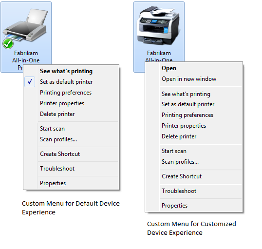

# Device Experience in Devices and Printers

In Windows Vista, users open the Printers folder to view the available printers. They open the Control Panel Scanners and Cameras application to view the available scanners and cameras. In Windows 7, the Printers folder is removed and all printers and scanners appear in the Devices and Printers view.

If a manufacturer does not supply a custom Device Stage metadata package for a printer, scanner, or MFP device, the devices will still appear in the Devices and Printers view. Devices and Printers user interface provides a default device experience for the device. The default device experience does not include a Device Stage page for the device.

As shown in Figure 3, the device icon and the context menu that appears when the user right-clicks a device in the Devices and Printers view is different for devices that have customized device experiences and those devices that have default device experiences. In this example, the device is a locally connected MFP. For the default experience, shown on the left side of Figure 3, the device is represented by a generic printer icon. For the customized experience, shown on the right side of Figure 3, the device is represented by a custom icon that the manufacturer supplies. For the customized experience, the default action in the context menu is **Open**. Clicking **Open** opens the Device Stage page. **Open in new window** opens the Device Stage in a new window. For the default experience, the device has no associated Device Stage page and the context menu does not contain an **Open** option. Clicking the **See what's printing** option opens the print queue.

 

 

--------------------
[Send comments about this topic to Microsoft](mailto:wsddocfb@microsoft.com?subject=Documentation%20feedback%20%5Bprint\print%5D:%20Device%20Experience%20in%20Devices%20and%20Printers%20%20%20RELEASE:%20%289/1/2016%29&body=%0A%0APRIVACY%20STATEMENT%0A%0AWe%20use%20your%20feedback%20to%20improve%20the%20documentation.%20We%20don't%20use%20your%20email%20address%20for%20any%20other%20purpose,%20and%20we'll%20remove%20your%20email%20address%20from%20our%20system%20after%20the%20issue%20that%20you're%20reporting%20is%20fixed.%20While%20we're%20working%20to%20fix%20this%20issue,%20we%20might%20send%20you%20an%20email%20message%20to%20ask%20for%20more%20info.%20Later,%20we%20might%20also%20send%20you%20an%20email%20message%20to%20let%20you%20know%20that%20we've%20addressed%20your%20feedback.%0A%0AFor%20more%20info%20about%20Microsoft's%20privacy%20policy,%20see%20http://privacy.microsoft.com/default.aspx. "Send comments about this topic to Microsoft")

