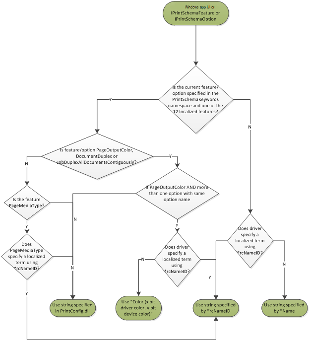
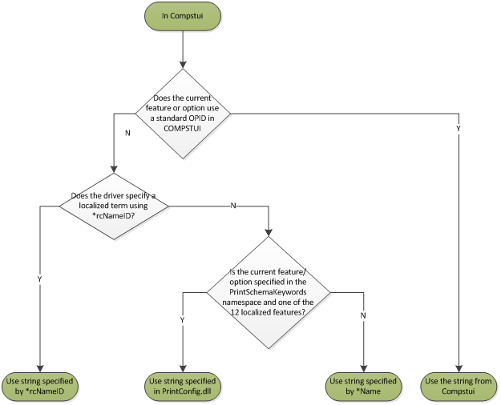

# V4 Printer Driver Localization

Windows 8 has provided standard, localized display strings to support the development of printer extensions and Windows Store device apps.

These standard, localized display strings are provided through the new [**IPrintSchemaCapabilities**](https://msdn.microsoft.com/library/windows/hardware/hh451256) objects to support some features and their associated standard options. The following table shows the features that Windows 8 can localize with its standard display strings:

<table>
<colgroup>
<col width="50%" />
<col width="50%" />
</colgroup>
<thead>
<tr class="header">
<th align="left">Feature</th>
<th align="left">Standard options</th>
</tr>
</thead>
<tbody>
<tr class="odd">
<td align="left">Input bins</td>
<td align="left">Job/Document/PageInputBin</td>
</tr>
<tr class="even">
<td align="left">Media types</td>
<td align="left">PageMediaType</td>
</tr>
<tr class="odd">
<td align="left">Duplexing</td>
<td align="left">JobDuplexAllDocumentsContiguously</td>
</tr>
<tr class="even">
<td align="left">Collation</td>
<td align="left">DocumentCollate</td>
</tr>
<tr class="odd">
<td align="left">Output color</td>
<td align="left">PageOutputColor</td>
</tr>
<tr class="even">
<td align="left">Orientation</td>
<td align="left">PageOrientation</td>
</tr>
<tr class="odd">
<td align="left">N-Up</td>
<td align="left">JobNUpAllDocumentsContiguously</td>
</tr>
<tr class="even">
<td align="left">Hole punching</td>
<td align="left"><ul>
<li>
JobHolePunch
</li>
<li>
DocumentHolePunch
</li>
</ul></td>
</tr>
<tr class="odd">
<td align="left">Stapling</td>
<td align="left"><ul>
<li>
JobStapleAllDocuments
</li>
<li>
DocumentStaple
</li>
</ul></td>
</tr>
<tr class="even">
<td align="left">Binding</td>
<td align="left"><ul>
<li>
JobBindAllDocuments
</li>
<li>
DocumentBinding
</li>
</ul></td>
</tr>
<tr class="odd">
<td align="left">Output quality</td>
<td align="left">PageOutputQuality</td>
</tr>
<tr class="even">
<td align="left">Media size</td>
<td align="left">PageMediaSize</td>
</tr>
</tbody>
</table>

 

In addition, these strings are available in the XML forms of PrintCapabilities, provided that the driver does not specify a display name using a resource DLL for the feature or option. If a driver does specify a display name using a resource DLL, it will be provided in the XML, as well as to the legacy COMPSTUI-based print preferences UI used on previous versions of Windows.

Across the different user interfaces and APIs, the display names vary. Use the following three flowcharts to see an overview of the expected localization behavior for a given scenario.

The following flowchart shows the expected localization behavior in Windows Store apps, as well as in the [**IPrintSchemaFeature**](https://msdn.microsoft.com/library/windows/hardware/hh451284) and [**IPrintSchemaOption**](https://msdn.microsoft.com/library/windows/hardware/hh451335) families of objects.

The following flowchart shows the expected localization behavior in **PrintCapabilities** XML documents.

The following flowchart shows the expected localization behavior in the standard, Compstui-based print preferences dialog.

To use the Microsoft-localized display names, follow the instructions in this table to properly edit your GPD or PPD configuration files.

<table>
<colgroup>
<col width="50%" />
<col width="50%" />
</colgroup>
<thead>
<tr class="header">
<th align="left">File type</th>
<th align="left">Instructions</th>
</tr>
</thead>
<tbody>
<tr class="odd">
<td align="left">GPD</td>
<td align="left"><ul>
<li>
Specify the <strong>*Name</strong> entry for the GPD feature or option.
</li>
<li>
Do not specify the <strong>*rcNameID</strong> entry.
</li>
<li>For the following features/options, you must also specify <strong>*PrintSchemaKeywordMap</strong> to map GPD features or options to the corresponding Print Schema-defined features or options, unless they are specified as [Standard Features](standard-features.md). To see examples showing how to use <strong>*PrintSchemaKeywordMap</strong> to map features, see [GPD/PPD-Based Feature Description Changes](gpd-ppd-based-feature-description-changes.md).
o JobHolePunch, DocumentHolePunch
o JobStapleAllDocuments, DocumentStaple
o JobBindAllDocuments, DocumentBinding
o PageOutputQuality
o PageMediaType</li>
<li>
For N-Up, do not use <strong>*PrintSchemaKeywordMap</strong> on the option values.
</li>
</ul></td>
</tr>
<tr class="even">
<td align="left">PPD</td>
<td align="left"><ul>
<li>
Use <strong>*PrintSchemaKeywordMap</strong> to map PPD features or options to the corresponding Print Schema-defined features or options. To see examples showing how to use <strong>*PrintSchemaKeywordMap</strong> to map features, see [GPD/PPD-Based Feature Description Changes](gpd-ppd-based-feature-description-changes.md).
</li>
<li>
For N-Up, do not use <strong>*PrintSchemaKeywordMap</strong> on the option values.
</li>
</ul></td>
</tr>
</tbody>
</table>

 

**Localizing PPD Based Drivers**

PPD based drivers do not support resource DLLs. As a result, it may be necessary to provide multiple PPD files. Microsoft recommends that v4 print drivers that use PPD configuration files should use the techniques outlined in this topic to include one PPD file per locale.

## Related topics

[**IPrintSchemaCapabilities**](https://msdn.microsoft.com/library/windows/hardware/hh451256)

[**IPrintSchemaFeature**](https://msdn.microsoft.com/library/windows/hardware/hh451284)

[**IPrintSchemaOption**](https://msdn.microsoft.com/library/windows/hardware/hh451335)

[GPD/PPD-Based Feature Description Changes](gpd-ppd-based-feature-description-changes.md)

[Standard Features](standard-features.md)

 

 

[Send comments about this topic to Microsoft](mailto:wsddocfb@microsoft.com?subject=Documentation%20feedback%20%5Bprint\print%5D:%20V4%20Printer%20Driver%20Localization%20%20RELEASE:%20%283/29/2016%29&body=%0A%0APRIVACY%20STATEMENT%0A%0AWe%20use%20your%20feedback%20to%20improve%20the%20documentation.%20We%20don't%20use%20your%20email%20address%20for%20any%20other%20purpose,%20and%20we'll%20remove%20your%20email%20address%20from%20our%20system%20after%20the%20issue%20that%20you're%20reporting%20is%20fixed.%20While%20we're%20working%20to%20fix%20this%20issue,%20we%20might%20send%20you%20an%20email%20message%20to%20ask%20for%20more%20info.%20Later,%20we%20might%20also%20send%20you%20an%20email%20message%20to%20let%20you%20know%20that%20we've%20addressed%20your%20feedback.%0A%0AFor%20more%20info%20about%20Microsoft's%20privacy%20policy,%20see%20http://privacy.microsoft.com/default.aspx. "Send comments about this topic to Microsoft")

