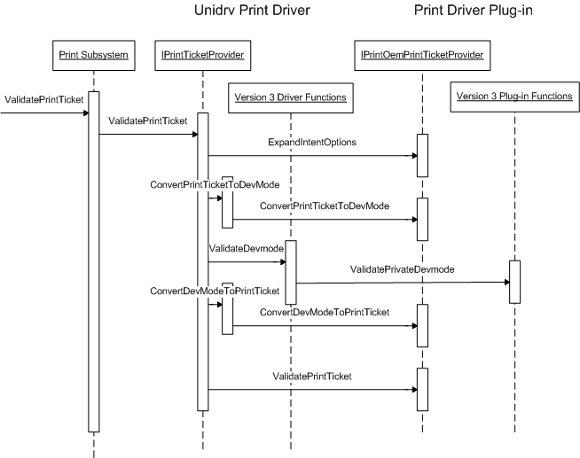

# ValidatePrintTicket overview

Unidrv and PScript5 print drivers validate the Print Ticket by using the sequence that the following illustration and list show.

1.  For each plug-in, call the [**IPrintOemPrintTicketProvider::ExpandIntentOptions**](https://msdn.microsoft.com/library/windows/hardware/ff553168) method.

2.  Call the [**IPrintOemPrintTicketProvider::ConvertPrintTicketToDevMode**](https://msdn.microsoft.com/library/windows/hardware/ff553167) method.

3.  For each plug-in, call **IPrintOemPrintTicketProvider::ConvertPrintTicketToDevMode** to convert the private portions of the [**DEVMODEW**](https://msdn.microsoft.com/library/windows/hardware/ff552837) structure.

4.  Validate public and private parts of the DEVMODEW structure that the Unidrv or PScript5 print driver supports.

5.  For each plug-in, validate the private parts of the DEVMODEW structure.

6.  Call the [**IPrintTicketProvider::ConvertPrintTicketToDevMode**](https://msdn.microsoft.com/library/windows/hardware/ff554363) method.

7.  For each plug-in, call the [**IPrintOemPrintTicketProvider::ConvertDevModeToPrintTicket**](https://msdn.microsoft.com/library/windows/hardware/ff553161) method to convert the private portions of the DEVMODEW structure.

8.  For each plug-in, call the [**IPrintOemPrintTicketProvider::ValidatePrintTicket**](https://msdn.microsoft.com/library/windows/hardware/ff553184) method to validate the PrintTicket.

 

 

--------------------
[Send comments about this topic to Microsoft](mailto:wsddocfb@microsoft.com?subject=Documentation%20feedback%20%5Bprint\print%5D:%20ValidatePrintTicket%20%20RELEASE:%20%289/1/2016%29&body=%0A%0APRIVACY%20STATEMENT%0A%0AWe%20use%20your%20feedback%20to%20improve%20the%20documentation.%20We%20don't%20use%20your%20email%20address%20for%20any%20other%20purpose,%20and%20we'll%20remove%20your%20email%20address%20from%20our%20system%20after%20the%20issue%20that%20you're%20reporting%20is%20fixed.%20While%20we're%20working%20to%20fix%20this%20issue,%20we%20might%20send%20you%20an%20email%20message%20to%20ask%20for%20more%20info.%20Later,%20we%20might%20also%20send%20you%20an%20email%20message%20to%20let%20you%20know%20that%20we've%20addressed%20your%20feedback.%0A%0AFor%20more%20info%20about%20Microsoft's%20privacy%20policy,%20see%20http://privacy.microsoft.com/default.aspx. "Send comments about this topic to Microsoft")

