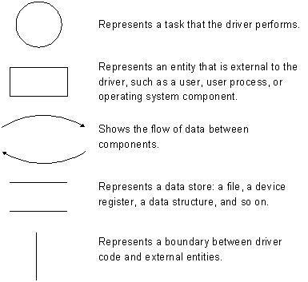
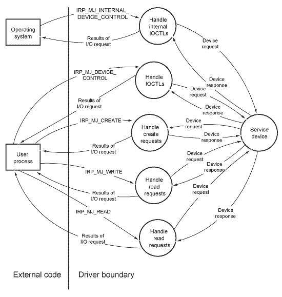
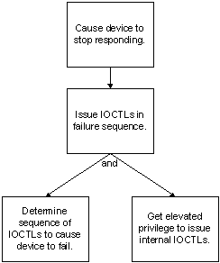

# Create threat models for drivers

Creating a threat model requires a thorough understanding of the driver’s design, the types of threats to which the driver might be exposed, and the consequences of a security attack that exploits a particular threat. After creating the threat model for a driver, you can determine how to mitigate the potential threats.

Threat modeling is most effective when performed in an organized, structured way during driver design, rather than haphazardly during coding. A structured approach increases the likelihood that you will discover vulnerabilities in the design, thereby helping to ensure that the model is comprehensive.

One way to organize a threat modeling effort is to follow these steps:

1.  Create a structured diagram showing data flow through the driver. Include all possible tasks that the driver performs and the source and destination of all input and output from the driver. A formal data flow diagram, or similar structured diagram, can help you to analyze the path of data through your driver and to identify the driver’s external interfaces, boundaries, and interactions. Numerous books about data flow diagrams are available. To find references, search on “data flow diagram” in your favorite Internet search engine.
2.  Analyze the potential security threats, based on the data flow diagram.
3.  Assess the threats that you identified in the previous step and determine how to mitigate them.

## Create a data flow diagram

A data flow diagram shows in conceptual form the flow of data between the driver and the external entities with which it interacts—typically the operating system, a user process, and the device. A formal data flow diagram uses the following symbols:

The following figure shows a sample data flow diagram for a hypothetical kernel-mode Windows Driver Model (WDM) driver. Regardless of the architecture for your particular type of driver, the conceptual model is the same: show all data paths and identify each source of data that enters or exits the driver.

**Note**  The previous figure shows data flowing directly between a user process and the driver, and omits any intermediate drivers. However, in reality, all requests pass through the I/O manager and may traverse one or more higher-level drivers before reaching a particular driver. The figure omits these intermediate steps to emphasize the importance of the original source of the data and the context of the thread that supplied the data. Kernel-mode drivers must validate data that originates in user mode.

 

Information enters the driver because of requests from the operating system, requests from a user process, or requests (typically interrupts) from the device.

The driver in the previous figure receives data from the operating system in several types of requests:

-   Requests to perform administrative tasks for the driver and its device, through calls to **DriverEntry**, **DriverUnload**, and **AddDevice** routines
-   Plug and Play requests (IRP\_MJ\_PNP)
-   Power management requests (IRP\_MJ\_POWER)
-   Internal device I/O control requests (IRP\_MJ\_INTERNAL\_DEVICE\_CONTROL)

In response to these requests, data flows from the driver back to the operating system as status information. The driver in the figure receives data from a user process in the following types of requests:

-   Create, read, and write requests (IRP\_MJ\_CREATE, IRP\_MJ\_READ, or IRP\_MJ\_WRITE)
-   Public device I/O control requests (IRP\_MJ\_DEVICE\_ CONTROL)

In response to these requests, output data and status information flow from the driver back to the user process.

Finally, the driver receives data from the device because of device I/O operations or user actions (such as opening the tray on a CD drive) that change device status. Likewise, data from the driver flows to the device during I/O operations and changes in device status.

The previous figure shows driver data flow at a broad conceptual level. Each circle represents a relatively large task and lacks detail. In some cases, a one-level diagram such as the sample is adequate for understanding the data sources and paths. If your driver handles many different types of I/O requests from varying sources, you might need to create one or more additional diagrams that show more detail. For example, the circle labeled “Handle I/O Requests” might be expanded into a separate diagram, similar to the following figure.

The second diagram shows separate tasks for each type of I/O request in the first diagram. (For simplicity, data paths to the device have been omitted.)

The external entities and the types of input and output shown in the diagram may vary, depending on the type of device. For example, Windows supplies class drivers for many common device types. A system-supplied class driver works with a vendor-supplied minidriver, which typically is a dynamic link library (DLL) that contains a set of callback routines. User I/O requests are directed to the class driver, which then calls the routines in the minidriver to perform specific tasks. The minidriver typically does not receive the entire I/O request packet as input; instead, each callback routine receives only the data that is required for its specific task.

As you create the data flow diagrams, remember the variety of sources for driver requests. Any code that is run on a user’s computer could generate an I/O request to a driver, from well-known applications such as Microsoft Office to freeware, shareware, and Web downloads of potentially dubious origin. Depending on your specific device, you might also need to consider media codecs or third-party filters that your company ships to support its device. Possible data sources include:

-   IRP\_MJ\_XXX requests that the driver handles
-   IOCTLs that the driver defines or handles
-   APIs that the driver calls
-   Callback routines
-   Any other interfaces that the driver exposes
-   Files that the driver reads or writes, including those used during installation
-   Registry keys that the driver reads or writes
-   Configuration property pages, and any other information provided by the user that the driver consumes

Your model should also cover the driver installation and update procedures. Include all the files, directories, and registry entries that are read or written during driver installation. Consider also the interfaces exposed in device installers, co-installers, and property pages.

Any point at which the driver exchanges data with an external entity is potentially vulnerable to attack.

## Analyze potential threats

After you identify the points at which a driver might be vulnerable, you can determine which types of threats could occur at each point. Consider the following types of questions:

-   What security mechanisms are in place to protect each resource?
-   Are all transitions and interfaces properly secured?
-   Could improper use of a feature unintentionally compromise security?
-   Could malicious use of a feature compromise security?
-   Do default settings provide adequate security?

### The STRIDE approach

The acronym STRIDE describes six categories of threats to software. This acronym is derived from:

-   **S**poofing
-   **T**ampering
-   **R**epudiation
-   **I**nformation disclosure
-   **D**enial of service
-   **E**levation of privilege

Using STRIDE as a guide, you can pose detailed questions about the kinds of attacks that could be targeted at a driver. The goal is to determine the types of attacks that could be possible at each vulnerable point in the driver and then to create a scenario for each possible attack.

-   **Spoofing** is using someone else’s credentials to gain access to otherwise inaccessible assets. A process mounts a spoofing attack by passing forged or stolen credentials.
-   **Tampering** is changing data to mount an attack. For example, a driver might be susceptible to tampering if the required driver files are not adequately protected by driver signing and access control lists (ACLs). In this situation, a malicious user could alter the files, thus breaching system security.
-   **Repudiation** occurs when a user denies performing an action, but the target of the action has no way to prove otherwise. A driver might be susceptible to a repudiation threat if it does not log actions that could compromise security. For example, a driver for a video device could be susceptible to repudiation if it does not log requests to change characteristics of its device, such as focus, scanned area, frequency of image capture, target location of captured images, and so forth. The resulting images could be corrupted, but system administrators would have no way to determine which user caused the problem.
-   **Information disclosure** threats are exactly as the name implies: the disclosure of information to a user who does not have permission to see it. Any driver that passes information to or from a user buffer is susceptible to information disclosure threats. To avoid information disclosure threats, drivers must validate the length of each user buffer and zero-initialize the buffers before writing data.
-   **Denial-of-service** attacks threaten the ability of valid users to access resources. The resources could be disk space, network connections, or a physical device. Attacks that slow performance to unacceptable levels are also considered denial-of-service attacks. A driver that allows a user process to monopolize a system resource unnecessarily could be susceptible to a denial-of-service attack if the resource consumption hinders the ability of other valid users to perform their tasks.

    For example, a driver might use a semaphore to protect a data structure while executing at IRQL = PASSIVE\_LEVEL. However, the driver must acquire and release the semaphore within a **KeEnterCriticalRegion/KeLeaveCriticalRegion** pair, which disables and re-enables the delivery of asynchronous procedure calls (APCs). If the driver fails to use these routines, an APC could cause the operating system to suspend the thread that holds the semaphore. As a result, other processes (including those created by an administrator) would be unable to gain access to the structure.

-   An **elevation-of-privilege** attack can occur if an unprivileged user gains privileged status. A kernel-mode driver that passes a user-mode handle to a **ZwXxx** routine is vulnerable to elevation-of-privilege attacks because **ZwXxx** routines bypass security checks. Kernel-mode drivers must validate every handle that they receive from user-mode callers.

    Elevation-of-privilege attacks can also occur if a kernel-mode driver relies on the **RequestorMode** value in the IRP header to determine whether an I/O request comes from a kernel-mode or user-mode caller. In IRPs that arrive from the network or the Server service (SRVSVC), the value of **RequestorMode** is **KernelMode**, regardless of the origin of the request. To avoid such attacks, drivers must perform access control checks for such requests instead of simply using the value of **RequestorMode**.

### Analysis techniques

A simple way to organize the analysis is to list the vulnerable areas along with the potential threats and one or more scenarios for each type of threat.

To perform a thorough analysis, you must explore the possibility of threats at every potentially vulnerable point in the driver. At each vulnerable point, determine each category of threat (spoofing, tampering, repudiation, information disclosure, denial of service, and elevation of privilege) that might be possible. Then create one or more attack scenarios for each plausible threat.

For example, consider the data flow for IRP\_MJ\_DEVICE\_CONTROL requests as shown in the preceding figure. The following table shows two types of threats that a driver could encounter when processing such requests:

<table>
<colgroup>
<col width="33%" />
<col width="33%" />
<col width="33%" />
</colgroup>
<thead>
<tr class="header">
<th align="left">Vulnerable point</th>
<th align="left">Potential threat (STRIDE)</th>
<th align="left">Scenario</th>
</tr>
</thead>
<tbody>
<tr class="odd">
<td align="left">IRP_MJ_DEVICE_CONTROL requests</td>
<td align="left">
Denial of service

Elevation of privilege
</td>
<td align="left">
User process issues a sequence of IOCTLs that causes the device to fail.

User process issues an IOCTL that permits FILE_ANY_ACCESS.
</td>
</tr>
</tbody>
</table>

 

One threat is often related to another. For example, an attack that exploits an elevation-of-privilege threat can result in information disclosure or denial of service. Furthermore, some types of attacks depend on a sequence of events. A malicious user might start by exploiting an elevation-of-privilege threat. Then, with the added capabilities that come with elevated privilege, the user might find and exploit additional vulnerabilities.

Threat trees and outlines can be useful in modeling such complex scenarios.

A threat tree is a diagram that shows a hierarchy of threats or vulnerabilities; in essence, a threat tree mimics the malicious user’s steps in mounting an attack. The ultimate goal of the attack is at the top of the tree. Each subordinate level shows the steps required to carry out the attack. The following figure is a simple threat tree for the denial-of-service scenario in the preceding example.

The threat tree shows the required steps to mount a particular attack and the relationships between the steps. An outline is an alternative to a threat tree.

An outline simply lists in hierarchical order the steps to attack a particular threat. For example:

1.0 Cause device to stop responding.

1.1 Issue IOCTLS in failure sequence.

1.1.1 Determine sequence that causes device to fail.

1.1.2 Get elevated privilege to issue internal IOCTLs.

Either technique can help you to understand which threats are most dangerous and which vulnerabilities in your design are most critical.

 

 

[Send comments about this topic to Microsoft](mailto:wsddocfb@microsoft.com?subject=Documentation%20feedback%20[hw_design\hw_design]:%20Create%20threat%20models%20for%20drivers%20%20RELEASE:%20%286/16/2017%29&body=%0A%0APRIVACY%20STATEMENT%0A%0AWe%20use%20your%20feedback%20to%20improve%20the%20documentation.%20We%20don't%20use%20your%20email%20address%20for%20any%20other%20purpose,%20and%20we'll%20remove%20your%20email%20address%20from%20our%20system%20after%20the%20issue%20that%20you're%20reporting%20is%20fixed.%20While%20we're%20working%20to%20fix%20this%20issue,%20we%20might%20send%20you%20an%20email%20message%20to%20ask%20for%20more%20info.%20Later,%20we%20might%20also%20send%20you%20an%20email%20message%20to%20let%20you%20know%20that%20we've%20addressed%20your%20feedback.%0A%0AFor%20more%20info%20about%20Microsoft's%20privacy%20policy,%20see%20http://privacy.microsoft.com/default.aspx. "Send comments about this topic to Microsoft")

