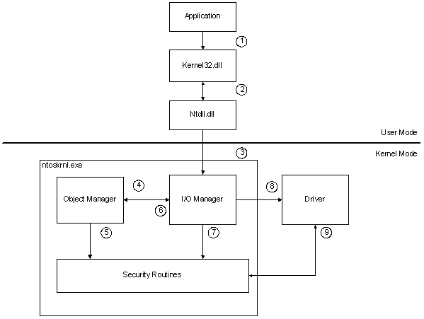

# Windows security model scenario: creating a file

**Last updated:**

-   July 7, 2004

The system uses the security constructs described in the Windows security model whenever a process creates a handle to a file or object.

The following diagram shows the security-related actions that are triggered when a user-mode process attempts to create a file.

The previous diagram shows how the system responds when a user-mode application calls the **CreateFile** function. The following notes refer to the circled numbers in the figure:

1.  A user-mode application calls the **CreateFile** function, passing a valid Microsoft Win32 file name.
2.  The user-mode Kernel32.dll passes the request to Ntdll.dll, which converts the Win32 name to a Microsoft Windows NT file name.
3.  Ntdll.dll calls the **NtCreateFile** function with the Windows file name. Within Ntoskrnl.exe, the I/O Manager handles **NtCreateFile**.
4.  The I/O Manager repackages the request into an Object Manager call.
5.  The Object Manager resolves symbolic links and ensures that the user has traversal rights for the path in which the file will be created. For more information, see [Security checks in the Object Manager](#omchecks).
6.  The Object Manager calls the system component that owns the underlying object type associated with the request. For a file creation request, this component is the I/O Manager, which owns device objects.
7.  The I/O Manager checks the security descriptor for the device object against the access token for the user’s process to ensure that the user has the required access to the device. For more information, see [Security checks in the I/O Manager](#iomanchecks).
8.  If the user process has the required access, the I/O Manager creates a handle and sends an IRP\_MJ\_CREATE request to the driver for the device or file system.
9.  The driver performs additional security checks as needed. For example, if the request specifies an object in the device’s namespace, the driver must ensure that the caller has the required access rights. For more information, see [Security checks in the driver](#driver).

## Security checks in the Object Manager

The responsibility for checking access rights belongs to the highest-level component that can perform such checks. If the Object Manager can verify the caller’s access rights, it does so. If not, the Object Manager passes the request to the component responsible for the underlying object type. That component, in turn, verifies access, if it can; if it cannot, it passes the request to a still-lower component, such as a driver.

The Object Manager checks ACLs for simple object types, such as events and mutex locks. For objects that have a namespace, the type owner performs security checks. For example, the I/O Manager is considered the type owner for device objects and file objects. If the Object Manager finds the name of a device object or file object when parsing a name, it hands off the name to the I/O Manager, as in the file creation scenario presented above. The I/O Manager then checks the access rights if it can. If the name specifies an object within a device namespace, the I/O Manager in turn hands off the name to the device (or file system) driver, and that driver is responsible for validating the requested access.

## Security checks in the I/O Manager

When the I/O Manager creates a handle, it checks the object’s rights against the process access token and then stores the rights granted to the user as part of the handle. When later I/O requests arrive, the I/O Manager checks the rights recorded in the handle to ensure that the process has the right to perform the requested I/O operation. For example, if the process later requests a write operation, the I/O Manager checks the rights in the handle to ensure that the caller has write access to the object.

If the handle is duplicated, rights can be removed from the copy, but not added to it.

When the I/O Manager creates an object, it converts generic Win32 access modes to object-specific rights. For example, the following rights apply to files and directories:

| Win32 access mode | Object-specific rights                |
|-------------------|---------------------------------------|
| GENERIC\_READ     | ReadData | ReadAttributes | ReadEA    |
| GENERIC\_WRITE    | WriteData | WriteAttributes | WriteEA |
| GENERIC\_EXECUTE  | ReadAttributes | Execute/Traverse     |
| GENERIC\_ALL      | All                                   |

 

To create a file, a process must have traversal rights to the parent directories in the target path. For example, to create \\Device\\Floppy0\\Directory\\File.txt, a process must have the right to traverse \\Device, \\Device\\Floppy0, and \\Device\\Floppy0\\Directory. The I/O Manager checks only the traversal rights for these directories.

The I/O Manager checks traversal rights when it parses the file name. If the file name is a symbolic link, the I/O Manager resolves it to a full path and then checks traversal rights, starting from the root. For example, assume the symbolic link \\DosDevices\\A maps to the Windows NT device name \\Device\\Floppy0. The process must have traversal rights to the \\Device directory.

## Security checks in the driver

The operating system kernel treats every driver, in effect, as a file system with its own namespace. Consequently, when a caller attempts to create an object in the device namespace, the I/O Manager checks that the process has traversal rights to the directories in the path. By default, however, the I/O Manager does not perform security checks against the namespace. The driver is responsible for ensuring the security of its namespace.

 

 

[Send comments about this topic to Microsoft](mailto:wsddocfb@microsoft.com?subject=Documentation%20feedback%20[hw_design\hw_design]:%20Windows%20security%20model%20scenario:%20creating%20a%20file%20%20RELEASE:%20%286/16/2017%29&body=%0A%0APRIVACY%20STATEMENT%0A%0AWe%20use%20your%20feedback%20to%20improve%20the%20documentation.%20We%20don't%20use%20your%20email%20address%20for%20any%20other%20purpose,%20and%20we'll%20remove%20your%20email%20address%20from%20our%20system%20after%20the%20issue%20that%20you're%20reporting%20is%20fixed.%20While%20we're%20working%20to%20fix%20this%20issue,%20we%20might%20send%20you%20an%20email%20message%20to%20ask%20for%20more%20info.%20Later,%20we%20might%20also%20send%20you%20an%20email%20message%20to%20let%20you%20know%20that%20we've%20addressed%20your%20feedback.%0A%0AFor%20more%20info%20about%20Microsoft's%20privacy%20policy,%20see%20http://privacy.microsoft.com/default.aspx. "Send comments about this topic to Microsoft")

