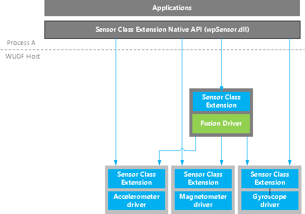
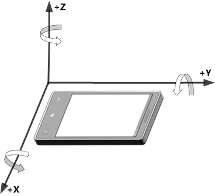

# Fusion sensor implementation details

This section provides implementation details about the Windows fusion sensor driver stack.

>[!NOTE]
>Microsoft provides fusion driver binaries on some platforms and these cannot be replaced by partners.

 

The following diagram shows the sensor fusion software stack.

The fusion software stack consists of the following components:

-   The **sensor native APIs** are called by applications to access fusion and compass features and functionality. The APIs are wrappers for ReadFile and DeviceIoControl. These APIs are sent to the sensor class extension, which then processes and completes the request.

-   The **sensor class extension** provides support for any required sensor-specific extensibility.

-   The **fusion driver** is the function-specific software part of the driver. It reads the physical sensors and processes the data. The algorithm for the compass and fusion sensor is implemented in this component.

## Coordinate systems

The coordinate system shown in the following diagram is used for all physical sensors and fusion data.

The coordinate system shown in the following diagram is the convention used by the fusion algorithm and APIs for all vectors in the Earth/ground frame of reference.

<!--
//commenting out for now, all these links are bad.
## Data structures

The following structures and enumerations are used by the fusion data part of the logical sensor driver:

-   [**VEC3D**](https://msdn.microsoft.com/library/windows/hardware/dn946712)

-   [**COORDINATE\_AXIS**](https://msdn.microsoft.com/library/windows/hardware/dn957021)

-   [**QUATERNION**](https://msdn.microsoft.com/library/windows/hardware/dn957081)

-   [**MATRIX3X3**](https://msdn.microsoft.com/library/windows/hardware/dn957074)

-   [Fusion sensor enumerations](https://go.microsoft.com/fwlink/p/?linkid=839352) and [Fusion sensor structures](https://go.microsoft.com/fwlink/p/?linkid=839355) provide information about the entire sensor fusion data structure, which include the attitude (in multiple formats) and the linear acceleration, and the compass data.
-->
 

 

