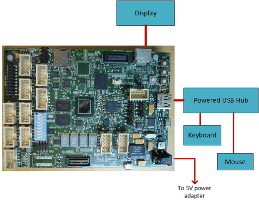
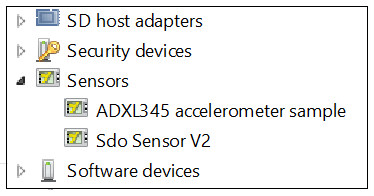

# Install the sensor driver


This topic shows you how to install the sensor driver on a development board, after you update the secondary system description table (SSDT) for the development board.

This topic uses the Sharks Cove development board and an ADXL345 accelerometer as a case study, to help explain the process of installing a sensor driver on a development board. So if you want to perform the tasks presented in this topic, you must first install an operating system on the Sharks Cove. For more information about how to do that, see [Download kits and tools for Windows 10](https://msdn.microsoft.com/windows/hardware/dn913721.aspx), and follow the instructions in **Step 1** (Install Windows 10).

After you finish installing the operating system on the Sharks Cove, See [Build the sensor driver](build-the-sensor-driver.md) to learn how to build a driver in Microsoft Visual Studio. Then return here to continue.

The accelerometer is attached to the Sharks Cove via the I2C bus. Peripherals that are connected to the I2C bus are enumerated via the Advanced Configuration and Power Interface (ACPI). So the sample driver for the accelerometer was developed to support ACPI instead of Plug and Play.

To make the Sharks Cove’s ACPI driver aware of the new device (the accelerometer) on the I2C bus, you must add information about the accelerometer to the SSDT on the Sharks Cove. This table describes the hardware resources and interrupt requirements for a hardware platform’s devices, including attached peripherals like the accelerometer.

## Before you begin


Before you start performing the tasks outlined below, please make sure that your Sharks Cove is set up as shown in the following image:



## Retrieve and review the default SSDT


This section shows you how to use the ACPI Source Language (ASL) compiler to retrieve the factory default SSDT for the Sharks Cove, and then review it. You will also learn how to replace the default SSDT with an updated one.

1. On your development computer, navigate to the following location to copy the ASL compiler:
**c:\\Program Files (x86)\\Windows Kits\\10\\Tools\\x86\\ACPIVerify**
2. Copy the *Asl.exe* file, and save it to a flash drive.

3. On the Sharks Cove, create a **Tools** folder in the root directory. Then Attach the flash drive to the Sharks Cove's USB hub, and copy the *Asl.exe* file to the **Tools** folder.

4. Open a Command prompt window as an administrator, and enter the following commands:
**cd\\tools**
**dir**
Make sure that the *Asl.exe* file is listed in the directory.

5. Invoke the ASL compiler and create an ASL file by entering the following command:
**asl /tab=ssdt**
6. Make sure that the ASL file was created successfully by entering the following command:
**dir ssdt.asl**
7. Open the ASL file in Notepad by entering the following command:
**notepad ssdt.asl**
Review the ASL file, and notice that there are no references to the accelerometer, or the I2C bus.

8. Close Notepad. Then enter the following command in the Command prompt window, to rename the *ssdt.asl* file.
**ren ssdt.asl ssdt-old.asl**
Then use the **dir** command to make sure that the file is now listed as *ssdt-old.asl*.

## Update the default SSDT


Perform the following tasks to update the SSDT, and load it to replace the factory default version. The updated SSDT will be stored in a potion of memory called *battery-backed RAM*. So make sure that the button cell (battery) that came with your Sharks Cove is plugged into its socket.

1. Copy the following updated SSDT and paste it into a new instance of Notepad.
```Text
// CreatorID=INTL  CreatorRev=20.14.805
// FileLength=177   FileChkSum=0x88

DefinitionBlock("SSDT.AML", "SSDT", 0x01, "Intel_", "ADebTabl", 0x00001000)
{
    Scope()
    {
        Name(DPTR, 0x3bf2d000)
        Name(EPTR, 0x3bf3d000)
        Name(CPTR, 0x3bf2d010)
        Mutex(MMUT, 0x0)
        Method(MDBG, 0x1, Serialized)
        {
            Store(Acquire(MMUT, 0x3e8), Local0)
            If(LEqual(Local0, Zero))
            {
                OperationRegion(ABLK, SystemMemory, CPTR, 0x10)
                Field(ABLK, ByteAcc, NoLock, Preserve)
                {
                    AAAA, 128
                }
                Store(Arg0, AAAA)
                Add(CPTR, 0x10, CPTR)
                If(LNot(LLess(CPTR, EPTR)))
                {
                    Add(DPTR, 0x10, CPTR)
                }
                Release(MMUT)
            }
            Return(Local0)
        }
    }
    
    Scope(_SB_)
    {
       Device(SPBA)
       {
           Name(_HID, "ADXL345Acc")
           Name(_UID, 1)


           Method(_CRS, 0x0, NotSerialized)
           {
               Name(RBUF, ResourceTemplate()
               {          
                   I2CSerialBus(0x53, ControllerInitiated, 400000, AddressingMode7Bit, "\\_SB.I2C3", 0, ResourceConsumer) 
                   GpioInt(Edge, ActiveHigh, Exclusive, PullDown, 0, "\\_SB.GPO2") {0x17}
               })

               Return(RBUF)
           }


           Method(_DSM, 0x4, NotSerialized)
           {
               If(LEqual(Arg0, Buffer(0x10)
               {
                   0x1e, 0x54, 0x81, 0x76, 0x27, 0x88, 0x39, 0x42, 0x8d, 0x9d, 0x36, 0xbe, 0x7f, 0xe1, 0x25, 0x42
               }))
               {
                   If(LEqual(Arg2, Zero))
                   {
                       Return(Buffer(One)
                       {
                           0x03
                       })
                   }

                   If(LEqual(Arg2, One))
                   {
                       Return(Buffer(0x4)
                       {
                           0x00, 0x01, 0x02, 0x03
                       })
                   }
               }
               Else
               {
                   Return(Buffer(One)
                   {
                       0x00
                   })
               }
           } // Method(_DSM ...)

       } // Device(SPBA)

   } // Scope(_SB_)
}
```

2. In Notepad, click **File** &gt; **Save As**. Then click the **Save as type** dropdown box, and select **All Files**.

3. In the **File name** box, type *ssdt.asl*, then click **Save**, and close Notepad.

4. In the Command prompt window, use the **dir** command to make sure that you can see the default file now listed as *ssdt-old.asl*, and the new file listed as *ssdt.asl*.

5. Compile the *ssdt.asl* file into a format that the Sharks Cove can understand by entering the following command:
**asl ssdt.asl**
6. Verify that the compiled file was successfully created in **Step 3** by entering the following command:
**dir ssdt.aml**
You should see the *ssdt.aml* file listed in the tools directory.

7. Load the compiled file into battery-backed RAM by entering the following command:
**asl /loadtable ssdt.aml**
## Turn on testsigning


Before you install the sample sensor driver, you must turn on testsigning. Perform the following tasks to turn on testsigning. Perform the following steps to install the sensor driver via **Device Manager**.

1. In the Command prompt window, enter the following command to see whether testsigning is already turned on.
**bcdedit /enum**
2. If you see a listing similar to the following, showing an entry for testsigning, with its value set to “yes” then skip to **Step 5**.


3. If you need to turn on test signing, then enter the following command:
**bcdedit /set testsigning on**
4. Repeat **Step 1** (in this exercise) to verify that the value of the testsigning system variable is now set to “yes” in the Windows Boot Loader list.

5. Restart the Sharks Cove. As the board restarts, hold the Volume-up button for about 2 seconds, to enter system setup (UEFI) window.

6. In the UEFI window, select **Device Manager** &gt; **System Setup** &gt; **Boot**, and make sure that **UEFI Security Boot** is set to **&lt;Disable&gt;**.

7. Save your changes and exit the UEFI window.

## Install the sensor driver


There are four main methods for installing a driver on the Sharks Cove board:

-   Download the driver from a network source directly onto the Sharks Cove.
-   Develop the sensor driver on a host computer, with your Sharks Cove connected as a provisioned client. Then deploy the driver from the host computer to the Sharks Cove.
-   Copy the driver package to a flash drive and attach the flash drive to the Sharks Cove. Then use the **devcon** command from a Command prompt window to install the driver manually.
-   Copy the driver package to a flash drive and attach the flash drive to the Sharks Cove. Then install the driver manually via **Device Manager**.

For simplicity, we will use the last method in the preceding list. Perform the following steps to manually install the sensor driver via **Device Manager**.

You must connect your sensor to the Sharks Cove before you install the sensor driver. For information about how to modify the ADXL345 accelerometer breakout board from SparkFun, to get it to work with the sample sensor driver, see [Prepare your sensor test board](prepare-your-sensor-test-board.md). And for information about how to connect the sensor breakout board to the Sharks Cove, see [Connect your sensor to the Sharks Cove board](connect-your-sensor-to-the-sharks-cove-board.md).

1. Make sure that the ADXL345 accelerometer is connected to the Sharks Cove J1C1 connector, then power up the Sharks Cove.

2. Attach a flash drive with the sensor driver to the powered USB hub connected to the Sharks Cove. For example, this can be the flash drive onto which you saved the driver that you built by following the steps in [Build the sensor driver](build-the-sensor-driver.md).

3. Open **Device Manager**, and look for an "Unknown device" in the **Other devices** node with a yellow bang symbol against it (see the following screen shot).


4. Right-click the device with the yellow bang (listed as Unknown device), and select **Update Driver Software**, and click **Browse my computer for driver software**.

5. Browse to the ADXL345 driver on the flash drive, then click **Next**. Follow the screen prompts to install the sensor driver.

6. After the sample sensor driver is successfully installed, **Device Manager** displays the sensor as shown in the following screen shot.



For information about how to use Visual Studio to deploy a driver to a client computer (like the Sharks Cove), see [Deploying a Driver to a Test Computer](https://msdn.microsoft.com/library/windows/hardware/hh454834.aspx).

After successfully installing the sample sensor driver, see [Test your universal sensor driver](test-your-universal-sensor-driver.md) for information about how to test a sensor.

 

 


--------------------
[Send comments about this topic to Microsoft](mailto:wsddocfb@microsoft.com?subject=Documentation%20feedback%20%5Bsensors\sensors%5D:%20Install%20the%20sensor%20driver%20%20RELEASE:%20%281/12/2017%29&body=%0A%0APRIVACY%20STATEMENT%0A%0AWe%20use%20your%20feedback%20to%20improve%20the%20documentation.%20We%20don't%20use%20your%20email%20address%20for%20any%20other%20purpose,%20and%20we'll%20remove%20your%20email%20address%20from%20our%20system%20after%20the%20issue%20that%20you're%20reporting%20is%20fixed.%20While%20we're%20working%20to%20fix%20this%20issue,%20we%20might%20send%20you%20an%20email%20message%20to%20ask%20for%20more%20info.%20Later,%20we%20might%20also%20send%20you%20an%20email%20message%20to%20let%20you%20know%20that%20we've%20addressed%20your%20feedback.%0A%0AFor%20more%20info%20about%20Microsoft's%20privacy%20policy,%20see%20http://privacy.microsoft.com/default.aspx. "Send comments about this topic to Microsoft")


