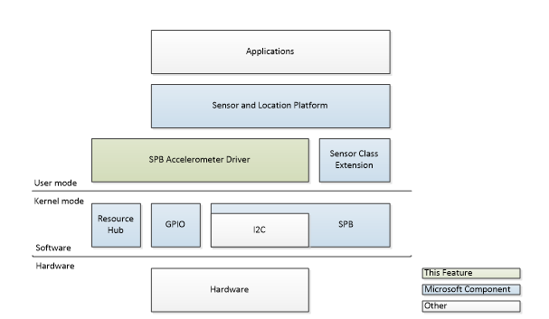

# Sample driver I/O model


An SPB driver communicates over the simple peripheral bus, the system GPIO pins, and the resource hub. Here you can see how the components are organized in: user mode, kernel mode, and the actual hardware.



## Simple peripheral bus (SPB)


Windows 8.1 supports an SPB component as a class extension (running in kernel mode) that makes developing and implementing SPB controller drivers easier. The SPB component:

-   Handles all communication with the Resource Hub including registration and setting retrieval.
-   Implements tiered queue structure to manage simultaneous targets and bus-locking requests
-   Translates buffers from user-mode to kernel-mode

For more information see Simple Peripheral Bus on MSDN.

### SPB component and the sample driver

| Module         | Class/Interface |
|----------------|-----------------|
| SpbRequest.cpp | CSpbRequest     |

 

The SpbAccelerometer sample code interacts with the SPB component is found in SpbRequest.cpp. The three methods in the CSpbRequest class interact with this component as described below.

| Method                                          | Purpose                                       |
|-------------------------------------------------|-----------------------------------------------|
| **CSpbRequest::CreateAndSendIoctl**             | Creates and issues an IOCTL request.          |
| **CSpbRequest::CreateAndSendWrite**             | Creates and issues an SPB write               |
| **CSpbRequest::CreateAndSendWriteReadSequence** | Creates and issues a SPB write/read sequence. |

 

### General-purpose input/output (GPIO)

Windows 8.1 supports a GPIO class extension that resides at the same level as the kernel-mode SPB component. The extension allows for flexibility in the underlying hardware connections and GPIO locations while offering a standard interface for client drivers.

On SoC platforms GPIO pins are spread across the chip as well as exposed on other components like a SPI-connected modem.

### The GPIO component and the sample driver

| Module               | Class/Interface |
|----------------------|-----------------|
| SpbAccelerometer.asl | N/A             |

 

The SpbAccelerometer sample relies on the GPIO component for interrupts. The GpioInt() element in the SpbAccelerometer.asl file defines the GPIO pin that’s connected to the ADXL345 as an interrupt resource.

``` syntax
//
// Sample I2C and GPIO resources. Modify to match your
// platform's underlying controllers and connections.
// \_SB.I2C and \_SB.GPIO are paths to predefined I2C 
// and GPIO controller instances. 
//
// Note: as written SpbAccelerometer requires a GPIO resource.
//
I2CSerialBus(0x1D, ControllerInitiated, 400000, AddressingMode7Bit, "\\_SB.I2C", , )
GpioInt(Level, ActiveHigh, Exclusive, PullDown, 0, "\\_SB.GPIO") {1} })
```

Here are the key elements of the I2C resource:

| Element    | Description                                             |
|------------|---------------------------------------------------------|
| 0x1D       | Specifies the I2C address for the slave device.         |
| 400000     | Specifies the operating frequency for the slave device. |
| \\\\SB.I2C | Specifies the ACPI node for the slave device.           |

 

### Processing acceleration data

| Module                  | Class/Interface      |
|-------------------------|----------------------|
| AccelerometerDevice.cpp | CAccelerometerDevice |

 

If the GPIO line is asserted by the ADXL345, the sample driver’s passive ISR routine (**CAccelerometerDevice::OnInterruptIsr**) is invoked. A helper function, **CAccelerometerDevice::OnInterruptWorkItem**, processes the interrupt data that::**OnInterruptIsr** stored.

If the interrupt processed by ::**OnInterruptIsr** corresponds to register 0x30 (ADXL\_345\_INT\_SOURCE in the file Adxl345.h), the driver invokes a register read operation to get the contents of registers 0x32 through 0x37. These registers contain the latest acceleration data for the X-, Y-, and Z-axis. The read operations are invoked in the **CAcclerometerDevice::RequestData** method (which is invoked by **CAccelerometerDevice::OnInterruptWorkItem**).

When the ::**RequestData** method processes the results of the read operations, it first combines the two bytes of data corresponding to each axis. Next, it applies a scale factor to obtain the actual acceleration value. (The scale factor is the result of dividing the range of G-forces (32) by the resolution (2^13). The result is .00390625.)

```ManagedCPlusPlus
// Get the data values as doubles
SHORT xRaw, yRaw, zRaw;
DOUBLE xAccel, yAccel, zAccel;
const DOUBLE scaleFactor = 1/256.0F;

xRaw = (SHORT)((m_pDataBuffer[1] << 8) | m_pDataBuffer[0]);
yRaw = (SHORT)((m_pDataBuffer[3] << 8) | m_pDataBuffer[2]);
zRaw = (SHORT)((m_pDataBuffer[5] << 8) | m_pDataBuffer[4]);

xAccel = (DOUBLE)xRaw * scaleFactor;
yAccel = (DOUBLE)yRaw * scaleFactor;
zAccel = (DOUBLE)zRaw * scaleFactor;
```

The scale factor is determined by the settings in register 0x31 (DATA\_FORMAT).

### Resource hub

Windows 8.1 supports a resource hub that manages the connections for all devices and bus controllers. It makes sure the necessary start and stop ordering is maintained.

The hub is a component specifically aimed at SoC platforms and their flat device tree. Buses on these systems differ from PCs:

-   Connections are typically non-discoverable; they are statically defined in ACPI
-   Hardware components often have multiple dependencies spanning multiple buses, rather than strict parent-child relationships

### Resource hub and the sample driver

| Module               | Class/Interface |
|----------------------|-----------------|
| SpbAccelerometer.asl | N/A             |

 

The **ResourceTemplate** section of SpbAccelerometer.asl specifies how the resources are connected.

```Text
Name(RBUF, ResourceTemplate()
{
   //
    // Sample I2C and GPIO resources. Modify to match your
    // platform&#39;s underlying controllers and connections.
    // \_SB.I2C and \_SB.GPIO are paths to predefined I2C 
    // and GPIO controller instances. 
    //
    // Note: as written SpbAccelerometer requires a GPIO resource.
    //
    I2CSerialBus(0x1D, ControllerInitiated, 400000, AddressingMode7Bit, "\\_SB.I2C", , )
    GpioInt(Level, ActiveHigh, Exclusive, PullDown, 0, "\\_SB.GPIO") {1}
        })
Return(RBUF)
```

 

 

[Send comments about this topic to Microsoft](mailto:wsddocfb@microsoft.com?subject=Documentation%20feedback%20%5Bsensors\sensors%5D:%20Sample%20driver%20I/O%20model%20%20RELEASE:%20%281/12/2017%29&body=%0A%0APRIVACY%20STATEMENT%0A%0AWe%20use%20your%20feedback%20to%20improve%20the%20documentation.%20We%20don't%20use%20your%20email%20address%20for%20any%20other%20purpose,%20and%20we'll%20remove%20your%20email%20address%20from%20our%20system%20after%20the%20issue%20that%20you're%20reporting%20is%20fixed.%20While%20we're%20working%20to%20fix%20this%20issue,%20we%20might%20send%20you%20an%20email%20message%20to%20ask%20for%20more%20info.%20Later,%20we%20might%20also%20send%20you%20an%20email%20message%20to%20let%20you%20know%20that%20we've%20addressed%20your%20feedback.%0A%0AFor%20more%20info%20about%20Microsoft's%20privacy%20policy,%20see%20http://privacy.microsoft.com/default.aspx. "Send comments about this topic to Microsoft")


