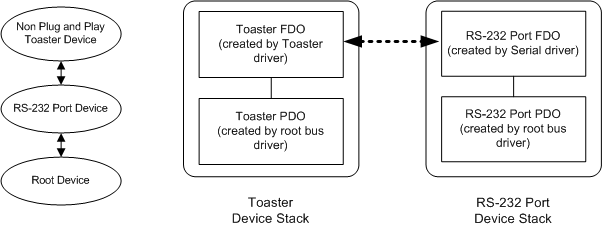

# Configuration of Non-Plug and Play Serial Device Connected to an RS-232 Port

## 

This topic describes the typical configuration of hardware, drivers, and device stacks for legacy serial devices that are connected to an RS-232 port.

The following diagram shows the typical configuration for a non-Plug and Play Toaster device.

Serenum is not used to install a non-Plug and Play serial device. The installation of the Toaster device stack is device-specific. To communicate with the Toaster device, the Toaster driver opens the [COM port](configuration-of-com-ports.md) that is associated with the RS-232 port.

 

 

--------------------
[Send comments about this topic to Microsoft](mailto:wsddocfb@microsoft.com?subject=Documentation%20feedback%20%5Bserports\serports%5D:%20Configuration%20of%20Non-Plug%20and%20Play%20Serial%20Device%20Connected%20to%20an%20RS-232%20Port%20%20RELEASE:%20%288/4/2016%29&body=%0A%0APRIVACY%20STATEMENT%0A%0AWe%20use%20your%20feedback%20to%20improve%20the%20documentation.%20We%20don't%20use%20your%20email%20address%20for%20any%20other%20purpose,%20and%20we'll%20remove%20your%20email%20address%20from%20our%20system%20after%20the%20issue%20that%20you're%20reporting%20is%20fixed.%20While%20we're%20working%20to%20fix%20this%20issue,%20we%20might%20send%20you%20an%20email%20message%20to%20ask%20for%20more%20info.%20Later,%20we%20might%20also%20send%20you%20an%20email%20message%20to%20let%20you%20know%20that%20we've%20addressed%20your%20feedback.%0A%0AFor%20more%20info%20about%20Microsoft's%20privacy%20policy,%20see%20http://privacy.microsoft.com/default.aspx. "Send comments about this topic to Microsoft")

