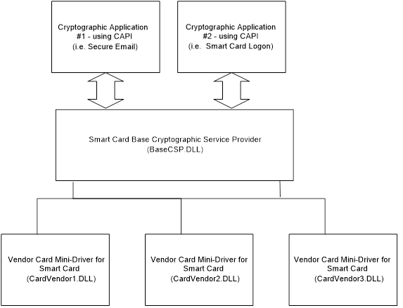
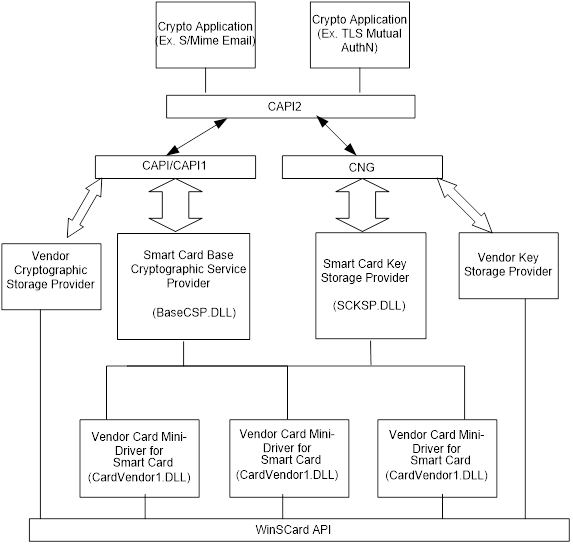

# Smart Card Minidrivers

The smart card minidriver provides a simpler alternative to developing a legacy cryptographic service provider (CSP) by encapsulating most of the complex cryptographic operations from the card minidriver developer.

For information about the specification for smart card minidrivers, see [Smart Card Minidriver Specification](https://msdn.microsoft.com/library/windows/hardware/dn631754).

Beginning with Windows Vista, applications can use the Microsoft Cryptography API: Next Generation (CNG) for smart card–based cryptographic services. As part of the elliptic curve cryptography (ECC) effort that was introduced in Windows Vista, ECC smart cards are supported in the new cryptographic framework. Applications and interfaces that interact with existing Rivest-Shamir-Adleman (RSA) card minidrivers through the legacy CAPI subsystem continue to work without modification.

RSA smart card minidrivers can also be registered with the smart card key storage provider (KSP) so that they can be called through the CNG interface. Dual-mode ECC/RSA + ECC-only requests are routed to the KSP and, through it, to the appropriate card minidrivers. For Windows Vista–based clients, ECC-only and ECC/RSA dual-mode cards are supported by using the Windows smart card framework. Dual-mode cards can also be accessed through CAPI primarily to expose RSA-only features.

Applications use CAPI for smart card–based cryptographic services. CAPI, in turn, routes these requests to the appropriate CSP to handle the cryptographic requirements.

The Microsoft Smart Card Base CSP and KSP is a refinement of the architecture that separates commonly needed CAPI-based CSP and CNG-based KSP functionality, respectively, from the implementation details that must change for every card vendor.

Although Base CSP can use the RSA capabilities of a smart card only by using the minidriver, the CNG-based KSP supports ECC-only as well as ECC/RSA dual-mode smart cards in Windows Vista and later versions of Windows.

Ultimately, the intention is for the new architecture to support all new smart cards—RSA, ECC, and whatever follows. It splits the implementation of the CSP into two parts:

-   The Base CSP/KSP (the common part), which includes functionality for hashing, symmetric, and public key cryptographic operations in addition to personal identification number (PIN) entry and caching.
-   A series of plug-ins, which are known as “card minidrivers,” that translate the characteristics of particular smart cards into a uniform interface that is the same for all smart cards. Card minidrivers then communicate with their cards by using the services of the smart card resource manager (SCRM) that similarly abstracts the characteristics of a variety of smart card readers.

The remaining portion for smart card vendors is to implement a card minidriver, a reasonably limited interface layer that provides an abstraction of the card to the Base CSP/KSP and that is organized as a file system, and a set of primitive capabilities. Higher order functionality, such as caching (ensuring that different files on the card have consistent content) or handling naming collisions, is handled at a higher level, outside the card minidriver.

The following figure shows the interfaces between card minidrivers and CAPI-based applications.

The following figure shows the interfaces between card minidrivers and CAPI2-based applications.

It is recommend that developers take advantage of the rich set of libraries that Microsoft provides for cryptographic operations that the minidriver performs. This lets developers benefit from the Microsoft Windows Update infrastructure for the distribution of critical security updates.

 

 

[Send comments about this topic to Microsoft](mailto:wsddocfb@microsoft.com?subject=Documentation%20feedback%20[smartcrd\smartcrd]:%20Smart%20Card%20Minidrivers%20%20RELEASE:%20%287/20/2016%29&body=%0A%0APRIVACY%20STATEMENT%0A%0AWe%20use%20your%20feedback%20to%20improve%20the%20documentation.%20We%20don't%20use%20your%20email%20address%20for%20any%20other%20purpose,%20and%20we'll%20remove%20your%20email%20address%20from%20our%20system%20after%20the%20issue%20that%20you're%20reporting%20is%20fixed.%20While%20we're%20working%20to%20fix%20this%20issue,%20we%20might%20send%20you%20an%20email%20message%20to%20ask%20for%20more%20info.%20Later,%20we%20might%20also%20send%20you%20an%20email%20message%20to%20let%20you%20know%20that%20we've%20addressed%20your%20feedback.%0A%0AFor%20more%20info%20about%20Microsoft's%20privacy%20policy,%20see%20http://privacy.microsoft.com/default.aspx. "Send comments about this topic to Microsoft")

