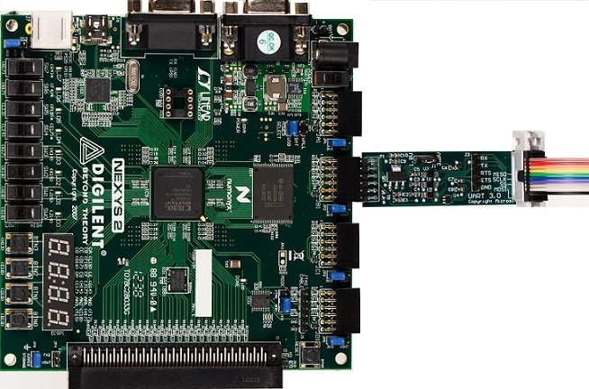

# UART tests in MITT


**Last updated**

-   January, 2015

**Applies to:**

-   Windows 8.1

The MITT software package includes tests for validating data transfers to a UART controller and its driver. The MITT board’s UART interface acts as a UART loopback device.

## Before you begin...


-   Get a MITT board and a UART adapter board. See [Buy hardware for using MITT](buses.multi_interface_test_tool__mitt__).
-   [Download the MITT software package](buses.mitt_software_package). Install it on the system under test.
-   Install MITT firmware on the MITT board. See [Get started with MITT](buses.get_started_with_mitt___).

## Hardware setup




1.  You need external PIN-outs to connect the UART interface on the MITT board to the UART controller of the system under test. If the UART controller exposes PIN-outs, connect directly to **JB1** of the board.
2.  Connect these lines:

    | UART interface on the MITT board | UART controller on the system under test |
    |----------------------------------|------------------------------------------|
    | TX                               | RX                                       |
    | RTS                              | CTS                                      |
    | RX                               | TX                                       |
    | CTS                              | RTS                                      |

     

3.  The UART adapter board provides a jumper for selecting the correct voltage. Only 3.3V signal is supported for direct connect (without the adapter board).

    

## <a href="" id="test-driver-and-acpi-configuration--"></a>Test driver and ACPI configuration


To modify the ACPI tables, install Windows Hardware Certification Kit (HCK) 8.1. Perform these steps on the system under test that has the UART controller:

1.  Perform the system changes that are described under the Device.BusController.UART.HCKTestability requirement.
2.  Update the ACPI table for UART test drivers based on the template provided under \\\\&lt;hckcontrollername&gt;\\Tests\\&lt;architecture&gt;\\UART\\Sample-UART.asl or use this example. You can use the [Microsoft ASL compiler](p_oembringup.microsoft_asl_compiler).

    ``` syntax
    Device(UART) {
        Name (_HID, "UTK0001")
        Name (_CID, "UARTTest")
        Name (_UID,0)
        Method (_CRS, 0x0, NotSerialized) {
            Name (
                RBUF,
                ResourceTemplate () {
                    UARTSerialBus (
                        115200, // Baud Rate = 115200
                        DataBitsEight,
                        StopBitsOne,
                        0xC0,
                        LittleEndian,
                        ParityTypeNone,
                        FlowControlHardware, 
                        32,
                        32,
                        "\\_SB.UAR4",,,,
                    )
                }
            )
        Return(RBUF)
        }
    }
    ```

3.  Install the UARTTest test peripheral driver from \\\\&lt;hckcontrollername&gt;\\Tests\\&lt;architecture&gt;\\UART by running this command:

    **pnputil –a UARTTest.inf**

## <a href="" id="uart-automation-tests--"></a>UART automation tests


1.  Perform steps described in Test driver and ACPI configuration.
2.  Create a folder on the system under test.
3.  Copy these files from %ProgramFiles(x86)%\\Windows Kits\\8.1\\Testing\\Runtimes\\TAEF to the folder.
    -   Wex.Common.dll
    -   Wex.Communication.dll
    -   Wex.Logger.dll

4.  Copy UtsSanity.exe and muttutil.dll from the MITT software package.
5.  View all commands available, launch UtsSanity.exe -? and refer to the command line options available:
    **Note**  The **–mitt** option is required to run the tests while the MITT board is connected.

     

Example 1: To run the tests at 115200 bps (default)

**C:\\uart&gt; UtsSanity.exe –mitt**

Example 2: To run the tests at 3Mbps:

**C:\\uart&gt; UtsSanity.exe -mitt –baudRate 3000000**

## UART adapter schematic


 

 


--------------------
[Send comments about this topic to Microsoft](mailto:wsddocfb@microsoft.com?subject=Documentation%20feedback%20%5BSPB\buses%5D:%20UART%20tests%20in%20MITT%20%20RELEASE:%20%286/1/2016%29&body=%0A%0APRIVACY%20STATEMENT%0A%0AWe%20use%20your%20feedback%20to%20improve%20the%20documentation.%20We%20don't%20use%20your%20email%20address%20for%20any%20other%20purpose,%20and%20we'll%20remove%20your%20email%20address%20from%20our%20system%20after%20the%20issue%20that%20you're%20reporting%20is%20fixed.%20While%20we're%20working%20to%20fix%20this%20issue,%20we%20might%20send%20you%20an%20email%20message%20to%20ask%20for%20more%20info.%20Later,%20we%20might%20also%20send%20you%20an%20email%20message%20to%20let%20you%20know%20that%20we've%20addressed%20your%20feedback.%0A%0AFor%20more%20info%20about%20Microsoft's%20privacy%20policy,%20see%20http://privacy.microsoft.com/en-us/default.aspx. "Send comments about this topic to Microsoft")


