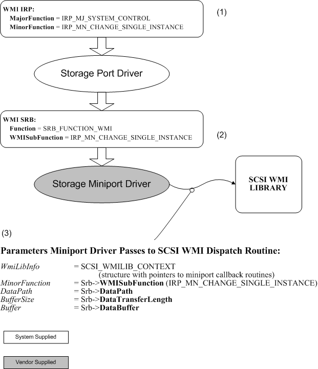

# How the Port Driver Processes WMI Requests

## 

Windows notifies a storage port driver of a WMI request by sending a I/O request packet (IRP) of type [**IRP\_MJ\_SYSTEM\_CONTROL**](https://msdn.microsoft.com/library/windows/hardware/ff550813), as described in [Windows Management Instrumentation](https://msdn.microsoft.com/library/windows/hardware/ff547139). A system control IRP can contain any of the minor IRP numbers that represent WMI operations. For more information, see [WMI Minor IRPs](https://msdn.microsoft.com/library/windows/hardware/ff566361).

To use the [Using the SCSI Port WMI Library](using-the-scsi-port-wmi-library.md) to process WMI SRBs, your SCSI miniport driver must provide a series of callback routines that correspond to the WMI minor IRP numbers. The following table illustrates the relationship between the miniport driver callback routines and their corresponding WMI minor IRP numbers.

<table>
<colgroup>
<col width="50%" />
<col width="50%" />
</colgroup>
<thead>
<tr class="header">
<th align="left">WMI IRP Minor Number</th>
<th align="left">Miniport Driver Callback Routine</th>
</tr>
</thead>
<tbody>
<tr class="odd">
<td align="left">
[<strong>IRP_MN_REGINFO</strong>](https://msdn.microsoft.com/library/windows/hardware/ff551731)
</td>
<td align="left">
[<strong>HwScsiWmiQueryReginfo</strong>](https://msdn.microsoft.com/library/windows/hardware/ff557344)
</td>
</tr>
<tr class="even">
<td align="left">
[<strong>IRP_MN_QUERY_ALL_DATA</strong>](https://msdn.microsoft.com/library/windows/hardware/ff551650)
</td>
<td align="left">
[<strong>HwScsiWmiQueryDataBlock</strong>](https://msdn.microsoft.com/library/windows/hardware/ff557340)
</td>
</tr>
<tr class="odd">
<td align="left">
[<strong>IRP_MN_QUERY_SINGLE_INSTANCE</strong>](https://msdn.microsoft.com/library/windows/hardware/ff551718)
</td>
<td align="left">
[<strong>HwScsiWmiQueryDataBlock</strong>](https://msdn.microsoft.com/library/windows/hardware/ff557340)
</td>
</tr>
<tr class="even">
<td align="left">
[<strong>IRP_MN_CHANGE_SINGLE_INSTANCE</strong>](https://msdn.microsoft.com/library/windows/hardware/ff550831)
</td>
<td align="left">
<em>HwScsiWmiSetDataBlock</em>
</td>
</tr>
<tr class="odd">
<td align="left">
[<strong>IRP_MN_CHANGE_SINGLE_ITEM</strong>](https://msdn.microsoft.com/library/windows/hardware/ff550836)
</td>
<td align="left">
[<strong>HwScsiWmiSetDataItem</strong>](https://msdn.microsoft.com/library/windows/hardware/ff557357)
</td>
</tr>
<tr class="even">
<td align="left">
[<strong>IRP_MN_EXECUTE_METHOD</strong>](https://msdn.microsoft.com/library/windows/hardware/ff550868)
</td>
<td align="left">
[<strong>HwScsiWmiExecuteMethod</strong>](https://msdn.microsoft.com/library/windows/hardware/ff557332)
</td>
</tr>
<tr class="odd">
<td align="left">
[<strong>IRP_MN_ENABLE_EVENTS</strong>](https://msdn.microsoft.com/library/windows/hardware/ff550859)
</td>
<td align="left">
[<strong>HwScsiWmiFunctionControl</strong>](https://msdn.microsoft.com/library/windows/hardware/ff557338)
</td>
</tr>
<tr class="even">
<td align="left">
[<strong>IRP_MN_DISABLE_EVENTS</strong>](https://msdn.microsoft.com/library/windows/hardware/ff550851)
</td>
<td align="left">
<em>HwScsiWmiFunctionControl</em>
</td>
</tr>
<tr class="odd">
<td align="left">
[<strong>IRP_MN_ENABLE_COLLECTION</strong>](https://msdn.microsoft.com/library/windows/hardware/ff550857)
</td>
<td align="left">
<em>HwScsiWmiFunctionControl</em>
</td>
</tr>
<tr class="even">
<td align="left">
[<strong>IRP_MN_DISABLE_COLLECTION</strong>](https://msdn.microsoft.com/library/windows/hardware/ff550848)
</td>
<td align="left">
<em>HwScsiWmiFunctionControl</em>
</td>
</tr>
</tbody>
</table>

 

Each miniport driver callback routine should provide the functionality associated with the corresponding WMI minor IRP number or numbers. Some routines, such as *HwScsiWmiFunctionControl*, must be able to provide functionality that corresponds to several WMI minor IRP numbers.

Your miniport driver will call the SCSI Port WMI library dispatch routine, [**ScsiPortWmiDispatchFunction**](https://msdn.microsoft.com/library/windows/hardware/ff564766), and then the dispatch routine will call the appropriate miniport driver callback routine. The port driver transfers the WMI minor IRP number to the SRB so that the dispatch routine can consult the SRB to determine which callback routine to call.

The following diagram illustrates the changes that a WMI request undergoes from the moment that a storage port driver receives it until the storage miniport driver passes it to the SCSI Port WMI library dispatch routine.

1.  The following steps explain how the storage stack repackages a WMI IRP as an SRB:

2.  Windows notifies a storage port driver of a WMI request by sending an IRP of type [**IRP\_MJ\_SYSTEM\_CONTROL**](https://msdn.microsoft.com/library/windows/hardware/ff550813).

3.  The port driver repackages the WMI IRP as a WMI SRB of type [**SCSIWMI\_REQUEST\_CONTEXT**](https://msdn.microsoft.com/library/windows/hardware/ff564946) and assigns a value of SRB\_FUNCTION\_WMI to the SRB's **Function** member. The port driver transfers the minor WMI IRP number to the SRB **WMISubFunction** member. and arranges for the I/O manager to call the miniport driver's start I/O routine [**HwScsiStartIo**](https://msdn.microsoft.com/library/windows/hardware/ff557323) by means of a call to [**IoStartPacket**](https://msdn.microsoft.com/library/windows/hardware/ff550370).

4.  The miniport driver calls the SCSI Port WMI library dispatch routine to process the SRB. For more information, see [Using the SCSI Port WMI Library](using-the-scsi-port-wmi-library.md).

 

 

--------------------

