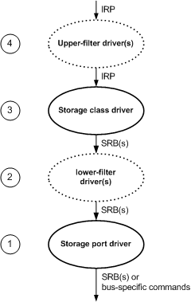

# Windows Storage Driver Architecture

## 

Windows operating system class and filter drivers for peripheral storage devices act as an interface between any intermediate or highest level drivers layered above the class or filter driver and a system-supplied port driver.

I/O requests from a user application or kernel component reach storage class drivers through I/O System Services and one or more intermediate or highest level drivers, such as a file system driver. Storage class drivers translate the standard IRPs they get into IRPs with system-defined SCSI request blocks (SRBs) containing SCSI command descriptor blocks (CDBs) before sending each IRP on to the next-lower driver. A storage port driver translates SRBs from class drivers into bus-specific commands which it sends to the storage HBA, through an I/O bus driver and possibly one or more filter drivers.

The following figure shows the layered architecture of Windows storage drivers.

Windows Storage Driver Architecture

Starting from the bottom of the figure, the following describes each type of storage driver:

1.  A *storage port driver* defines an interface to all Windows storage class drivers, including the system-supplied disk, tape, CDROM, DVD, and changer class drivers. This port/class interface insulates class drivers from adapter-specific requirements of the host bus adapter to which their respective devices are connected. A storage port driver also synchronizes access to the bus for all drivers of devices on the corresponding HBA. The system supplies storage port drivers for SCSI, IDE, USB and IEEE 1394 adapters.

    A storage port driver receives SRBs from the next higher driver (a storage class driver or intervening filter driver) and processes them as follows:

    -   The storage port driver for a SCSI, or other bus, passes SRBs with CDBs on to an operating system-independent, HBA-specific *Storport miniport driver* , which is dynamically linked to its corresponding port driver and provides hardware-specific support for a particular HBA. For information about implementing a SCSI miniport driver, see [Storport Miniport Drivers](storport-miniport-drivers.md).
    -   The storage port driver for a legacy IDE/ATAPI or IEEE 1394 bus translates the SRBs received from the storage class driver into the format required by the underlying adapter--for example, repackaging CDBs according to a bus-specific transport protocol, or translating them into a different format, thereby insulating upper level drivers from peculiarities of the underlying bus.

2.  An upper or lower *storage filter driver* supports device-specific functionality not provided by a system-supplied storage class driver. A lower filter storage driver monitors SRBs and/or IRPs issued by a storage class driver and modifies them as needed before passing them to the next-lower driver (a storage port driver or another storage filter driver).

    For information about implementing a storage filter driver, see [Storage Filter Drivers](storage-filter-drivers.md).

3.  A *storage class driver* uses the SCSI port/class interface to control a device of its type on any bus for which the system provides a storage port driver. A class driver is specific to a particular class of device--for example, one class driver can run all CD-ROM devices on any supported bus; another can control all disk devices. The storage class driver handles I/O requests from user applications or drivers higher in the storage stack by building SRBs containing CDBs and issuing those SRBs to the next-lower driver (a storage port driver or intervening filter driver), just as if the device were a SCSI device.

    The implementation of a storage class driver is transparent to upper level drivers. A class driver for a tape or medium changer device is implemented as a device-specific miniclass driver that links to a system-supplied class driver. System-supplied class drivers for other storage devices, such as disk and CD-ROM/DVD, are implemented as single monolithic drivers.

    For information about implementing a storage class driver, see [Storage Class Drivers](storage-class-drivers.md). For information about implementing a tape or changer miniclass driver, see [Tape Drivers](tape-drivers.md) and [Changer Drivers](changer-drivers.md), respectively.

4.  An upper filter storage driver intercepts IRPs from user applications and drivers higher in the storage stack and then possibly modifies them before passing them to the next-lower driver (a storage class driver or another storage filter driver). Filter drivers typically monitor performance of the underlying device.

The type of bus to which a device is attached and the implementation of its storage port driver are transparent to upper level drivers. A storage port driver might be implemented according to the port/miniport driver architecture, like the SCSI port driver; as a monolithic driver that controls a single, standard piece of hardware, such as the IDE/ATAPI port driver; or as a filter driver that translates SRBs into the format required by a different driver stack, such as the IEEE 1394 port driver.

The system-supplied SCSI port driver can also act as an interface between a storage class driver and a SCSI miniport driver that controls a non-SCSI storage device of the same type. For example, rather than writing a driver for a new disk-array controller, a driver writer can save considerable design, development, and debugging effort by writing a pseudo-SCSI miniport driver that links to the system SCSI port driver and uses the interface it provides. Such a miniport driver is required to translate incoming SCSI commands into device-specific commands. On the other hand, the system-supplied port and class drivers handle much necessary work on a pseudo-SCSI miniport's behalf, including registry accesses during initialization, all resource and object allocations, synchronization, presizing of requested transfers to suit the capabilities of the miniport's device, and retrying requests.

For more detailed information about SRBs, see the Kernel-Mode Driver Architecture Reference. For device-type-specific information about CDBs, consult appropriate command sets in the INCITS SCSI-3 standards.

 

 

--------------------

