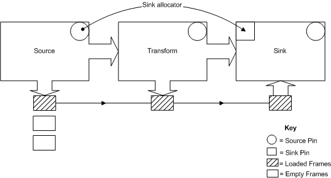

# Allocation Schemes

## 

The following diagram represents a single allocator that is assigned for use by three filters. No allocation is required in the transform or sink filters because the system has not assigned an allocator handle to these filters.

The source filter allocates a frame, fills it with data and submits it to the next filter. The transform filter performs an in-place data transformation and submits the frame to the next filter. When the sink filter completes the I/O operation, the source filter either frees or reuses the frame. Flow control is maintained in this filter graph by the number of total outstanding frames that can be allocated from the sink allocator and by the rate of completion of the I/O operation.

The following diagram represents an allocator configuration in which a source frame is routed to multiple destination sinks.

In the diagram, the file writer could represent wave out to a file, and the device a sound card to which audio is being sent.

This filter graph contains two allocators: the transform's allocator and the device's allocator. The source filter allocates a frame from the transform allocator, fills it with data and submits it to the transform filter and then to the file writer. On receipt of a frame, the transform filter allocates a frame from the device allocator, performs a transformation of the data into the new frame and submits this frame to the device.

Flow control is maintained in this filter graph by the number of total outstanding frames that can be allocated from the allocators and by the rate of completion of the I/O operations. Note that there must be a separate allocator for each separate list of source/sink segments created through connecting pins. If separate allocators are not present, a given segment may consume all frames available, leaving none for the next segment, which may require one or more frames to process the data created by the previous segment.

 

 

--------------------
[Send comments about this topic to Microsoft](mailto:wsddocfb@microsoft.com?subject=Documentation%20feedback%20%5Bstream\stream%5D:%20Allocation%20Schemes%20%20RELEASE:%20%288/23/2016%29&body=%0A%0APRIVACY%20STATEMENT%0A%0AWe%20use%20your%20feedback%20to%20improve%20the%20documentation.%20We%20don't%20use%20your%20email%20address%20for%20any%20other%20purpose,%20and%20we'll%20remove%20your%20email%20address%20from%20our%20system%20after%20the%20issue%20that%20you're%20reporting%20is%20fixed.%20While%20we're%20working%20to%20fix%20this%20issue,%20we%20might%20send%20you%20an%20email%20message%20to%20ask%20for%20more%20info.%20Later,%20we%20might%20also%20send%20you%20an%20email%20message%20to%20let%20you%20know%20that%20we've%20addressed%20your%20feedback.%0A%0AFor%20more%20info%20about%20Microsoft's%20privacy%20policy,%20see%20http://privacy.microsoft.com/default.aspx. "Send comments about this topic to Microsoft")

