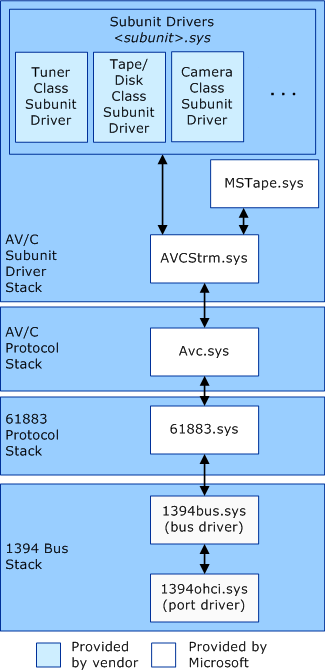

# AV/C Streaming Driver Stack

## 

Windows loads *Avcstrm.sys* between a subunit driver's functional device object (FDO) and the corresponding physical device object (PDO) created by *Avc.sys*. *Avcstrm.sys* resides between individual subunit drivers and the function driver, *Avc.sys*. *Avcstrm.sys* is installed as a lower-level filter driver to subunit drivers in order to provide its streaming services. The interface to the streaming service provided by *Avcstrm.sys* is based on the I/O request packet (IRP) model used by the WDM architecture, with a list of supported I/O control (IOCTL) functions. *Avcstrm.sys* can service a subunit driver that is based on either the Stream class or the AVStream interfaces. The AVStream driver model is the preferred interface to use. The following diagram illustrates where *Avcstrm.sys* fits into the AV/C driver stack.

*Avcstrm.sys* is format-aware. It must know the data format of the streaming data, such as SDDV or MPEG2TS, in order to make the proper isochronous connection between the source and the target devices. With the given format information, *Avcstrm.sys* can then interface with the AV/C subunit's driver through the 61883 protocol driver to receive or transmit data. Because *Avcstrm.sys* is format-aware, it will have to be updated to add a different format (for example, a service pack or new operating system release). Currently, SDDV and MPEG2TS formats are the only formats implemented.

In the future, *Avcstrm.sys* may be extended to:

-   Query data format

-   Perform data intersection (negotiate data format between two pins)

-   Be a clock provider

-   Get and set streaming properties

Currently, each subunit driver must implement the preceding operations.

The AV/C Streaming filter driver does not timestamp data at this time. A clock provider needs to timestamp the data as well as provide the current stream time. The subunit driver must timestamp the data if it is a clock provider.

 

 

--------------------
[Send comments about this topic to Microsoft](mailto:wsddocfb@microsoft.com?subject=Documentation%20feedback%20%5Bstream\stream%5D:%20AV/C%20Streaming%20Driver%20Stack%20%20RELEASE:%20%288/23/2016%29&body=%0A%0APRIVACY%20STATEMENT%0A%0AWe%20use%20your%20feedback%20to%20improve%20the%20documentation.%20We%20don't%20use%20your%20email%20address%20for%20any%20other%20purpose,%20and%20we'll%20remove%20your%20email%20address%20from%20our%20system%20after%20the%20issue%20that%20you're%20reporting%20is%20fixed.%20While%20we're%20working%20to%20fix%20this%20issue,%20we%20might%20send%20you%20an%20email%20message%20to%20ask%20for%20more%20info.%20Later,%20we%20might%20also%20send%20you%20an%20email%20message%20to%20let%20you%20know%20that%20we've%20addressed%20your%20feedback.%0A%0AFor%20more%20info%20about%20Microsoft's%20privacy%20policy,%20see%20http://privacy.microsoft.com/default.aspx. "Send comments about this topic to Microsoft")

