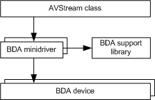

# Broadcast Driver Architecture Minidrivers

## 

Broadcast Driver Architecture (BDA) minidrivers control hardware that performs the following operations:

-   Tuning a digital broadcast signal

-   Demodulating the digital signal

-   Capturing frames of the digital signal

-   Demultiplexing the signal into video, audio, and data streams

BDA minidrivers are AVStream minidrivers that run under the [AVStream module](avstream-overview.md) in the kernel-streaming driver *ks.sys*. AVStream is a class driver that provides a unified kernel streaming class model for both audio and video minidrivers, and that supports use of COM objects without altering existing minidriver binaries. The AVStream class driver provides much of the default behavior required to make a minidriver's filter work as a WDM kernel streaming compliant filter. To simplify the task of writing BDA minidrivers, you can use the BDA support library (*Bdasup.lib*) of functions that is included in the Microsoft Windows Driver Kit (WDK). This library provides extensive default handling for the BDA minidriver's property and method sets.

Typically, driver writers only have to code the appropriate static template structures, register them with the BDA support library, and then let the library provide default handling for all the properties and methods. In some instances, a BDA minidriver must intercept a property or method request and perform appropriate operations.

The following figure shows an architectural overview for BDA minidrivers:

The following sections describe implementation details for a BDA minidriver, discuss details of some property and method sets, and contain sample code that shows how to intercept certain properties and methods:

[Initializing a BDA Minidriver](initializing-a-bda-minidriver.md)

[Starting a BDA Minidriver](starting-a-bda-minidriver.md)

[Creating Dispatch Tables](creating-dispatch-tables.md)

[Defining Automation Tables](defining-automation-tables.md)

[Initializing a BDA Filter](initializing-a-bda-filter.md)

[Using BDA Property and Method Sets](using-bda-property-and-method-sets.md)

[Caching Pin Information for DirectShow](caching-pin-information-for-directshow.md)

[Securing a BDA Minidriver](securing-a-bda-minidriver.md)

[Connecting Between Pins of Filters for BDA Minidrivers](connecting-between-pins-of-filters-for-bda-minidrivers.md)

 

 

--------------------
[Send comments about this topic to Microsoft](mailto:wsddocfb@microsoft.com?subject=Documentation%20feedback%20%5Bstream\stream%5D:%20Broadcast%20Driver%20Architecture%20Minidrivers%20%20RELEASE:%20%288/23/2016%29&body=%0A%0APRIVACY%20STATEMENT%0A%0AWe%20use%20your%20feedback%20to%20improve%20the%20documentation.%20We%20don't%20use%20your%20email%20address%20for%20any%20other%20purpose,%20and%20we'll%20remove%20your%20email%20address%20from%20our%20system%20after%20the%20issue%20that%20you're%20reporting%20is%20fixed.%20While%20we're%20working%20to%20fix%20this%20issue,%20we%20might%20send%20you%20an%20email%20message%20to%20ask%20for%20more%20info.%20Later,%20we%20might%20also%20send%20you%20an%20email%20message%20to%20let%20you%20know%20that%20we've%20addressed%20your%20feedback.%0A%0AFor%20more%20info%20about%20Microsoft's%20privacy%20policy,%20see%20http://privacy.microsoft.com/default.aspx. "Send comments about this topic to Microsoft")

